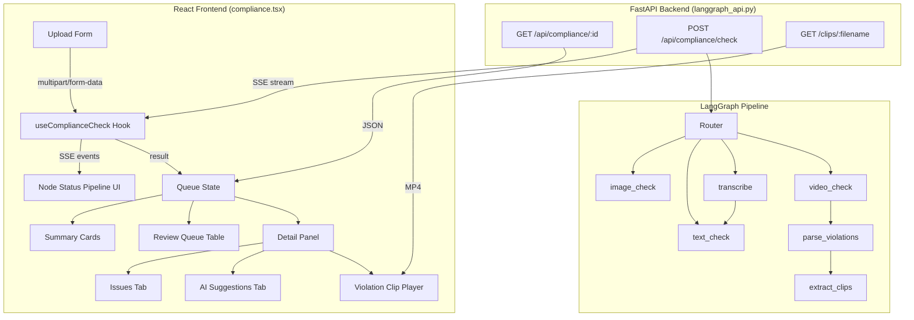
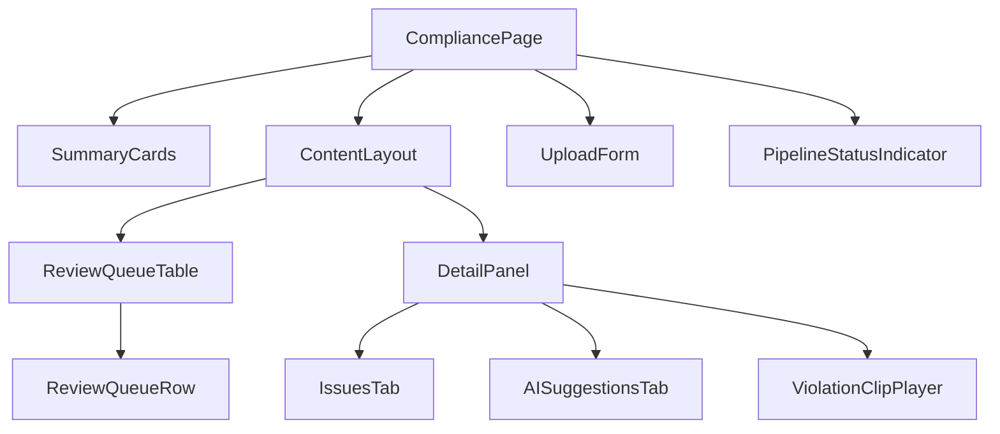

# Design Document: Compliance Checker Integration

## Overview

This design integrates the existing LangGraph-based compliance checking backend into the React frontend, replacing mock data with real API calls. The integration supports multi-modal file uploads (video, image, audio, text) with SSE streaming for real-time pipeline progress, compliance results display with GSAP animations, violation clip playback, and a dashboard matching the Figma design system.

The architecture follows a unidirectional data flow: the Upload Form submits to the backend via `POST /api/compliance/check`, consumes the SSE stream for node status updates, and renders the final compliance result in the Detail Panel. A local queue state manages all compliance check items, their statuses, and selection state.

### Key Design Decisions

1. **SSE via POST (not EventSource)**: The backend returns SSE from a POST endpoint with multipart/form-data. Since the browser `EventSource` API only supports GET, we use `fetch()` with a `ReadableStream` reader to parse SSE lines — matching the existing `complianceApi.ts` pattern.

2. **Fix endpoint URL mismatch**: The existing `complianceApi.ts` points to `/api/compliance/check/stream` which doesn't exist. The actual backend endpoint is `POST /api/compliance/check` which already returns SSE. We'll fix `checkComplianceStream` to use the correct URL.

3. **State management via React hooks**: No external state library needed. A custom `useComplianceCheck` hook encapsulates the streaming logic, node status tracking, and result handling. The page component manages queue state with `useState` + `useReducer`.

4. **GSAP animations via `useGSAP` hook**: All animations use scoped container refs following the project's established pattern. Summary cards get staggered entrance, queue rows animate after cards, score counts up, and detail panel transitions on selection change.

5. **Figma design system compliance**: All components use the design tokens from `compliance.html` — surface hierarchy colors, Hanken Grotesk typography, Material Symbols Outlined icons, `shadow-retina` card borders, and `aurora-border-active` for selected states.

---

## Architecture



### Component Hierarchy



---

## Components and Interfaces

### 1. CompliancePage (`pages/compliance.tsx`)

The root page component. Manages queue state, selected item, and orchestrates child components.

**Responsibilities:**
- Holds queue items array in state (replaces mock `complianceService`)
- Manages selected item ID
- Provides GSAP scoped container ref for page-level animations
- Renders Layout Shell (sidebar already handled by parent `dashboard.tsx`)

### 2. UploadForm Component

A modal or inline form for submitting new compliance checks.

**Props:**
```typescript
interface UploadFormProps {
  onSubmit: (params: UploadParams) => void;
  isSubmitting: boolean;
}

interface UploadParams {
  file?: File;
  text?: string;
  market: string;
  ethnicity: string;
  ageGroup: string;
}
```

**Behavior:**
- Accepts `video/*`, `image/*`, `audio/*` files or text input
- Displays filename, media type icon, file size when file selected
- Dropdowns for market, ethnicity, age_group with defaults
- Disables submit when no file/text provided or when submitting
- Validates file size < 100MB before submission

### 3. useComplianceCheck Hook

Custom hook encapsulating the SSE streaming logic.

```typescript
interface UseComplianceCheckReturn {
  submit: (params: UploadParams) => Promise<ComplianceResult>;
  isStreaming: boolean;
  nodeStatuses: NodeStatus[];
  currentNode: string | null;
  error: string | null;
  retry: () => void;
}
```

**Behavior:**
- Calls `POST /api/compliance/check` with FormData
- Reads SSE stream via `ReadableStream` reader
- Accumulates `node_status` events into `nodeStatuses` array
- Resolves promise with `ComplianceResult` on `result` event
- Sets error state on stream failure/timeout
- Provides retry function to re-submit last params

### 4. PipelineStatusIndicator Component

Displays real-time node processing progress.

**Props:**
```typescript
interface PipelineStatusIndicatorProps {
  nodeStatuses: NodeStatus[];
  currentNode: string | null;
  isStreaming: boolean;
  mediaType: string;
}
```

**Behavior:**
- Shows pipeline nodes as a horizontal sequence with icons
- Nodes are colored: completed (emerald), active (aurora-purple pulse), pending (muted)
- Only shows relevant nodes for the detected media type path
- Displays current node description text below the indicator

### 5. SummaryCards Component

Four bento-grid cards with GSAP staggered entrance.

**Props:**
```typescript
interface SummaryCardsProps {
  readyCount: number;
  attentionCount: number;
  pendingCount: number;
  topRiskFlags: string[];
  hasHighRisk: boolean;
}
```

### 6. ReviewQueueTable Component

Table listing all compliance check items.

**Props:**
```typescript
interface ReviewQueueTableProps {
  items: QueueItem[];
  selectedId: string | null;
  onSelect: (id: string) => void;
  riskFilter: RiskLevel | "all";
  onFilterChange: (filter: RiskLevel | "all") => void;
}
```

### 7. DetailPanel Component

Right-side panel with tabs for Issues and AI Suggestions.

**Props:**
```typescript
interface DetailPanelProps {
  item: QueueItem | null;
  onRerun: (id: string) => void;
  onApplyFix: (itemId: string, violationIndex: number) => void;
}
```

### 8. ViolationClipPlayer Component

Inline HTML5 video player for violation clips.

**Props:**
```typescript
interface ViolationClipPlayerProps {
  clipUrl: string | null;
  start: number;
  end: number;
}
```

---

## Data Models

### QueueItem (Frontend State)

```typescript
interface QueueItem {
  id: string;                    // check_id from backend
  campaignName: string;          // derived from filename or user input
  assetFilename: string;         // original filename
  mediaType: "video" | "image" | "audio" | "text";
  platform: string[];            // platform icons to display
  riskLevel: "High" | "Medium" | "Low" | null;  // null while pending
  flags: ViolationFlag[];        // colored dot indicators
  status: "passed" | "needs_changes" | "in_progress" | "error";
  lastChecked: Date;
  thumbnailUrl?: string;
  result: ComplianceResult | null;  // full result when available
}

interface ViolationFlag {
  category: string;
  color: "error" | "ship-red" | "amber";  // maps to dot color
}

type RiskLevel = "High" | "Medium" | "Low";
```

### ComplianceResult (from API — already defined in `complianceApi.ts`)

```typescript
interface ComplianceResult {
  check_id: string;
  video_filename: string;
  market: string;
  ethnicity: string;
  age_group: string;
  score: number;
  risk_level: "High" | "Medium" | "Low";
  explanation: string;
  suggestion: string;
  localization: Localization;
  persona: Persona | null;
  violations: Violation[];
  processing_time_seconds: number;
}
```

### NodeStatus (from SSE stream — already defined in `complianceApi.ts`)

```typescript
interface NodeStatus {
  type: "node_status";
  node: string;
  status: "running" | "completed" | "error";
  description: string;
  duration_ms?: number;
}
```

### Upload Parameters

```typescript
interface UploadParams {
  file?: File;
  text?: string;
  market: string;       // default: "malaysia"
  ethnicity: string;    // default: "malay"
  ageGroup: string;     // default: "all_ages"
}
```

### Queue Reducer Actions

```typescript
type QueueAction =
  | { type: "ADD_ITEM"; payload: QueueItem }
  | { type: "UPDATE_STATUS"; id: string; status: QueueItem["status"] }
  | { type: "SET_RESULT"; id: string; result: ComplianceResult }
  | { type: "SET_ERROR"; id: string; error: string };
```

---


## Correctness Properties

*A property is a characteristic or behavior that should hold true across all valid executions of a system — essentially, a formal statement about what the system should do. Properties serve as the bridge between human-readable specifications and machine-verifiable correctness guarantees.*

### Property 1: File preview displays all metadata

*For any* file with a valid name, MIME type, and size, the file preview component SHALL render the filename, a media type icon corresponding to the MIME category, and the formatted file size.

**Validates: Requirements 1.2**

### Property 2: FormData construction preserves all parameters

*For any* valid upload submission (either a file with params or text with params), the constructed FormData SHALL contain the file/text field and all parameter fields (market, ethnicity, age_group) with their exact values.

**Validates: Requirements 1.4, 1.5**

### Property 3: Pipeline node state classification

*For any* ordered sequence of completed node names and a known pipeline path, the pipeline indicator SHALL classify each node as "completed" if it appears in the completed list, "active" if it is the next expected node, and "pending" otherwise.

**Validates: Requirements 2.2, 2.3**

### Property 4: Risk level badge color mapping

*For any* risk level value ("High", "Medium", "Low"), the rendered badge SHALL use the correct color classes: High → `bg-error-container text-on-error-container`, Medium → `bg-amber-100 text-amber-800`, Low → `bg-surface-container-highest text-text-muted`.

**Validates: Requirements 3.2, 10.5**

### Property 5: Compliance result fields rendered

*For any* ComplianceResult object with non-empty explanation, suggestion, processing_time_seconds, and persona, the results display SHALL render all four fields visibly in the output.

**Validates: Requirements 3.3, 3.4, 3.5, 3.6**

### Property 6: Violation card renders all fields with resolved clip URL

*For any* violation object, the rendered card SHALL contain the category, severity, type (visual/audio), description, and formatted timestamp range (start–end). If clip_url is non-null, the video element src SHALL equal `${API_BASE}${clip_url}`.

**Validates: Requirements 4.1, 4.2, 4.4**

### Property 7: Violation severity and category to color mapping

*For any* violation, the Issues tab SHALL render it with a left border color determined by severity (error → red/border-error, warning → amber/border-amber-500), and the flag dot color SHALL be determined by category (critical → bg-error, regulatory → bg-ship-red, warning → bg-amber-500).

**Validates: Requirements 5.2, 10.11**

### Property 8: AI suggestion card structure

*For any* AI suggestion object with original and suggested text, the rendered card SHALL contain an uppercase label header, a two-column grid with "Original" (strikethrough, muted) and "Suggested" content, and footer buttons labeled "Apply" and "Keep".

**Validates: Requirements 5.3, 10.12**

### Property 9: Summary card counts derived from queue state

*For any* array of queue items, the summary cards SHALL display: "Ready to Publish" = count of items with status "passed", "Needing Attention" = count of items with status "needs_changes", "Checks Pending" = count of items with status "in_progress", and "Top Risk Flags" = unique violation categories from all items.

**Validates: Requirements 6.1, 6.3**

### Property 10: Selected row highlighting exclusivity

*For any* queue with multiple items and a selected item ID, exactly one row SHALL have the `aurora-border-active` style, and it SHALL be the row whose item ID matches the selected ID.

**Validates: Requirements 7.3, 10.10**

### Property 11: Risk level filter correctness

*For any* queue of items with mixed risk levels and a selected filter value, the displayed rows SHALL include only items whose risk_level matches the filter (or all items if filter is "all").

**Validates: Requirements 7.4**

---

## Error Handling

### API Errors

| Error Condition | HTTP Status | Frontend Behavior |
|---|---|---|
| No file or text provided | 400 | Display validation error inline on form |
| Backend unreachable | Network error | Display "Connection failed" toast with Retry button |
| Backend server error | 5xx | Display "Server error" message with Retry button |
| SSE stream terminates early | Stream ends without `result` event | Display "Check incomplete" warning with Retry |
| File too large | Client-side (>100MB) | Display warning before submission, block submit |

### Error State Management

```typescript
interface ErrorState {
  type: "validation" | "connection" | "server" | "stream_incomplete";
  message: string;
  retryable: boolean;
}
```

**Retry Logic:**
- The `useComplianceCheck` hook stores the last submission params
- On retry, it re-submits with the same params
- The queue item status transitions: `error` → `in_progress` on retry
- Maximum 3 automatic retries for stream disconnections before showing manual retry

### Graceful Degradation

- If a violation clip URL returns 404, show "Clip unavailable" placeholder
- If persona data is null, hide the persona section (don't show empty card)
- If processing_time is 0 or missing, hide the timing display
- If the backend returns an unknown risk_level value, default to "Medium" styling

---

## Testing Strategy

### Unit Tests (Example-Based)

Focus on specific scenarios, edge cases, and UI interactions:

- **Upload Form**: Default dropdown values, disabled state when empty, file size validation (>100MB)
- **SSE Stream**: Mock stream consumption, result event handling, stream failure recovery
- **GSAP Animations**: Verify `useGSAP` is called with correct params (mock gsap)
- **Detail Panel**: Tab switching, success state with zero violations, "Fix issues with AI" button
- **Responsive Layout**: Verify vertical stacking below `lg` breakpoint
- **Error States**: 400 validation, 5xx server error, stream termination

### Property-Based Tests

**Library:** [fast-check](https://github.com/dubzzz/fast-check) (TypeScript PBT library)

**Configuration:** Minimum 100 iterations per property test.

Each property test references its design document property:

| Property | Test Description | Generator Strategy |
|---|---|---|
| Property 1 | File preview metadata | Random filenames, MIME types (video/*, image/*, audio/*), sizes (1B–100MB) |
| Property 2 | FormData construction | Random files/text + market/ethnicity/ageGroup string combos |
| Property 3 | Pipeline node classification | Random subsets of pipeline nodes as "completed" |
| Property 4 | Risk badge color mapping | Random selection from ["High", "Medium", "Low"] |
| Property 5 | Result fields rendered | Random ComplianceResult objects with varying field content |
| Property 6 | Violation card fields | Random Violation objects with/without clip_url, varying timestamps |
| Property 7 | Severity/category color mapping | Random violations with different severity and category values |
| Property 8 | AI suggestion card structure | Random suggestion objects with original/suggested text |
| Property 9 | Summary counts | Random arrays of QueueItems with mixed statuses |
| Property 10 | Selected row exclusivity | Random queue arrays + random selected ID |
| Property 11 | Risk filter correctness | Random queue arrays + random filter value |

**Tag format:** `Feature: compliance-checker-integration, Property {N}: {title}`

### Integration Tests

- **End-to-end SSE flow**: Submit a file to the real backend, verify node_status events arrive, verify final result renders
- **Clip playback**: Verify video clips load from `/clips/` endpoint
- **Previous results**: Verify `GET /api/compliance/{check_id}` returns stored results

### Visual Regression

- Snapshot tests for Summary Cards, Review Queue, Detail Panel against Figma reference
- Dark mode snapshot comparison
- Responsive layout at `lg` breakpoint
