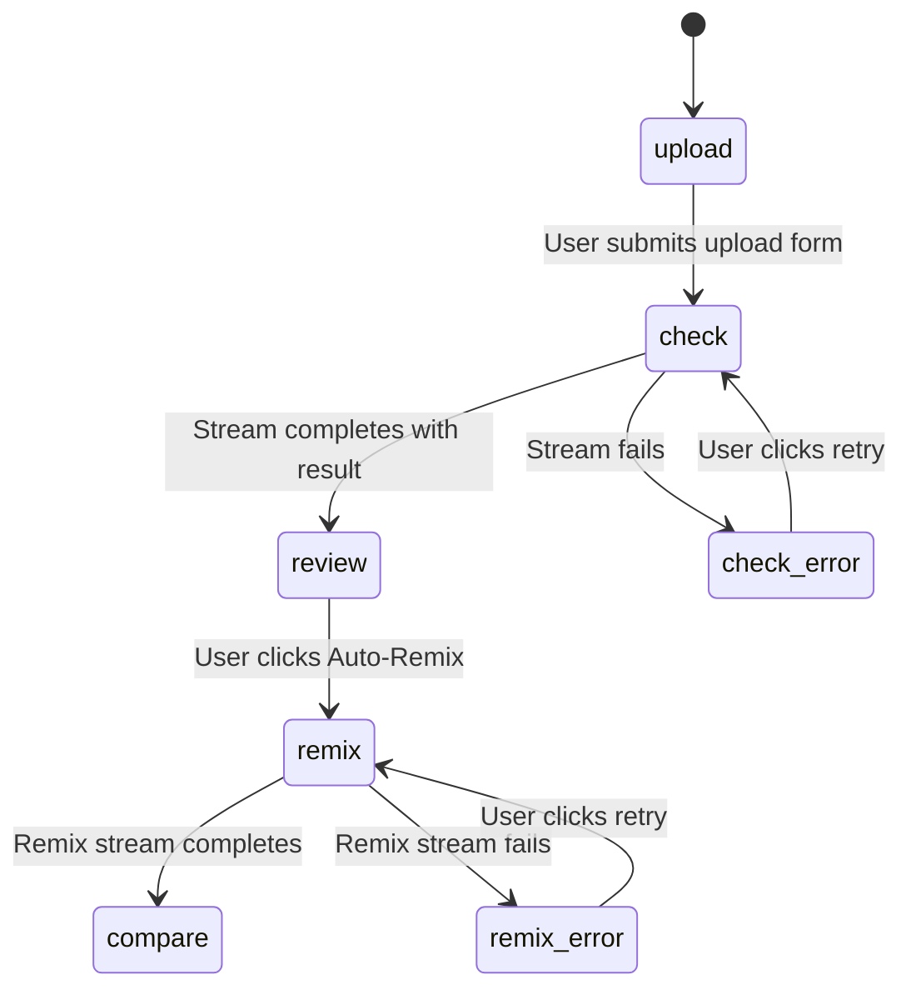

# Design Document: Compliance Workspace Redesign

## Overview

This design transforms the compliance page from a flat "upload → table → detail panel" layout into a step-based, project-centric workspace. Each compliance check becomes an independent **Project** that progresses through Upload → Check → Review → Remix → Compare steps. A persistent sidebar allows switching between projects, while the main content area displays the currently selected project at its current step.

**Key design decisions:**
- **State machine approach**: Each project's step progression is modeled as a finite state machine, making transitions explicit and testable.
- **Composition over replacement**: Existing hooks (`useComplianceCheck`, `useComplianceRemix`) and components (`UploadForm`, `PipelineStatusIndicator`, `ViolationClipPlayer`) are reused without modification.
- **Single source of truth**: All project state lives in a `useReducer`-managed store, replacing the current flat `QueueItem[]` array with a `Map<string, Project>` keyed by `check_id`.
- **Elimination of duplicate remix UI**: The current page has both a "Remix It" button in the main area and a "Fix issues with AI" button in the DetailPanel. The redesign consolidates these into a single `Auto_Remix_Action` in the Review step.

## Architecture

### High-Level Component Hierarchy

```
ComplianceWorkspace (page)
├── ProjectSidebar
│   └── ProjectSidebarItem (per project)
├── StepNavigator
└── StepContent (conditional render based on current step)
    ├── UploadStep → UploadForm (existing)
    ├── CheckStep → PipelineProgress (wraps PipelineStatusIndicator)
    ├── ReviewStep
    │   ├── ScoreDisplay
    │   ├── ViolationList → ViolationCard (extracted from DetailPanel)
    │   └── AutoRemixAction
    ├── RemixStep → PipelineProgress (reused for remix)
    └── CompareStep → ComparisonView
        ├── OriginalPanel
        └── RemixedPanel
```

### Data Flow Diagram

```mermaid
flowchart TD
    subgraph State["Client State (useReducer)"]
        PS[ProjectStore: Map of Projects]
        AP[activeProjectId: string]
    end

    subgraph Hooks["Existing Hooks (unchanged)"]
        UC[useComplianceCheck]
        UR[useComplianceRemix]
    end

    subgraph API["Backend API (unchanged)"]
        CC["POST /api/compliance/check (SSE)"]
        CR["POST /api/compliance/{id}/remix (SSE)"]
    end

    UF[UploadForm] -->|onSubmit| CW[ComplianceWorkspace]
    CW -->|dispatch CREATE_PROJECT| PS
    CW -->|submit()| UC
    UC -->|SSE stream| CC
    UC -->|nodeStatuses, result| CW
    CW -->|dispatch SET_RESULT| PS
    CW -->|dispatch ADVANCE_STEP| PS

    AR[AutoRemixAction] -->|onClick| CW
    CW -->|startRemix()| UR
    UR -->|SSE stream| CR
    UR -->|remixNodes, remixComplete| CW
    CW -->|dispatch SET_REMIX_RESULT| PS

    PS -->|current project| StepContent
    PS -->|all projects| Sidebar[ProjectSidebar]
    Sidebar -->|onSelect| CW
    CW -->|dispatch SET_ACTIVE_PROJECT| AP
```

### Step State Machine



## Components and Interfaces

### New Components (in `src/components/compliance/`)

| Component | File | Responsibility |
|-----------|------|----------------|
| `ComplianceWorkspace` | Replaces content in `pages/compliance.tsx` | Top-level orchestrator; manages project store, coordinates hooks |
| `ProjectSidebar` | `ProjectSidebar.tsx` | Lists all projects, handles selection, GSAP entrance animation |
| `ProjectSidebarItem` | Inside `ProjectSidebar.tsx` | Single project entry with name, icon, risk dot, step indicator |
| `StepNavigator` | `StepNavigator.tsx` | Horizontal stepper with 5 steps, keyboard nav, ARIA |
| `UploadStep` | `UploadStep.tsx` | Thin wrapper rendering `UploadForm` + error state |
| `CheckStep` | `CheckStep.tsx` | Shows `PipelineStatusIndicator` during streaming + error/retry |
| `ReviewStep` | `ReviewStep.tsx` | Score display, violation list, single Auto-Remix button |
| `RemixStep` | `RemixStep.tsx` | Shows remix pipeline progress + error/retry |
| `ComparisonView` | `ComparisonView.tsx` | Side-by-side original vs remixed with GSAP panel animations |

### Existing Components Reused (unchanged)

| Component | Usage in Redesign |
|-----------|-------------------|
| `UploadForm` | Rendered inside `UploadStep`; props `{ onSubmit, isSubmitting }` unchanged |
| `PipelineStatusIndicator` | Rendered inside `CheckStep` and `RemixStep` |
| `ViolationClipPlayer` | Rendered inside `ReviewStep` and `ComparisonView` for each violation |

### Components Removed

| Component | Reason |
|-----------|--------|
| `SummaryCards` | Replaced by project-level focused view; no multi-item aggregation |
| `ReviewQueueTable` | Replaced by `ProjectSidebar` + focused single-project steps |
| `DetailPanel` | Functionality split into `ReviewStep` (violations) and `ComparisonView` |

### Component Interface Definitions

```typescript
// StepNavigator
interface StepNavigatorProps {
  steps: readonly StepDefinition[];
  currentStep: WorkflowStep;
  completedSteps: WorkflowStep[];
  onStepClick: (step: WorkflowStep) => void;
}

// ProjectSidebar
interface ProjectSidebarProps {
  projects: Project[];
  activeProjectId: string | null;
  onSelectProject: (projectId: string) => void;
}

// UploadStep
interface UploadStepProps {
  onSubmit: (params: UploadParams) => void;
  isSubmitting: boolean;
  error: { message: string; retryable: boolean } | null;
  onRetry: () => void;
}

// CheckStep
interface CheckStepProps {
  nodeStatuses: NodeStatus[];
  currentNode: string | null;
  isStreaming: boolean;
  mediaType: string;
  error: { message: string; retryable: boolean } | null;
  onRetry: () => void;
}

// ReviewStep
interface ReviewStepProps {
  result: ComplianceResult;
  onStartRemix: () => void;
  isRemixAvailable: boolean;
}

// RemixStep
interface RemixStepProps {
  remixNodes: NodeStatus[];
  isRemixing: boolean;
  remixComplete: boolean;
  remixError: string | null;
  onRetry: () => void;
}

// ComparisonView
interface ComparisonViewProps {
  originalResult: ComplianceResult;
  remixResult: unknown | null;  // Shape from remix API (currently opaque)
}
```

## Data Models

### New Types (added to `src/types/compliance.ts`)

```typescript
/**
 * The five workflow steps for a compliance project.
 */
export type WorkflowStep = "upload" | "check" | "review" | "remix" | "compare";

/**
 * Step definition for the StepNavigator component.
 */
export interface StepDefinition {
  id: WorkflowStep;
  label: string;
  icon: string; // Material Symbols icon name
}

/**
 * A compliance project representing a single check lifecycle.
 * Replaces QueueItem as the primary state unit.
 */
export interface Project {
  id: string;                          // Unique check_id
  campaignName: string;                // Derived from filename or "Text Ad"
  mediaType: "video" | "image" | "audio" | "text";
  currentStep: WorkflowStep;
  completedSteps: WorkflowStep[];      // Steps that can be navigated back to
  uploadParams: UploadParams;          // Stored for retry
  result: ComplianceResult | null;     // Set after check completes
  remixResult: unknown | null;         // Set after remix completes
  error: ProjectError | null;          // Current error state (if any)
  createdAt: number;                   // Unix timestamp for ordering
}

/**
 * Error state scoped to a project and step.
 */
export interface ProjectError {
  step: WorkflowStep;
  message: string;
  retryable: boolean;
}

/**
 * Actions for the project store reducer.
 */
export type ProjectAction =
  | { type: "CREATE_PROJECT"; payload: Project }
  | { type: "SET_ACTIVE_PROJECT"; projectId: string }
  | { type: "ADVANCE_STEP"; projectId: string; to: WorkflowStep }
  | { type: "SET_RESULT"; projectId: string; result: ComplianceResult }
  | { type: "SET_REMIX_RESULT"; projectId: string; remixResult: unknown }
  | { type: "SET_ERROR"; projectId: string; error: ProjectError }
  | { type: "CLEAR_ERROR"; projectId: string }
  | { type: "NAVIGATE_TO_STEP"; projectId: string; step: WorkflowStep };

/**
 * The full project store state.
 */
export interface ProjectStore {
  projects: Map<string, Project>;
  activeProjectId: string | null;
}
```

### Step Definitions (constant)

```typescript
export const WORKFLOW_STEPS: readonly StepDefinition[] = [
  { id: "upload", label: "Upload", icon: "upload_file" },
  { id: "check", label: "Check", icon: "verified_user" },
  { id: "review", label: "Review", icon: "rate_review" },
  { id: "remix", label: "Remix", icon: "auto_fix_high" },
  { id: "compare", label: "Compare", icon: "compare" },
] as const;
```

### State Transition Rules

The project reducer enforces these rules:

| Action | Precondition | Effect |
|--------|--------------|--------|
| `CREATE_PROJECT` | — | Adds project with `currentStep="check"`, sets as active |
| `ADVANCE_STEP` | `to` is the next step in sequence | Sets `currentStep`, adds previous step to `completedSteps` |
| `SET_RESULT` | Project is on "check" step | Stores result, advances to "review" |
| `SET_REMIX_RESULT` | Project is on "remix" step | Stores remix result, advances to "compare" |
| `SET_ERROR` | — | Sets error on project |
| `NAVIGATE_TO_STEP` | `step` is in `completedSteps` | Sets `currentStep` without modifying `completedSteps` |

### Reducer Implementation Strategy

```typescript
function projectReducer(state: ProjectStore, action: ProjectAction): ProjectStore {
  switch (action.type) {
    case "CREATE_PROJECT": {
      const newProjects = new Map(state.projects);
      newProjects.set(action.payload.id, action.payload);
      return { projects: newProjects, activeProjectId: action.payload.id };
    }
    case "SET_ACTIVE_PROJECT":
      return { ...state, activeProjectId: action.projectId };
    case "ADVANCE_STEP": {
      const project = state.projects.get(action.projectId);
      if (!project) return state;
      const newProjects = new Map(state.projects);
      newProjects.set(action.projectId, {
        ...project,
        completedSteps: [...project.completedSteps, project.currentStep],
        currentStep: action.to,
        error: null,
      });
      return { ...state, projects: newProjects };
    }
    case "SET_RESULT": {
      const project = state.projects.get(action.projectId);
      if (!project) return state;
      const newProjects = new Map(state.projects);
      newProjects.set(action.projectId, {
        ...project,
        result: { ...action.result, violations: normalizeViolations(action.result) },
        completedSteps: [...project.completedSteps, "check"],
        currentStep: "review",
        error: null,
      });
      return { ...state, projects: newProjects };
    }
    case "SET_REMIX_RESULT": {
      const project = state.projects.get(action.projectId);
      if (!project) return state;
      const newProjects = new Map(state.projects);
      newProjects.set(action.projectId, {
        ...project,
        remixResult: action.remixResult,
        completedSteps: [...project.completedSteps, "remix"],
        currentStep: "compare",
        error: null,
      });
      return { ...state, projects: newProjects };
    }
    case "SET_ERROR": {
      const project = state.projects.get(action.projectId);
      if (!project) return state;
      const newProjects = new Map(state.projects);
      newProjects.set(action.projectId, { ...project, error: action.error });
      return { ...state, projects: newProjects };
    }
    case "CLEAR_ERROR": {
      const project = state.projects.get(action.projectId);
      if (!project) return state;
      const newProjects = new Map(state.projects);
      newProjects.set(action.projectId, { ...project, error: null });
      return { ...state, projects: newProjects };
    }
    case "NAVIGATE_TO_STEP": {
      const project = state.projects.get(action.projectId);
      if (!project || !project.completedSteps.includes(action.step)) return state;
      const newProjects = new Map(state.projects);
      newProjects.set(action.projectId, { ...project, currentStep: action.step });
      return { ...state, projects: newProjects };
    }
    default:
      return state;
  }
}
```

### Hook Reuse Strategy

The existing hooks are used as-is within the `ComplianceWorkspace` page component:

```typescript
// In ComplianceWorkspace (pages/compliance.tsx)
const complianceCheck = useComplianceCheck();
const remix = useComplianceRemix();

// Submit flow:
const handleSubmit = async (params: UploadParams) => {
  const id = generateId();
  dispatch({ type: "CREATE_PROJECT", payload: newProject });
  try {
    const result = await complianceCheck.submit(params);
    dispatch({ type: "SET_RESULT", projectId: id, result });
  } catch {
    dispatch({ type: "SET_ERROR", projectId: id, error: { step: "check", message: "...", retryable: true } });
  }
};

// Remix flow:
const handleStartRemix = async () => {
  const project = getActiveProject();
  if (!project?.result) return;
  dispatch({ type: "ADVANCE_STEP", projectId: project.id, to: "remix" });
  try {
    await remix.startRemix(project.result.check_id);
    dispatch({ type: "SET_REMIX_RESULT", projectId: project.id, remixResult: {} });
  } catch {
    dispatch({ type: "SET_ERROR", projectId: project.id, error: { step: "remix", message: "...", retryable: true } });
  }
};
```

## Correctness Properties

*A property is a characteristic or behavior that should hold true across all valid executions of a system — essentially, a formal statement about what the system should do. Properties serve as the bridge between human-readable specifications and machine-verifiable correctness guarantees.*

### Property 1: Project creation produces unique ID and correct initial state

*For any* valid `UploadParams`, when a project is created via the `CREATE_PROJECT` action, the resulting project SHALL have a unique `id`, `currentStep` set to `"check"`, an empty `completedSteps` array, the provided upload params stored, and `result` and `remixResult` both null.

**Validates: Requirements 1.1, 3.2**

### Property 2: Project data round-trip across navigation

*For any* set of projects in any step with any associated data (result, remixResult, error), navigating away to a different project and then navigating back SHALL preserve all project fields unchanged.

**Validates: Requirements 1.2, 1.3, 8.2**

### Property 3: Sidebar ordering and field display

*For any* list of projects with distinct `createdAt` timestamps, the Project_Sidebar SHALL render them in descending `createdAt` order, and each entry SHALL include the project's `campaignName`, a media type icon matching `mediaType`, and a risk level colored dot matching `riskLevel`.

**Validates: Requirements 1.4, 8.3**

### Property 4: Step state classification

*For any* project with `currentStep = S` and `completedSteps = C`, the Step_Navigator SHALL classify each step as: "completed" if the step is in `C`, "active" if the step equals `S`, and "unreached" otherwise.

**Validates: Requirements 2.2**

### Property 5: Step navigation rules

*For any* project and any step clicked in the Step_Navigator: if the step is in `completedSteps`, navigation SHALL occur (currentStep changes to clicked step); if the step is not in `completedSteps` and is not the current step, navigation SHALL NOT occur (state remains unchanged).

**Validates: Requirements 2.3, 2.4**

### Property 6: Auto-advancement on stream completion

*For any* project in the "check" step, when `SET_RESULT` is dispatched with a valid `ComplianceResult`, the project SHALL advance to `currentStep = "review"` with "check" added to `completedSteps`. Similarly, *for any* project in the "remix" step, when `SET_REMIX_RESULT` is dispatched, the project SHALL advance to `currentStep = "compare"` with "remix" added to `completedSteps`.

**Validates: Requirements 2.5, 2.6**

### Property 7: Pipeline node status display completeness

*For any* sequence of `NodeStatus` events received during streaming (whether compliance check or remix), the Pipeline_Progress component SHALL render every event with its `node` name, `status` indicator, and `description` text.

**Validates: Requirements 4.1, 6.4**

### Property 8: Retry re-submits original parameters

*For any* project that has encountered an error on the "check" step, clicking retry SHALL re-invoke `complianceCheck.submit()` with the exact same `UploadParams` that were originally stored in the project.

**Validates: Requirements 4.5**

### Property 9: Risk level to color mapping

*For any* `ComplianceResult` with `risk_level` of "High", "Medium", or "Low", the Review_View SHALL apply the color class: red/error for "High", amber for "Medium", and green/emerald for "Low".

**Validates: Requirements 5.2**

### Property 10: Violation rendering completeness

*For any* non-empty list of `Violation` objects in a `ComplianceResult`, the Review_View SHALL render each violation with its `category` as heading, `severity` as a badge, `type` as a label, `description` as body text, and a clip player when `clip_url` is non-null.

**Validates: Requirements 5.4**

### Property 11: Remix button presence

*For any* project on the "review" step: if `result.violations.length > 0`, exactly one Auto_Remix_Action button SHALL be rendered; if `result.violations.length === 0`, zero remix buttons SHALL be rendered.

**Validates: Requirements 6.1**

### Property 12: Sidebar visibility rules

*For any* workspace state: the Project_Sidebar SHALL be visible unless the active project is on the "upload" step AND the total project count is zero.

**Validates: Requirements 8.1**

### Property 13: Active project highlight exclusivity

*For any* list of projects with one `activeProjectId`, the Project_Sidebar SHALL apply highlight styling to exactly one entry (the active project) and no highlight to all other entries.

**Validates: Requirements 8.4**

### Property 14: Step_Navigator ARIA correctness

*For any* step configuration, the Step_Navigator SHALL set `aria-current="step"` on exactly the active step element, and `aria-disabled="true"` on all steps that are neither active nor in `completedSteps`.

**Validates: Requirements 10.2**

### Property 15: Project_Sidebar ARIA roles

*For any* project list with one selected project, the sidebar container SHALL have `role="listbox"`, each project entry SHALL have `role="option"`, and exactly one entry SHALL have `aria-selected="true"` (the active project).

**Validates: Requirements 10.4**

## Error Handling

### Error Scoping

Errors are scoped to individual projects and specific steps, preventing one failed check from affecting other projects:

```typescript
interface ProjectError {
  step: WorkflowStep;   // Which step the error occurred on
  message: string;      // User-facing error message
  retryable: boolean;   // Whether retry is available
}
```

### Error Scenarios and Recovery

| Scenario | Step | Recovery | User sees |
|----------|------|----------|-----------|
| Network failure on upload | check | Retry button re-submits stored `uploadParams` | Error banner with retry in CheckStep |
| HTTP 400 validation error | check | No retry (fix input) | Error message, navigate back to upload |
| HTTP 5xx server error | check | Retry button | Error banner with retry |
| Stream ends without result | check | Retry button | "Check incomplete" error with retry |
| Remix API failure | remix | Retry button re-calls `startRemix` | Error banner in RemixStep |
| AbortError (user navigates away) | any | Silent — no error shown | Previous view |

### Error Display Pattern

Each step component receives `error` and `onRetry` props. The error UI is consistent:

```tsx
{error && (
  <div className="p-4 bg-error-container rounded-xl flex items-center justify-between" role="alert">
    <div className="flex items-center gap-3">
      <span className="material-symbols-outlined text-on-error-container">error</span>
      <p className="text-on-error-container font-label-ui text-label-ui">{error.message}</p>
    </div>
    {error.retryable && (
      <Button onClick={onRetry} variant="default" size="sm">Retry</Button>
    )}
  </div>
)}
```

### Clearing Errors

Errors are automatically cleared when:
- A retry is initiated (optimistic clear)
- A step advances successfully
- The user navigates to a different step via `NAVIGATE_TO_STEP`

## Testing Strategy

### Unit Tests (Example-Based)

Unit tests cover specific scenarios and edge cases:

- **StepNavigator rendering**: Verify 5 steps in correct order (2.1)
- **Upload step error display**: Verify error message and retry button on network failure (3.3)
- **Check step loading indicator**: Verify loading state during streaming (4.2)
- **Review step success state**: Verify success message when violations empty (5.5)
- **Comparison_View layout**: Verify two-panel structure with correct aria-labels (7.1, 10.6)
- **No "Fix issues with AI" button**: Verify absence in all steps (6.2)
- **Remix error display**: Verify error message with retry (6.5)
- **GSAP animation configs**: Verify durations (0.3–0.5s), stagger (0.06–0.12s), and property targets (9.2, 9.3)
- **Keyboard navigation**: Tab/Enter/Space on StepNavigator, Tab/Arrow on Sidebar (10.1, 10.3)
- **aria-live region**: Verify updates announced on node status change (10.5)

### Property-Based Tests

Property tests verify universal correctness across all inputs using **fast-check** (TypeScript property-based testing library). Each property test runs a minimum of 100 iterations.

| Property | What's Generated | What's Verified |
|----------|-----------------|-----------------|
| Property 1 | Random `UploadParams` | Project has unique ID, step="check", empty completedSteps |
| Property 2 | Random project states, navigation sequences | All fields preserved after round-trip |
| Property 3 | Random projects with random timestamps | Descending order, all fields present |
| Property 4 | Random step index (0-4) | Correct classification of all steps |
| Property 5 | Random step + random click target | Navigation allowed/blocked correctly |
| Property 6 | Random `ComplianceResult` | Auto-advance occurs, completedSteps updated |
| Property 7 | Random `NodeStatus[]` sequences | All nodes rendered with status + description |
| Property 8 | Random `UploadParams` + error scenario | Same params passed to retry |
| Property 9 | Random risk level from {"High","Medium","Low"} | Correct color class applied |
| Property 10 | Random `Violation[]` (1-20 items) | All fields rendered per violation |
| Property 11 | Random `ComplianceResult` (0-N violations) | Button count matches violations > 0 |
| Property 12 | Random project count + random active step | Sidebar visible/hidden correctly |
| Property 13 | Random project list + random active ID | Exactly one highlighted |
| Property 14 | Random step configuration | Correct aria-current and aria-disabled |
| Property 15 | Random project list + selected ID | Correct role and aria-selected |

### Configuration

```typescript
// fast-check configuration
fc.assert(
  fc.property(arbUploadParams, (params) => {
    // Property assertion...
  }),
  { numRuns: 100 }
);
```

Each property test is tagged with a comment:
```typescript
// Feature: compliance-workspace-redesign, Property 1: Project creation produces unique ID and correct initial state
```

### Integration Tests

- **Full upload → review flow**: Submit real-ish params via mocked SSE, verify step progression
- **Remix flow end-to-end**: Start remix with mocked stream, verify compare view renders
- **Theme switching**: Toggle dark/light, verify no broken colors (11.3)

## GSAP Animation Plan

### Per-Component Animation Specs

| Component | Trigger | Animation | Duration | Properties |
|-----------|---------|-----------|----------|------------|
| `StepNavigator` | Step change | Active indicator slides to new position | 0.3s | `x`, `opacity` |
| `StepContent` | Step transition | Outgoing fades out, incoming fades in | 0.4s | `opacity`, `y` |
| `ReviewStep` violations | Mount / step enter | Staggered slide-up + fade | 0.35s, stagger 0.08s | `y`, `opacity` |
| `ReviewStep` score | Mount | Count-up from 0 | 1.5s | `textContent` (snap) |
| `ComparisonView` left panel | Mount | Slide in from left | 0.5s | `x`, `opacity` |
| `ComparisonView` right panel | Mount | Slide in from right | 0.5s | `x`, `opacity` |
| `ProjectSidebar` new item | Project created | Slide down + fade in | 0.3s | `y`, `opacity` |
| `ProjectSidebar` item select | Selection change | Background emphasis transition | 0.2s | `opacity` (via autoAlpha) |

### Animation Implementation Pattern

All animations follow the project's established pattern:

```tsx
import { useRef } from "react";
import { useGSAP } from "@gsap/react";
import gsap from "gsap";

gsap.registerPlugin(useGSAP);

function ReviewStep({ result }: ReviewStepProps) {
  const containerRef = useRef<HTMLDivElement>(null);

  useGSAP(() => {
    // Staggered violation card entrance
    gsap.from(".violation-card", {
      y: 20,
      opacity: 0,
      stagger: 0.08,
      duration: 0.35,
      ease: "power2.out",
    });
  }, { scope: containerRef });

  return <div ref={containerRef}>...</div>;
}
```

### Step Transition Animation

Content transitions between steps use a timeline for sequenced out/in:

```tsx
useGSAP(() => {
  const tl = gsap.timeline();
  tl.to(".step-content-outgoing", { opacity: 0, y: -10, duration: 0.2 })
    .from(".step-content-incoming", { opacity: 0, y: 20, duration: 0.4, ease: "power2.out" });
}, { scope: containerRef, dependencies: [currentStep] });
```

## Accessibility Implementation

### StepNavigator

```tsx
<nav aria-label="Compliance workflow steps">
  <ol role="list" className="flex items-center">
    {steps.map((step) => (
      <li key={step.id}>
        <button
          aria-current={step.id === currentStep ? "step" : undefined}
          aria-disabled={!completedSteps.includes(step.id) && step.id !== currentStep}
          onClick={() => handleStepClick(step.id)}
          tabIndex={completedSteps.includes(step.id) || step.id === currentStep ? 0 : -1}
        >
          {step.label}
        </button>
      </li>
    ))}
  </ol>
</nav>
```

### ProjectSidebar

```tsx
<aside aria-label="Compliance projects">
  <div role="listbox" aria-label="Project list">
    {projects.map((project) => (
      <div
        key={project.id}
        role="option"
        aria-selected={project.id === activeProjectId}
        tabIndex={0}
        onClick={() => onSelectProject(project.id)}
        onKeyDown={(e) => {
          if (e.key === "Enter" || e.key === " ") onSelectProject(project.id);
        }}
      >
        {/* Project entry content */}
      </div>
    ))}
  </div>
</aside>
```

### Pipeline Progress Live Region

```tsx
<div aria-live="polite" aria-atomic="false" className="sr-only">
  {latestNodeStatus && `${latestNodeStatus.description}: ${latestNodeStatus.status}`}
</div>
```

### Comparison View Labels

```tsx
<div className="grid grid-cols-2 gap-4">
  <section aria-label="Original content with violations">
    {/* Original panel */}
  </section>
  <section aria-label="Remixed compliant version">
    {/* Remixed panel */}
  </section>
</div>
```

## File Structure

```
frontend/src/
├── pages/
│   └── compliance.tsx              # Rewritten as ComplianceWorkspace orchestrator
├── components/compliance/
│   ├── UploadForm.tsx              # UNCHANGED — reused as-is
│   ├── PipelineStatusIndicator.tsx # UNCHANGED — reused in CheckStep + RemixStep
│   ├── ViolationClipPlayer.tsx     # UNCHANGED — reused in ReviewStep + ComparisonView
│   ├── StepNavigator.tsx           # NEW — horizontal stepper with ARIA
│   ├── ProjectSidebar.tsx          # NEW — project list with GSAP entrance
│   ├── UploadStep.tsx              # NEW — wraps UploadForm + error handling
│   ├── CheckStep.tsx               # NEW — pipeline progress + error/retry
│   ├── ReviewStep.tsx              # NEW — score, violations, single remix button
│   ├── RemixStep.tsx               # NEW — remix pipeline progress + error
│   └── ComparisonView.tsx          # NEW — side-by-side original vs remixed
├── types/
│   └── compliance.ts               # EXTENDED — new types added (Project, WorkflowStep, etc.)
├── hooks/
│   ├── useComplianceCheck.ts       # UNCHANGED
│   └── useComplianceRemix.ts       # UNCHANGED
└── services/
    └── complianceApi.ts            # UNCHANGED
```
