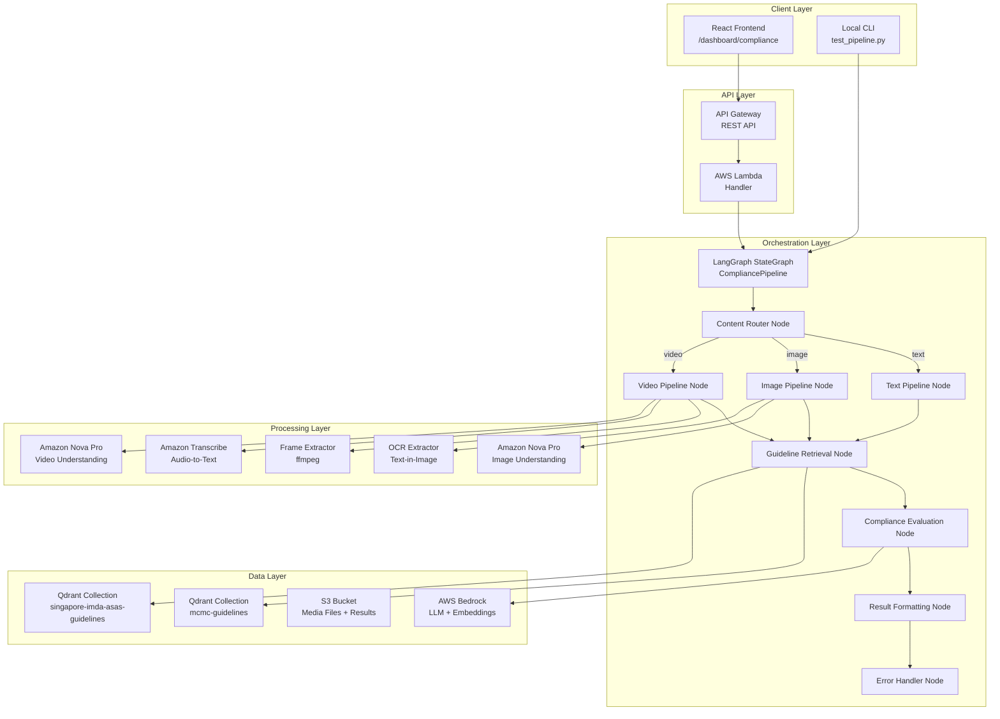
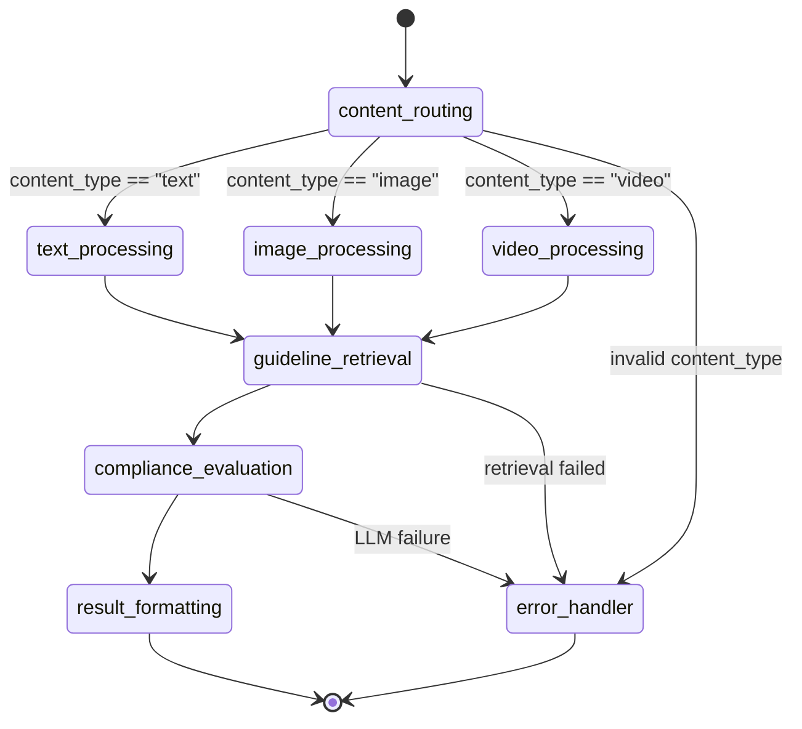
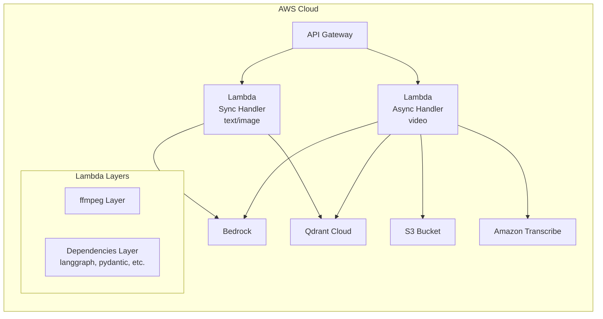

# Design Document: Content Compliance Pipeline

## Overview

This design extends the existing `culture_compliance` module into a production-grade, multi-modal content compliance system. The system evaluates text, images, and video advertisements against Malaysia (MCMC) and Singapore (IMDA/ASAS) regulatory guidelines using LLM-powered analysis with RAG retrieval.

Key architectural changes from the current implementation:
- **LangGraph orchestration** replaces the simple sequential `evaluate_content()` function with a directed graph supporting conditional routing, state management, and error recovery
- **True multi-modal processing** — images and video frames are analyzed directly via Amazon Nova Pro's native vision capabilities (not text descriptions), and videos undergo frame extraction + audio transcription
- **Dual-market support** — separate Qdrant collections for Malaysia and Singapore guidelines with market-specific scoring weights
- **AWS Lambda deployment** — stateless design with S3-based file handling for production, while retaining local CLI for development
- **Structured issue localization** — character offsets for text, bounding boxes for images, timestamps for video

The pipeline processes a single `ContentSubmission` per invocation and returns a `ComplianceResult` with risk scoring, localized issue indicators, and processing metadata.

## Architecture

### High-Level System Architecture



### LangGraph Pipeline Flow



### Deployment Architecture



## Components and Interfaces

### 1. Pipeline Orchestrator (`orchestrator.py`)

The central LangGraph graph definition. Constructs a `StateGraph` with typed state, conditional edges for content routing, and error handling.

```python
# Public interface
def create_pipeline() -> CompiledGraph:
    """Build and compile the LangGraph pipeline. Stateless — safe to call per-invocation."""

def run_pipeline(submission: ContentSubmission) -> ComplianceResult:
    """Execute the full pipeline for a single submission."""
```

### 2. Content Router (`nodes/router.py`)

Validates the `ContentSubmission` and determines which processing path to take.

```python
def content_routing(state: PipelineState) -> PipelineState:
    """Validate input and set routing decision in state."""
```

### 3. Text Pipeline (`nodes/text_pipeline.py`)

Passes text content directly to guideline retrieval and evaluation. Validates non-empty input.

```python
def text_processing(state: PipelineState) -> PipelineState:
    """Validate text content and prepare for evaluation."""
```

### 4. Image Pipeline (`nodes/image_pipeline.py`)

Sends image bytes to Amazon Nova Pro for visual understanding, runs OCR extraction, and combines results.

```python
def image_processing(state: PipelineState) -> PipelineState:
    """Extract visual understanding + OCR text from image file."""
```

**Dependencies:**
- `services/vision.py` — Amazon Nova Pro multimodal via Bedrock Converse API with image bytes
- `services/ocr.py` — Amazon Nova Pro with OCR-specific prompt (or Amazon Textract as fallback)

### 5. Video Pipeline (`nodes/video_pipeline.py`)

Extracts frames via ffmpeg, transcribes audio via Amazon Transcribe, analyzes frames with vision model.

```python
def video_processing(state: PipelineState) -> PipelineState:
    """Extract frames, transcribe audio, analyze visual content."""
```

**Dependencies:**
- `services/frame_extractor.py` — ffmpeg subprocess for frame sampling
- `services/transcriber.py` — Amazon Transcribe batch job
- `services/vision.py` — Frame-by-frame analysis via Amazon Nova Pro

### 6. Guideline Retrieval (`nodes/guideline_retrieval.py`)

Retrieves market-specific guidelines from the appropriate Qdrant collection.

```python
def guideline_retrieval(state: PipelineState) -> PipelineState:
    """Retrieve top-K guidelines from the market-specific Qdrant collection."""
```

### 7. Compliance Evaluation (`nodes/compliance_evaluation.py`)

Invokes the LLM with content + guidelines to produce the scored compliance result.

```python
def compliance_evaluation(state: PipelineState) -> PipelineState:
    """Invoke LLM for compliance scoring with localized issue detection."""
```

### 8. Result Formatter (`nodes/result_formatting.py`)

Validates and structures the final `ComplianceResult` from LLM output.

```python
def result_formatting(state: PipelineState) -> PipelineState:
    """Parse LLM output into validated ComplianceResult."""
```

### 9. Error Handler (`nodes/error_handler.py`)

Captures failures and produces partial results with warnings.

```python
def error_handler(state: PipelineState) -> PipelineState:
    """Build partial ComplianceResult with error context."""
```

### 10. Lambda Handler (`handler.py`)

AWS Lambda entry point. Parses API Gateway events, invokes the pipeline, returns JSON response.

```python
def lambda_handler(event: dict, context: Any) -> dict:
    """API Gateway Lambda proxy handler."""
```

### 11. CLI Runner (`cli.py`)

Local development entry point matching the Lambda interface.

```python
def main() -> None:
    """CLI for local pipeline testing with file paths."""
```

### 12. Guideline Ingestion (`ingest.py` — extended)

Extended to support multi-market ingestion with collection routing.

```python
def ingest_guidelines(csv_path: Path, market: str, recreate: bool = False) -> int:
    """Ingest guidelines CSV into the market-specific Qdrant collection."""
```

## Data Models

### Input Models

```python
from pydantic import BaseModel, Field, field_validator
from typing import Literal, Optional
from enum import Enum

class ContentType(str, Enum):
    TEXT = "text"
    IMAGE = "image"
    VIDEO = "video"

class Market(str, Enum):
    MALAYSIA = "malaysia"
    SINGAPORE = "singapore"

class ContentSubmission(BaseModel):
    """Input to the compliance pipeline."""
    content: str = Field(
        ...,
        description="Text content, base64-encoded image, or S3 URI for video"
    )
    content_type: ContentType
    market: Market = Market.MALAYSIA
    
    # Optional overrides
    frame_interval_seconds: float = Field(
        default=1.0, ge=0.5, le=5.0,
        description="Frame sampling interval for video (seconds)"
    )

    @field_validator("content")
    @classmethod
    def content_not_empty(cls, v: str) -> str:
        if not v or not v.strip():
            raise ValueError("Content must not be empty or whitespace-only")
        return v
```

### Pipeline State Model

```python
from typing import Any, Optional
from pydantic import BaseModel, Field

class PipelineState(BaseModel):
    """LangGraph state object passed between nodes."""
    # Input
    submission: ContentSubmission
    
    # Routing
    content_type: ContentType
    market: Market
    
    # Processing intermediates
    extracted_text: Optional[str] = None          # OCR / transcript text
    visual_description: Optional[str] = None      # Vision model output
    unified_content: Optional[str] = None         # Combined content for evaluation
    frame_descriptions: Optional[list[dict]] = None  # Per-frame analysis
    transcript_segments: Optional[list[dict]] = None  # Timestamped transcript
    
    # Guidelines
    retrieved_guidelines: Optional[str] = None
    guideline_collection: Optional[str] = None
    
    # Evaluation
    raw_llm_output: Optional[dict] = None
    
    # Result
    compliance_result: Optional[dict] = None
    
    # Error tracking
    errors: list[dict] = Field(default_factory=list)
    warnings: list[dict] = Field(default_factory=list)
    
    # Metadata
    pipeline_start_ms: Optional[int] = None
    models_used: list[str] = Field(default_factory=list)
```

### Output Models

```python
from pydantic import BaseModel, Field, field_validator
from typing import Literal, Optional

class TextIssueLocation(BaseModel):
    """Localization for text content issues."""
    phrase: str = Field(..., max_length=200, description="Verbatim problematic substring")
    char_offset: int = Field(..., ge=0, description="0-based character offset in original text")
    category: Literal[
        "Religious Sensitivity", "Ethnic/Racial", "Sexual/Explicit",
        "Political/State", "LGBTQ", "Profanity"
    ]
    severity: Literal["Severe", "Moderate", "Minor"]

class ImageIssueLocation(BaseModel):
    """Localization for image content issues."""
    bounding_box: dict = Field(
        ...,
        description="x, y, width, height as percentage (0-100) of image dimensions"
    )
    description: str = Field(..., max_length=200)
    category: Literal[
        "Religious Sensitivity", "Ethnic/Racial", "Sexual/Explicit",
        "Political/State", "LGBTQ", "Profanity"
    ]
    severity: Literal["Severe", "Moderate", "Minor"]

    @field_validator("bounding_box")
    @classmethod
    def validate_bbox(cls, v: dict) -> dict:
        required = {"x", "y", "width", "height"}
        if not required.issubset(v.keys()):
            raise ValueError(f"Bounding box must contain: {required}")
        for key in required:
            if not (0 <= v[key] <= 100):
                raise ValueError(f"{key} must be between 0 and 100")
        return v

class VideoIssueLocation(BaseModel):
    """Localization for video content issues."""
    timestamp: str = Field(..., description="Format: MM:SS or HH:MM:SS")
    description: str = Field(..., max_length=200)
    category: Literal[
        "Religious Sensitivity", "Ethnic/Racial", "Sexual/Explicit",
        "Political/State", "LGBTQ", "Profanity"
    ]
    severity: Literal["Severe", "Moderate", "Minor"]

class ProcessingMetadata(BaseModel):
    """Metadata about pipeline execution."""
    pipeline_duration_ms: int
    models_used: list[str]
    market: str

class PipelineWarning(BaseModel):
    """Warning about partial pipeline failure."""
    step_name: str
    description: str
    result_may_be_incomplete: bool

class ComplianceResult(BaseModel):
    """Final output of the compliance pipeline."""
    content_type: ContentType
    market: Market
    risk_level: Literal["High", "Medium", "Low"]
    score: int = Field(..., ge=0, le=100)
    high_risk_indicators: list[
        TextIssueLocation | ImageIssueLocation | VideoIssueLocation
    ] = Field(default_factory=list, max_length=10)
    explanation: str = Field(..., max_length=500)
    suggestion: str = Field(..., max_length=400)
    processing_metadata: ProcessingMetadata
    warnings: list[PipelineWarning] = Field(default_factory=list)

    @field_validator("score")
    @classmethod
    def validate_score_risk_consistency(cls, v: int, info) -> int:
        # Validation happens at model level via model_validator
        return v
```

### Scoring Configuration

```python
class ScoringCategory(BaseModel):
    """A single scoring category with weight."""
    name: str
    weight: int

MALAYSIA_SCORING = [
    ScoringCategory(name="Religious Sensitivity", weight=30),
    ScoringCategory(name="Ethnic/Racial", weight=20),
    ScoringCategory(name="Sexual/Explicit", weight=15),
    ScoringCategory(name="Political/State", weight=15),
    ScoringCategory(name="LGBTQ", weight=10),
    ScoringCategory(name="Profanity", weight=10),
]

SINGAPORE_SCORING = [
    ScoringCategory(name="Racial/Religious Harmony", weight=30),
    ScoringCategory(name="Public Morals", weight=20),
    ScoringCategory(name="National Interest", weight=15),
    ScoringCategory(name="Consumer Protection", weight=15),
    ScoringCategory(name="Decency", weight=10),
    ScoringCategory(name="Social Responsibility", weight=10),
]

SEVERITY_MULTIPLIERS = {
    "none": 0.0,
    "Minor": 0.25,
    "Moderate": 0.6,
    "Severe": 1.0,
}
```

### Qdrant Collection Configuration

```python
COLLECTION_CONFIG = {
    Market.MALAYSIA: {
        "collection_name": "mcmc-guidelines",
        "source_authority": "MCMC",
    },
    Market.SINGAPORE: {
        "collection_name": "singapore-imda-asas-guidelines",
        "source_authority": "IMDA/ASAS",
    },
}
```


## Correctness Properties

*A property is a characteristic or behavior that should hold true across all valid executions of a system — essentially, a formal statement about what the system should do. Properties serve as the bridge between human-readable specifications and machine-verifiable correctness guarantees.*

### Property 1: Content Type Routing Preserves Type

*For any* valid `ContentSubmission` with `content_type` in {"text", "image", "video"}, the pipeline routing node SHALL select the corresponding pipeline path and the final `ComplianceResult.content_type` SHALL equal the input `content_type`.

**Validates: Requirements 1.1, 1.2, 1.3, 7.5**

### Property 2: Invalid Content Type Rejection

*For any* string value that is not exactly one of "text", "image", or "video" (including case variants like "Text", "IMAGE", empty strings, and arbitrary strings), the content router SHALL reject the submission with an error response listing the supported types.

**Validates: Requirements 1.4, 1.6**

### Property 3: Scoring Formula Correctness

*For any* set of (category, severity) violation pairs drawn from the valid categories and severity levels, the compliance score SHALL equal `max(0, round(100 - sum(weight × multiplier)))` where weight is the category weight and multiplier is the severity multiplier (None=0, Minor=0.25, Moderate=0.6, Severe=1.0).

**Validates: Requirements 2.3, 5.5**

### Property 4: Score-to-Risk-Level Mapping

*For any* integer score in the range [0, 100], the risk level mapping SHALL produce "Low" when score >= 75, "Medium" when 40 <= score < 75, and "High" when score < 40. The three ranges SHALL be exhaustive and mutually exclusive.

**Validates: Requirements 2.4**

### Property 5: Whitespace Text Rejection

*For any* string composed entirely of whitespace characters (spaces, tabs, newlines, or empty string), the text pipeline SHALL reject the input with a validation error, and no compliance evaluation SHALL be performed.

**Validates: Requirements 2.5**

### Property 6: Image File Validation

*For any* image file metadata (format, size_bytes, width, height), the image pipeline SHALL accept the file if and only if: format is in {JPEG, PNG, WebP} AND size_bytes <= 5,242,880 AND width >= 50 AND height >= 50. All other combinations SHALL be rejected with an appropriate error message.

**Validates: Requirements 3.5, 3.6, 3.7**

### Property 7: Image Content Combination Completeness

*For any* non-empty visual description string and non-empty OCR text string, the unified content description produced by the image pipeline SHALL contain both the visual description content and the OCR text content as substrings (order-independent).

**Validates: Requirements 3.3**

### Property 8: Video Frame Count Calculation

*For any* video duration (in seconds) and frame interval (between 0.5 and 5.0 seconds), the frame extractor SHALL produce exactly `ceil(duration / interval)` frames, each associated with a timestamp that is a multiple of the interval starting from 0.

**Validates: Requirements 4.1**

### Property 9: Chronological Merge Ordering

*For any* set of timestamped frame descriptions and transcript segments, the unified content description produced by the video pipeline SHALL order all entries by timestamp in non-decreasing order.

**Validates: Requirements 4.4**

### Property 10: Video File Validation

*For any* video file metadata (format, size_bytes, duration_seconds), the video pipeline SHALL accept the file if and only if: format is in {MP4, MOV, WebM} AND size_bytes <= 104,857,600 AND duration_seconds <= 300. All other combinations SHALL be rejected with an appropriate error message.

**Validates: Requirements 4.6, 4.7**

### Property 11: Market Routing Correctness

*For any* case variant of "malaysia" (e.g., "Malaysia", "MALAYSIA", "mAlAySiA"), the pipeline SHALL select the "mcmc-guidelines" collection. *For any* case variant of "singapore", the pipeline SHALL select the "singapore-imda-asas-guidelines" collection.

**Validates: Requirements 5.1, 5.2**

### Property 12: Market Scoring Configuration

*For any* valid market value, the scoring configuration returned SHALL contain exactly 6 categories whose weights sum to 100, matching the defined weights for that market (Malaysia: Religious Sensitivity 30, Ethnic/Racial 20, Sexual/Explicit 15, Political/State 15, LGBTQ 10, Profanity 10; Singapore: Racial/Religious Harmony 30, Public Morals 20, National Interest 15, Consumer Protection 15, Decency 10, Social Responsibility 10).

**Validates: Requirements 5.5**

### Property 13: Invalid Market Rejection

*For any* string that does not match "malaysia" or "singapore" (case-insensitive), the pipeline SHALL reject the submission with an error indicating the supported markets.

**Validates: Requirements 5.6**

### Property 14: Error State Capture Completeness

*For any* pipeline node failure (given a node name, error type, and error description), the error handler SHALL produce a state containing all three error details and a warnings array entry identifying the failed step, the failure description, and whether the result may be incomplete.

**Validates: Requirements 7.3, 10.6**

### Property 15: ComplianceResult Schema Validity

*For any* valid combination of field values (content_type in valid set, market in valid set, risk_level in {"High", "Medium", "Low"}, score in [0,100], high_risk_indicators array of ≤10 items with correct location type per content_type, explanation ≤500 chars, suggestion ≤400 chars, processing_metadata with all required fields), constructing a `ComplianceResult` SHALL succeed and all fields SHALL be accessible with their original values.

**Validates: Requirements 10.1, 10.2, 10.3, 10.4, 10.5**

### Property 16: Serialization Round-Trip Identity

*For any* valid `ComplianceResult` object (including those with non-ASCII characters in explanation, suggestion, and indicator fields), serializing to JSON and deserializing back SHALL produce an object where every field value is equal in type and content to the original.

**Validates: Requirements 11.1, 11.2, 11.3**

### Property 17: Deserialization Error Detection

*For any* JSON payload that violates the `ComplianceResult` schema (missing required fields, score outside [0,100], unrecognized risk_level or content_type, or syntactically invalid JSON), deserialization SHALL fail with a validation error that identifies the specific violation.

**Validates: Requirements 11.4, 11.5, 11.6**

### Property 18: Payload Size Rejection

*For any* JSON payload whose UTF-8 encoded byte length exceeds 1,048,576 bytes (1 MB), the pipeline SHALL reject it with an error indicating the maximum allowed size, regardless of whether the content is otherwise valid.

**Validates: Requirements 11.7**

## Error Handling

### Error Categories

| Category | Example | Handling Strategy |
|----------|---------|-------------------|
| **Validation Error** | Empty content, invalid format, unsupported type | Immediate rejection with descriptive error, no pipeline execution |
| **Service Unavailable** | Qdrant down, Bedrock throttled | Retry up to 2× with exponential backoff, then error node |
| **Partial Failure** | Vision model fails but OCR succeeds | Continue with available data, add warning to result |
| **Timeout** | Video processing exceeds 120s | Return partial result with "Unknown" risk and -1 score |
| **Parse Error** | LLM returns non-JSON | Route to error handler, return error indicating evaluation failed |

### Error Response Schema

```python
class PipelineError(BaseModel):
    """Error response when pipeline cannot produce a result."""
    error_type: Literal["validation", "service_unavailable", "timeout", "parse_error"]
    message: str
    details: Optional[dict] = None  # e.g., {"missing_fields": ["content_type"]}
```

### Retry Strategy

```python
RETRY_CONFIG = {
    "max_retries": 2,
    "base_delay_seconds": 1.0,
    "backoff_multiplier": 2.0,
    "retryable_errors": [
        "ThrottlingException",
        "ServiceUnavailableException", 
        "ConnectionError",
        "TimeoutError",
    ],
}
```

### Graceful Degradation Matrix

| Component Failed | Fallback Behavior |
|-----------------|-------------------|
| Vision Model (image) | Use OCR text only + warning |
| OCR Extractor (image) | Use vision description only + warning |
| Video Understanding Model | Fall back to frame-by-frame analysis using Nova Pro vision |
| Audio Transcriber (video) | Visual-only analysis + warning |
| Guideline Store | Error — cannot evaluate without guidelines |
| LLM (evaluation) | Error — cannot produce compliance score |

## Testing Strategy

### Property-Based Testing

**Library:** [Hypothesis](https://hypothesis.readthedocs.io/) (Python PBT framework)

**Configuration:**
- Minimum 100 examples per property test
- Deadline: 5000ms per example (to account for Pydantic validation overhead)
- Database: store failing examples for regression

**Tag format:** Each test is tagged with:
```python
# Feature: content-compliance, Property {N}: {property_text}
```

**Properties to implement:**
- Properties 1–18 as defined in the Correctness Properties section
- Each property maps to a single `@given(...)` test function
- Generators produce random `ContentSubmission`, `ComplianceResult`, scoring inputs, file metadata, etc.

### Unit Tests (Example-Based)

| Test Area | Examples |
|-----------|----------|
| Default market fallback | Submit without market → Malaysia used |
| Clean content result | Known-clean text → score 100, risk "Low" |
| Vision model fallback | Mock vision failure → OCR-only result with warning |
| OCR fallback | Mock OCR failure → vision-only result with warning |
| Transcriber fallback | Mock transcriber failure → visual-only + warning |
| Video model fallback | Mock video model failure → frame-by-frame vision |
| No audio track | Video without audio → skip transcription |
| Retry on throttle | Mock transient error → verify 2 retries with backoff |
| Guideline store failure | Mock Qdrant error → pipeline error response |
| LLM parse failure | Mock garbage LLM output → pipeline error response |

### Integration Tests

| Test Area | Scope |
|-----------|-------|
| Full text pipeline | Real Bedrock + Qdrant, sample text → valid ComplianceResult |
| Full image pipeline | Real Bedrock Nova Pro vision + Qdrant, sample JPEG → valid ComplianceResult |
| Full video pipeline | Real Bedrock + Transcribe + Qdrant, sample MP4 → valid ComplianceResult |
| Lambda handler | Simulated API Gateway event → correct response format |
| CLI runner | CLI invocation with sample inputs → stdout output |
| Guideline ingestion | Ingest CSV → verify Qdrant collection populated |
| Multi-market | Same content, both markets → different scoring categories applied |

### Test Infrastructure

```
backend/culture_compliance/
├── tests/
│   ├── conftest.py              # Shared fixtures, Hypothesis profiles
│   ├── test_properties.py       # All 18 property-based tests
│   ├── test_router.py           # Unit tests for routing logic
│   ├── test_scoring.py          # Unit tests for scoring functions
│   ├── test_validation.py       # Unit tests for input validation
│   ├── test_serialization.py    # Unit tests for JSON round-trip
│   ├── test_image_pipeline.py   # Unit + integration for image processing
│   ├── test_video_pipeline.py   # Unit + integration for video processing
│   ├── test_orchestrator.py     # LangGraph graph structure tests
│   ├── test_lambda_handler.py   # Lambda handler tests
│   └── integration/
│       ├── test_full_pipeline.py    # End-to-end with real services
│       └── test_ingestion.py        # Guideline ingestion tests
├── generators/
│   ├── __init__.py
│   ├── submissions.py           # Hypothesis strategies for ContentSubmission
│   ├── results.py               # Hypothesis strategies for ComplianceResult
│   └── file_metadata.py         # Hypothesis strategies for file validation
```

### Running Tests

```bash
# Property tests only (fast, no external services)
pytest tests/test_properties.py -v --hypothesis-show-statistics

# Unit tests (mocked external services)
pytest tests/ -v --ignore=tests/integration

# Integration tests (requires AWS credentials + Qdrant)
pytest tests/integration/ -v --timeout=120

# All tests
pytest tests/ -v
```
