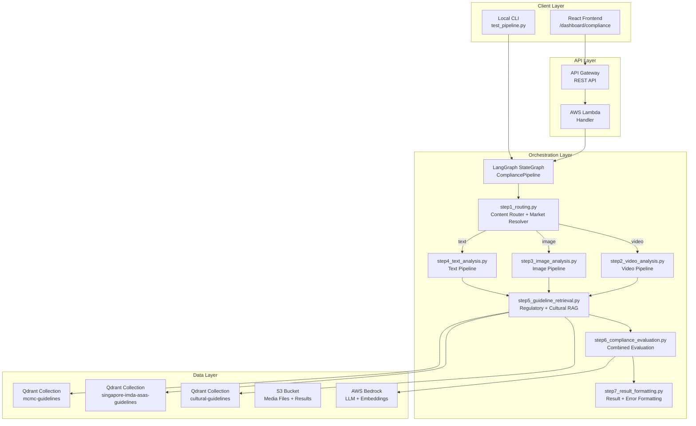
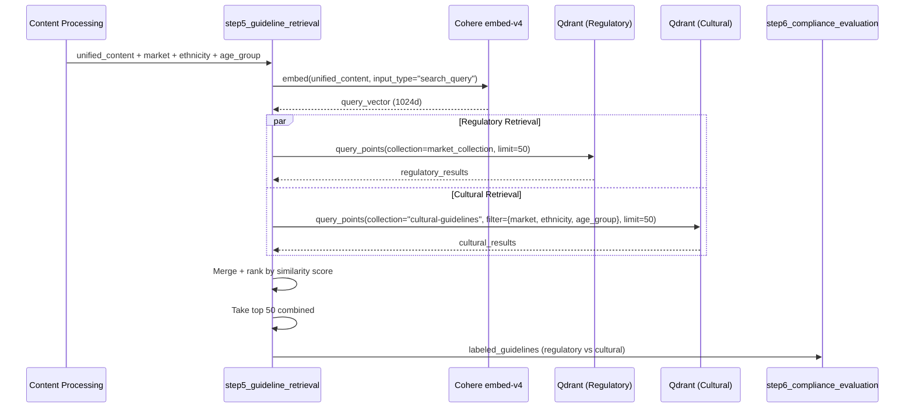
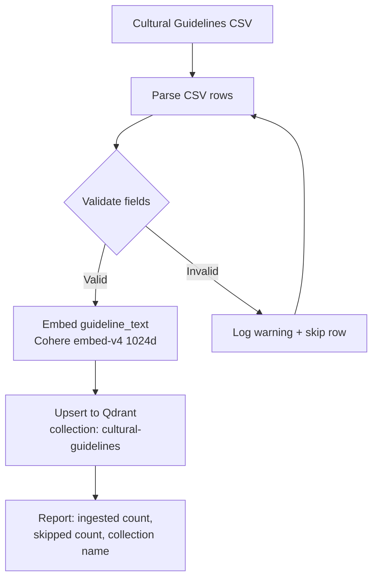
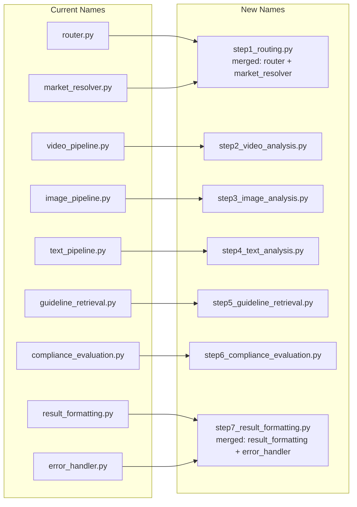

# Design Document: Cultural Guidelines V2

## Overview

This design extends the existing content compliance pipeline with a cultural guideline layer that evaluates advertising content against ethnic-specific cultural norms beyond regulatory requirements. The current system only evaluates against MCMC (Malaysia) and IMDA/ASAS (Singapore) regulatory guidelines. This enhancement adds:

- **Cultural Guideline Data Model** — A structured `GuidelineEntry` with market, ethnicity, age_group, category, severity, and guideline_text fields stored in a dedicated Qdrant collection
- **Ethnic-Specific Guidelines** — Curated cultural rules for Malay, Chinese, and Indian audiences covering body exposure, suggestive content, religious sensitivity, food taboos, and more
- **Expanded RAG Retrieval** — Increasing from top 5 to top 50 guidelines with combined regulatory + cultural retrieval
- **Ethnicity-Aware Filtering** — Qdrant payload filtering by target ethnicity and age group during vector search
- **Cultural Guideline Ingestion** — CSV-based ingestion with validation, embedding via Cohere embed-v4, and storage in a dedicated `cultural-guidelines` collection
- **Pipeline File Renaming** — Step-number prefixed file names for clarity (step1_routing.py, step2_video_analysis.py, etc.)
- **Combined Evaluation** — Unified regulatory + cultural evaluation with labeled guideline sources and severity-ranked violations

Key design decisions:
- Cultural guidelines live in a **separate Qdrant collection** (`cultural-guidelines`) from regulatory guidelines, enabling independent management while supporting combined retrieval
- Ethnicity and age group filtering use **Qdrant payload filters** combined with vector similarity search, avoiding post-retrieval filtering that would waste the top-K budget
- The existing scoring formula is reused — cultural violations are scored identically to regulatory violations using category weights and severity multipliers
- Pipeline files are renamed with step-number prefixes to make execution order explicit from file names alone

## Architecture

### Updated System Architecture



### Cultural Guideline Retrieval Flow



### Cultural Guideline Ingestion Flow



### Pipeline File Renaming Map



## Components and Interfaces

### 1. Cultural Guideline Data Model (`models/cultural_schemas.py`)

New Pydantic models for cultural guideline entries and ingestion.

```python
from enum import Enum
from pydantic import BaseModel, Field, field_validator

class Ethnicity(str, Enum):
    MALAY = "malay"
    CHINESE = "chinese"
    INDIAN = "indian"
    ALL = "all"

class AgeGroup(str, Enum):
    ALL_AGES = "all_ages"
    ADULTS_ONLY = "adults_only"
    CHILDREN = "children"

class CulturalCategory(str, Enum):
    BODY_EXPOSURE = "body_exposure"
    SUGGESTIVE_CONTENT = "suggestive_content"
    RELIGIOUS_SENSITIVITY = "religious_sensitivity"
    FOOD_TABOOS = "food_taboos"
    SUPERSTITIONS = "superstitions"
    COLOR_SYMBOLISM = "color_symbolism"
    NUMBER_SYMBOLISM = "number_symbolism"
    GENDER_NORMS = "gender_norms"
    ANCESTRAL_RESPECT = "ancestral_respect"
    CASTE_SENSITIVITY = "caste_sensitivity"
    MODESTY = "modesty"
    HALAL_COMPLIANCE = "halal_compliance"

class Severity(str, Enum):
    HIGH = "high"
    MEDIUM = "medium"
    LOW = "low"

class GuidelineEntry(BaseModel):
    """A single cultural guideline record with structured metadata."""
    market: str = Field(..., pattern="^(malaysia|singapore)$")
    ethnicity: str = Field(..., pattern="^(malay|chinese|indian|all)$")
    age_group: str = Field(..., pattern="^(all_ages|adults_only|children)$")
    category: str
    severity: str = Field(..., pattern="^(high|medium|low)$")
    guideline_text: str = Field(..., max_length=500)

    @field_validator("category")
    @classmethod
    def validate_category(cls, v: str) -> str:
        valid = {e.value for e in CulturalCategory}
        if v not in valid:
            raise ValueError(f"Invalid category '{v}'. Must be one of: {sorted(valid)}")
        return v
```

### 2. Extended Content Submission (`models/schemas.py` — updated)

Add `target_ethnicity` and `target_age_group` fields to `ContentSubmission`.

```python
class ContentSubmission(BaseModel):
    # ... existing fields ...
    target_ethnicity: str = Field(
        default="all",
        pattern="^(malay|chinese|indian|all)$",
        description="Target ethnic audience for cultural guideline filtering"
    )
    target_age_group: str = Field(
        default="all_ages",
        pattern="^(all_ages|adults_only|children)$",
        description="Target age group for cultural guideline filtering"
    )
```

### 3. Cultural Guideline Ingestion (`ingest_cultural.py`)

New ingestion module dedicated to cultural guidelines CSV processing.

```python
def ingest_cultural_guidelines(csv_path: Path, recreate: bool = False) -> dict:
    """Ingest cultural guidelines CSV into the 'cultural-guidelines' Qdrant collection.
    
    Returns:
        dict with keys: total_ingested, rows_skipped, collection_name, errors
    """

def validate_guideline_row(row: dict, row_number: int) -> tuple[bool, Optional[str]]:
    """Validate a single CSV row against GuidelineEntry schema.
    
    Returns:
        (is_valid, error_message_or_none)
    """
```

### 4. Updated Guideline Retrieval (`nodes/step5_guideline_retrieval.py`)

Extended to query both regulatory and cultural collections with ethnicity/age filtering.

```python
def guideline_retrieval(state: PipelineState) -> PipelineState:
    """Retrieve top-50 guidelines from regulatory + cultural collections.
    
    Queries:
    1. Regulatory collection (market-specific) — no payload filter
    2. Cultural collection — filtered by market, ethnicity, age_group
    
    Merges results by similarity score, takes top 50, labels each as
    'regulatory' or 'cultural' for the evaluation prompt.
    """
```

### 5. Updated Compliance Evaluation (`nodes/step6_compliance_evaluation.py`)

Extended prompt to distinguish regulatory vs cultural guidelines and label violations.

```python
def compliance_evaluation(state: PipelineState) -> PipelineState:
    """Evaluate content against both regulatory and cultural guidelines.
    
    The evaluation prompt clearly labels which guidelines are regulatory
    and which are cultural. Violations are tagged with their source type.
    """
```

### 6. Step 1: Routing (`nodes/step1_routing.py`)

Merges current `router.py` and `market_resolver.py` into a single routing step.

```python
def content_routing(state: PipelineState) -> PipelineState:
    """Validate input, resolve market, set routing decision and collection names."""
```

### 7. Step 7: Result Formatting (`nodes/step7_result_formatting.py`)

Merges current `result_formatting.py` and `error_handler.py`.

```python
def result_formatting(state: PipelineState) -> PipelineState:
    """Format final ComplianceResult or error response.
    
    Handles both successful evaluation formatting and error state capture.
    """
```

### 8. Updated Config (`config.py`)

```python
# Updated default
QDRANT_TOP_K = int(os.environ.get("QDRANT_TOP_K", "50"))

# New cultural collection config
CULTURAL_COLLECTION_NAME = os.environ.get(
    "CULTURAL_COLLECTION_NAME", "cultural-guidelines"
)
```

## Data Models

### Cultural Guideline Entry (Qdrant Point Schema)

Each cultural guideline is stored as a Qdrant point with:

| Field | Type | Storage | Description |
|-------|------|---------|-------------|
| id | UUID | Point ID | Auto-generated unique identifier |
| vector | float[1024] | Vector | Cohere embed-v4 embedding of guideline_text |
| market | string | Payload | "malaysia" or "singapore" |
| ethnicity | string | Payload | "malay", "chinese", "indian", or "all" |
| age_group | string | Payload | "all_ages", "adults_only", or "children" |
| category | string | Payload | Cultural category enum value |
| severity | string | Payload | "high", "medium", or "low" |
| guideline_text | string | Payload | The guideline rule text (max 500 chars) |
| source | string | Payload | Source CSV filename |

### Cultural Guidelines CSV Format

```csv
market,ethnicity,age_group,category,severity,guideline_text
malaysia,malay,all_ages,body_exposure,high,"Female hair (aurat) must not be shown uncovered in advertisements targeting Malay audiences"
malaysia,malay,all_ages,suggestive_content,high,"Physical contact between unrelated males and females must not be depicted in advertisements"
malaysia,chinese,all_ages,number_symbolism,medium,"The number 4 (associated with death) should be avoided in pricing and product quantities"
```

### Extended PipelineState

```python
class PipelineState(BaseModel):
    # ... existing fields ...
    
    # Cultural guideline additions
    target_ethnicity: str = "all"
    target_age_group: str = "all_ages"
    regulatory_guidelines: Optional[str] = None   # Labeled regulatory results
    cultural_guidelines: Optional[str] = None     # Labeled cultural results
    retrieved_guidelines: Optional[str] = None    # Combined formatted string
    guideline_sources: list[dict] = Field(default_factory=list)  # Track source per guideline
```

### Extended ComplianceResult — Violation Labels

The `high_risk_indicators` items gain a `guideline_source` field:

```python
class TextIssueLocation(BaseModel):
    # ... existing fields ...
    guideline_source: Literal["regulatory", "cultural"] = "regulatory"

class ImageIssueLocation(BaseModel):
    # ... existing fields ...
    guideline_source: Literal["regulatory", "cultural"] = "regulatory"

class VideoIssueLocation(BaseModel):
    # ... existing fields ...
    guideline_source: Literal["regulatory", "cultural"] = "regulatory"
```

### Qdrant Collection Configuration (Updated)

```python
COLLECTION_CONFIG = {
    Market.MALAYSIA: {
        "collection_name": "mcmc-guidelines",
        "source_authority": "MCMC",
    },
    Market.SINGAPORE: {
        "collection_name": "singapore-imda-asas-guidelines",
        "source_authority": "IMDA/ASAS",
    },
}

CULTURAL_COLLECTION_CONFIG = {
    "collection_name": "cultural-guidelines",
    "vector_size": 1024,
    "distance": "Cosine",
}
```

### Severity Mapping (Cultural → Compliance)

Cultural guideline severity maps to compliance violation severity:

| Cultural Severity | Compliance Severity |
|-------------------|---------------------|
| high | Severe |
| medium | Moderate |
| low | Minor |

## Correctness Properties

*A property is a characteristic or behavior that should hold true across all valid executions of a system — essentially, a formal statement about what the system should do. Properties serve as the bridge between human-readable specifications and machine-verifiable correctness guarantees.*

### Property 1: GuidelineEntry Field Validation

*For any* string value that is not in the allowed set for a given GuidelineEntry field (market not in {"malaysia", "singapore"}, ethnicity not in {"malay", "chinese", "indian", "all"}, age_group not in {"all_ages", "adults_only", "children"}, category not in the 12 defined cultural categories, severity not in {"high", "medium", "low"}), constructing a GuidelineEntry SHALL raise a validation error identifying the invalid field.

**Validates: Requirements 1.2, 1.3, 1.4, 1.5, 1.6**

### Property 2: GuidelineEntry Text Length Constraint

*For any* string with length greater than 500 characters, constructing a GuidelineEntry with that string as guideline_text SHALL raise a validation error. *For any* string with length between 1 and 500 characters (inclusive), the GuidelineEntry SHALL accept it as a valid guideline_text.

**Validates: Requirements 1.7**

### Property 3: Cultural Severity to Compliance Severity Mapping

*For any* cultural guideline violation, the severity mapping SHALL produce "Severe" when the guideline severity is "high", "Moderate" when "medium", and "Minor" when "low". This mapping SHALL be exhaustive and deterministic.

**Validates: Requirements 5.4, 5.5, 5.6**

### Property 4: Age Group Filtering Correctness

*For any* guideline with a given age_group value and any content with a given target_age_group value, the guideline SHALL be included in retrieval results if and only if: (a) the guideline's age_group is "all_ages", OR (b) the guideline's age_group equals the content's target_age_group. When no target_age_group is specified (defaults to "all_ages"), only guidelines with age_group "all_ages" SHALL be included.

**Validates: Requirements 6.1, 6.2, 6.3, 6.4**

### Property 5: Ethnicity Filtering Correctness

*For any* target_ethnicity value and any set of cultural guidelines, the filtered results SHALL include only guidelines where: (a) the guideline's ethnicity equals the target_ethnicity, OR (b) the guideline's ethnicity is "all". When target_ethnicity is "all", guidelines of all ethnicities for the specified market SHALL be included. *For any* string not in {"malay", "chinese", "indian", "all"}, the pipeline SHALL return a validation error.

**Validates: Requirements 11.2, 11.3, 11.5**

### Property 6: Combined Retrieval Merge Ranking

*For any* set of regulatory results and cultural results each with similarity scores, the merged result list SHALL be sorted in descending order by similarity score, and the total count SHALL not exceed 50. When fewer than 50 combined results exist, all results SHALL be returned without error.

**Validates: Requirements 7.2, 7.3, 10.1**

### Property 7: Guideline Source Labeling in Prompt

*For any* set of retrieved guidelines containing both regulatory and cultural entries, the formatted prompt string SHALL contain a clearly labeled "Regulatory Guidelines" section and a clearly labeled "Cultural Guidelines" section, with each guideline appearing in exactly one section matching its source.

**Validates: Requirements 10.2**

### Property 8: Cultural Violation Source Labeling

*For any* violation detected from a cultural guideline, the resulting high_risk_indicators entry SHALL have guideline_source set to "cultural". *For any* violation detected from a regulatory guideline, the entry SHALL have guideline_source set to "regulatory".

**Validates: Requirements 10.3**

### Property 9: Scoring Formula Applies Equally to Cultural and Regulatory Violations

*For any* set of violations (regardless of whether they originate from cultural or regulatory guidelines), the compliance score SHALL equal `max(0, round(100 - sum(weight × multiplier)))` using the same category weights and severity multipliers. The source (cultural vs regulatory) SHALL not affect the score calculation.

**Validates: Requirements 10.4**

### Property 10: Violation Severity Ordering

*For any* set of high_risk_indicators containing violations of mixed severities, the output array SHALL be ordered with "Severe" violations first, then "Moderate", then "Minor", regardless of whether violations are regulatory or cultural in origin.

**Validates: Requirements 10.5**

### Property 11: CSV Ingestion Valid Row Round-Trip

*For any* valid CSV row containing all required fields with values matching the allowed sets defined in Requirement 1, the ingestion process SHALL produce a GuidelineEntry with field values identical to the CSV row values. The guideline_text SHALL be preserved exactly as provided.

**Validates: Requirements 8.1**

### Property 12: CSV Ingestion Invalid Row Graceful Skip

*For any* CSV containing a mix of valid and invalid rows, the ingestion process SHALL ingest all valid rows, skip all invalid rows, and the count of ingested rows plus skipped rows SHALL equal the total row count. No invalid row SHALL cause the process to abort.

**Validates: Requirements 8.2, 8.3**

### Property 13: Ingestion Report Completeness

*For any* completed ingestion run, the report SHALL contain exactly three fields: total_ingested (integer >= 0), rows_skipped (integer >= 0), and collection_name (string equal to "cultural-guidelines"). The sum of total_ingested and rows_skipped SHALL equal the number of data rows in the input CSV.

**Validates: Requirements 8.6**

## Error Handling

### Error Categories (Extended for Cultural Guidelines)

| Category | Example | Handling Strategy |
|----------|---------|-------------------|
| **Validation Error** | Invalid ethnicity value, invalid age_group, guideline_text > 500 chars | Immediate rejection with descriptive error listing valid values |
| **Ingestion Validation** | CSV row with invalid field value | Skip row, log warning with row number and field, continue processing |
| **File Not Found** | Cultural guidelines CSV path doesn't exist | Return error with file path and reason, do not modify collection |
| **Empty File** | CSV exists but has no data rows | Return error indicating empty file, do not create/modify collection |
| **Collection Unavailable** | Qdrant cultural-guidelines collection unreachable | Retry 2× with backoff, then return error — cannot evaluate without guidelines |
| **Embedding Failure** | Cohere embed-v4 via Bedrock fails | Retry 2× with backoff, then skip guideline or abort ingestion batch |
| **Filter Mismatch** | No guidelines match ethnicity + age_group filter | Return empty cultural results (not an error), proceed with regulatory only |

### Ingestion Error Handling

```python
class IngestionResult(BaseModel):
    """Result of cultural guideline ingestion."""
    total_ingested: int
    rows_skipped: int
    collection_name: str
    errors: list[dict] = Field(default_factory=list)  # [{row: int, field: str, value: str, reason: str}]
```

When a row fails validation:
1. Log warning: `"Row {n}: Invalid {field} value '{value}'. Skipping."`
2. Add to errors list with row number, field name, invalid value, and reason
3. Continue processing next row

### Ethnicity/Age Group Validation Errors

```python
# In step1_routing.py
if target_ethnicity not in {"malay", "chinese", "indian", "all"}:
    return PipelineError(
        error_type="validation",
        message=f"Invalid target_ethnicity: '{target_ethnicity}'",
        details={"supported_values": ["malay", "chinese", "indian", "all"]}
    )
```

## Testing Strategy

### Property-Based Testing

**Library:** [Hypothesis](https://hypothesis.readthedocs.io/) (Python PBT framework)

**Configuration:**
- Minimum 100 examples per property test
- Deadline: 5000ms per example
- Database: store failing examples for regression

**Tag format:** Each test is tagged with:
```python
# Feature: cultural-guidelines-v2, Property {N}: {property_text}
```

**Properties to implement:**
- Properties 1–13 as defined in the Correctness Properties section
- Each property maps to a single `@given(...)` test function
- Generators produce random GuidelineEntry fields, CSV rows, ethnicity/age_group combinations, violation sets, and similarity scores

### Unit Tests (Example-Based)

| Test Area | Examples |
|-----------|----------|
| Default ethnicity fallback | Submit without target_ethnicity → "all" used |
| Default age_group fallback | Submit without target_age_group → "all_ages" used |
| Malay body_exposure content | Known guideline text mentions aurat rules |
| Chinese number_symbolism content | Known guideline text mentions number 4 and 8 |
| Indian religious_sensitivity content | Known guideline text mentions deity placement |
| Pegasus description as query | Video content uses Pegasus output for embedding |
| Image unified content as query | Image content uses vision+OCR for embedding |
| Text direct as query | Text content uses raw text for embedding |
| Empty cultural results | No matching cultural guidelines → proceed with regulatory only |
| CSV file not found | Non-existent path → error with path and reason |
| CSV file empty | Empty file → error without collection modification |

### Integration Tests

| Test Area | Scope |
|-----------|-------|
| Cultural ingestion end-to-end | Ingest sample CSV → verify Qdrant collection populated with correct metadata |
| Combined retrieval | Query with ethnicity filter → verify both regulatory and cultural results returned |
| Ethnicity filter in Qdrant | Set target_ethnicity="malay" → verify only malay + all guidelines returned |
| Age group filter in Qdrant | Set target_age_group="children" → verify only children + all_ages guidelines returned |
| Full pipeline with cultural | Submit content with ethnicity → verify cultural violations in result |
| Severity ordering | Submit content triggering multiple violations → verify sorted output |
| Top 50 retrieval | Verify retrieval limit is 50 across both collections |

### Smoke Tests (Data Completeness)

| Test Area | Scope |
|-----------|-------|
| Malay Malaysia count | Verify >= 15 guidelines with ethnicity="malay", market="malaysia" |
| Malay Singapore count | Verify >= 5 guidelines with ethnicity="malay", market="singapore" |
| Chinese Malaysia count | Verify >= 15 guidelines with ethnicity="chinese", market="malaysia" |
| Chinese Singapore count | Verify >= 5 guidelines with ethnicity="chinese", market="singapore" |
| Indian Malaysia count | Verify >= 15 guidelines with ethnicity="indian", market="malaysia" |
| Indian Singapore count | Verify >= 5 guidelines with ethnicity="indian", market="singapore" |
| Category coverage per ethnicity | Verify required categories have at least one guideline each |

### Test Infrastructure

```
backend/culture_compliance/
├── tests/
│   ├── conftest.py                          # Shared fixtures, Hypothesis profiles
│   ├── test_properties.py                   # Existing 18 property tests (content-compliance)
│   ├── test_cultural_properties.py          # 13 new property tests (cultural-guidelines-v2)
│   ├── test_cultural_ingestion.py           # Unit tests for CSV ingestion
│   ├── test_cultural_validation.py          # Unit tests for GuidelineEntry validation
│   ├── test_ethnicity_filtering.py          # Unit tests for ethnicity filter logic
│   ├── test_age_group_filtering.py          # Unit tests for age group filter logic
│   ├── test_combined_retrieval.py           # Unit tests for merged retrieval
│   ├── test_severity_mapping.py             # Unit tests for severity mapping
│   └── integration/
│       ├── test_cultural_ingestion_e2e.py   # End-to-end ingestion with Qdrant
│       ├── test_cultural_retrieval_e2e.py   # End-to-end retrieval with filters
│       ├── test_data_completeness.py        # Smoke tests for guideline counts
│       └── test_full_cultural_pipeline.py   # Full pipeline with cultural guidelines
├── generators/
│   ├── __init__.py
│   ├── submissions.py                       # Extended with ethnicity/age_group strategies
│   ├── results.py                           # Extended with guideline_source
│   ├── cultural_guidelines.py              # Hypothesis strategies for GuidelineEntry
│   └── csv_rows.py                          # Hypothesis strategies for CSV row generation
```

### Running Tests

```bash
# Cultural property tests only
pytest tests/test_cultural_properties.py -v --hypothesis-show-statistics

# All cultural unit tests (mocked external services)
pytest tests/test_cultural_*.py tests/test_ethnicity_*.py tests/test_age_group_*.py -v

# Integration tests (requires Qdrant + AWS credentials)
pytest tests/integration/test_cultural_*.py -v --timeout=120

# Smoke tests (requires populated Qdrant)
pytest tests/integration/test_data_completeness.py -v

# All tests
pytest tests/ -v
```

