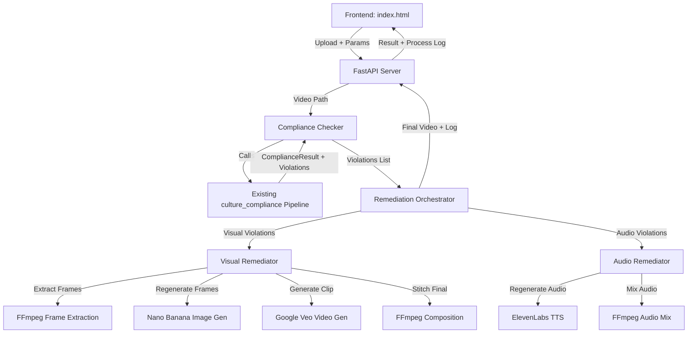
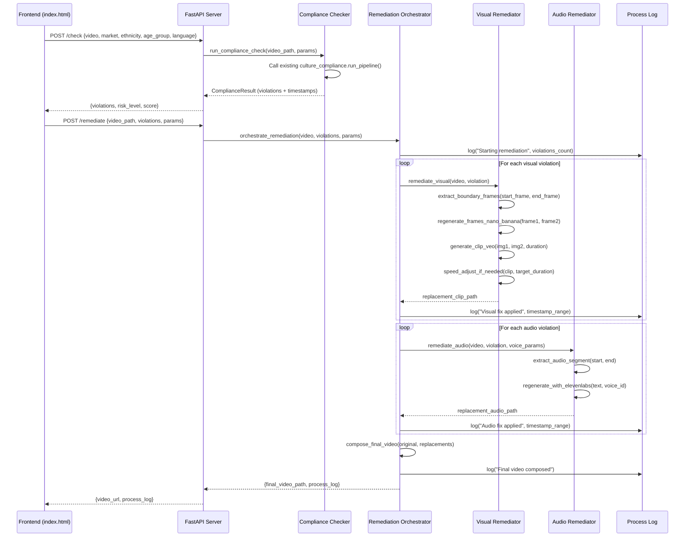
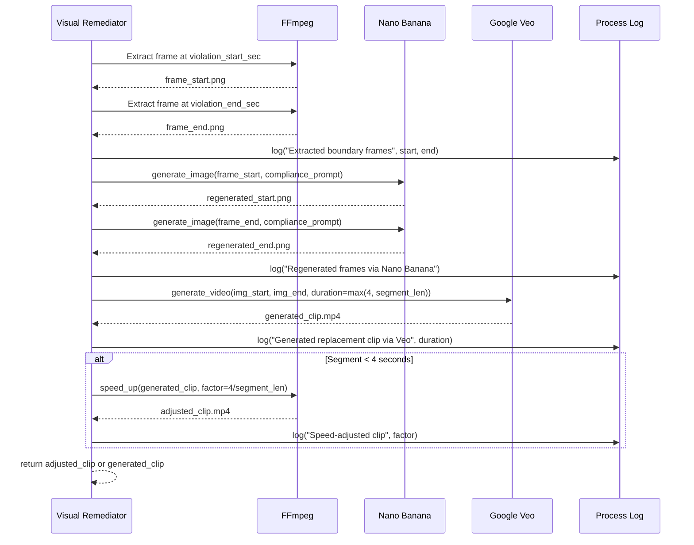

# Design Document: JusAds Video Compliance Remediation Pipeline

## Overview

The JusAds Video Compliance Remediation Pipeline is an automated system that takes a video advertisement, checks it against market-specific cultural and regulatory compliance rules (using the existing `culture_compliance` pipeline), and then automatically remediates any visual or audio violations. Visual violations are fixed by extracting boundary frames from the offending segment, regenerating them with Nano Banana (image generation), and stitching a replacement clip via Google Veo (video generation). Audio violations are fixed by regenerating the problematic audio segment using ElevenLabs TTS with market-appropriate voice selection.

The system produces a human-readable "process log" for each run — a structured report detailing every action taken, timestamps affected, models invoked, and final outcome. The frontend is a single `index.html` file providing upload, compliance check, remediation trigger, and process log display.

This pipeline does NOT require camera nodes or motion control code. Real-world video ad compliance tools (like Extreme Reach, Adstream/Peach, and Clearcast) operate as post-production QA pipelines — they receive finished video, flag issues, and produce corrected output. Our system follows the same pattern: receive → analyze → remediate → output.

## Architecture



## Sequence Diagrams

### Main Pipeline Flow



### Visual Remediation Detail



## Components and Interfaces

### Component 1: Compliance Checker (`compliance_checker.py`)

**Purpose**: Wraps the existing `culture_compliance` pipeline to check a video and return structured violation data with precise timestamps.

**Interface**:
```python
from dataclasses import dataclass

@dataclass
class Violation:
    timestamp_start: float      # seconds
    timestamp_end: float        # seconds
    category: str               # e.g. "Sexual/Explicit", "Religious Sensitivity"
    severity: str               # "Severe", "Moderate", "Minor"
    description: str            # what the violation is
    violation_type: str         # "visual" or "audio"
    guideline_source: str       # "regulatory" or "cultural"

@dataclass
class ComplianceCheckResult:
    risk_level: str             # "High", "Medium", "Low"
    score: int                  # 0-100
    violations: list[Violation]
    explanation: str
    suggestion: str
    raw_result: dict            # full pipeline output

async def check_compliance(
    video_path: str,
    market: str,
    target_ethnicity: str,
    target_age_group: str,
) -> ComplianceCheckResult:
    """Run the existing culture_compliance pipeline on a video."""
    ...
```

**Responsibilities**:
- Invoke `culture_compliance.orchestrator.run_pipeline()` with a video `ContentSubmission`
- Parse `high_risk_indicators` from the result into `Violation` objects
- Convert timestamp strings ("MM:SS") to float seconds
- Determine violation_type (visual vs audio) from category and description
- Return structured result for downstream remediation

### Component 2: Visual Remediator (`visual_remediator.py`)

**Purpose**: Fixes visual violations by extracting boundary frames, regenerating them with Nano Banana, and creating a replacement clip with Google Veo.

**Interface**:
```python
@dataclass
class VisualRemediationResult:
    original_start: float       # seconds
    original_end: float         # seconds
    replacement_clip_path: str
    veo_generation_duration: float  # actual Veo output duration
    speed_factor: float         # 1.0 if no adjustment needed
    success: bool
    error: str | None

async def remediate_visual_segment(
    video_path: str,
    violation: Violation,
    output_dir: str,
) -> VisualRemediationResult:
    """Fix a single visual violation segment."""
    ...

def extract_frame(video_path: str, timestamp_sec: float, output_path: str) -> bool:
    """Extract a single frame from video at given timestamp using FFmpeg."""
    ...

async def regenerate_frame(
    original_frame_path: str,
    compliance_prompt: str,
) -> str:
    """Regenerate a frame using Nano Banana to be compliant. Returns path to new image."""
    ...

async def generate_replacement_clip(
    start_image_path: str,
    end_image_path: str,
    duration_seconds: float,
) -> str:
    """Generate a video clip from two images using Google Veo. Min 4 seconds."""
    ...

def speed_adjust_clip(
    clip_path: str,
    target_duration: float,
    output_path: str,
) -> str:
    """Speed up a clip to fit target duration using FFmpeg. Returns output path."""
    ...
```

**Responsibilities**:
- Extract boundary frames at violation start and end timestamps
- Call Nano Banana to regenerate compliant versions of those frames
- Call Google Veo with the two regenerated images to produce a replacement clip
- Handle Veo's 4-second minimum: if violation segment < 4s, generate at 4s then speed up
- Return the replacement clip path for composition

### Component 3: Audio Remediator (`audio_remediator.py`)

**Purpose**: Fixes audio violations by regenerating the problematic audio segment using ElevenLabs TTS with the appropriate voice for the target market.

**Interface**:
```python
@dataclass
class VoiceConfig:
    voice_id: str
    language_code: str
    market: str
    ethnicity: str
    gender: str

@dataclass
class AudioRemediationResult:
    original_start: float       # seconds
    original_end: float         # seconds
    replacement_audio_path: str
    voice_id_used: str
    success: bool
    error: str | None

def select_voice(
    market: str,
    ethnicity: str,
    age_group: str,
    language: str,
    gender: str = "female",
) -> VoiceConfig:
    """Select appropriate ElevenLabs voice ID based on user parameters.
    Uses voice mappings from backend/config.py."""
    ...

async def remediate_audio_segment(
    video_path: str,
    violation: Violation,
    voice_config: VoiceConfig,
    replacement_text: str | None,
    output_dir: str,
) -> AudioRemediationResult:
    """Fix a single audio violation segment."""
    ...

def extract_audio_segment(
    video_path: str,
    start_sec: float,
    end_sec: float,
    output_path: str,
) -> bool:
    """Extract audio segment from video using FFmpeg."""
    ...
```

**Responsibilities**:
- Select the correct voice ID based on market/ethnicity/age_group/language from `config.py`
- Extract the problematic audio segment
- Generate replacement audio via ElevenLabs TTS
- Match duration of replacement to original segment (trim or pad with silence)
- Return replacement audio path for final mix

### Component 4: Remediation Orchestrator (`orchestrator.py`)

**Purpose**: Coordinates the full remediation workflow — separates violations by type, invokes the appropriate remediator, composes the final video, and builds the process log.

**Interface**:
```python
@dataclass
class ProcessLogEntry:
    timestamp: str              # ISO 8601
    action: str                 # e.g. "extract_frame", "generate_clip", "audio_regen"
    details: dict               # action-specific metadata
    duration_ms: int            # how long this step took
    success: bool

@dataclass
class RemediationResult:
    final_video_path: str
    process_log: list[ProcessLogEntry]
    violations_fixed: int
    violations_failed: int
    total_processing_time_ms: int

async def orchestrate_remediation(
    video_path: str,
    violations: list[Violation],
    market: str,
    ethnicity: str,
    age_group: str,
    language: str,
    output_dir: str,
) -> RemediationResult:
    """Run full remediation pipeline on all violations."""
    ...

def compose_final_video(
    original_video_path: str,
    visual_replacements: list[VisualRemediationResult],
    audio_replacements: list[AudioRemediationResult],
    output_path: str,
) -> bool:
    """Stitch all replacement segments into the original video using FFmpeg."""
    ...
```

**Responsibilities**:
- Separate violations into visual and audio categories
- Sort violations by timestamp to process in order
- Invoke `remediate_visual_segment` for each visual violation
- Invoke `remediate_audio_segment` for each audio violation
- Compose the final video by splicing replacements into the original
- Keep original audio for segments without audio violations
- Build and return the complete process log

### Component 5: FastAPI Server (`main.py`)

**Purpose**: HTTP API layer exposing compliance check and remediation endpoints. Serves the frontend.

**Interface**:
```python
from fastapi import FastAPI, UploadFile, File, Form
from fastapi.staticfiles import StaticFiles

app = FastAPI(title="JusAds Video Compliance")

@app.post("/api/check")
async def check_video(
    video: UploadFile = File(...),
    market: str = Form("malaysia"),
    ethnicity: str = Form("all"),
    age_group: str = Form("all_ages"),
    language: str = Form("ms"),
) -> dict:
    """Upload video and run compliance check. Returns violations."""
    ...

@app.post("/api/remediate")
async def remediate_video(
    video_path: str,
    violations: list[dict],
    market: str = "malaysia",
    ethnicity: str = "all",
    age_group: str = "all_ages",
    language: str = "ms",
) -> dict:
    """Trigger remediation on previously checked video. Returns final video + log."""
    ...

@app.get("/api/status/{job_id}")
async def get_job_status(job_id: str) -> dict:
    """Poll remediation job status (for long-running jobs)."""
    ...
```

**Responsibilities**:
- Accept video uploads and store temporarily
- Validate input parameters
- Route to compliance checker and remediation orchestrator
- Serve static frontend files
- Return process log and final video URL

### Component 6: Frontend (`frontend/index.html`)

**Purpose**: Single-page interface for video upload, parameter configuration, compliance checking, and remediation with process log display.

**Interface**: Vanilla HTML/CSS/JS with fetch API calls.

**Responsibilities**:
- Parameter controls: market (Malaysia/Singapore), ethnicity, age group, language dropdowns
- Video file upload with drag-and-drop
- "Check Compliance" button → calls `/api/check`
- Results display: violations table with timestamps, categories, severity
- "Remediate" button → calls `/api/remediate`
- Process log display: scrollable panel showing each remediation step
- Final video preview/download link

## Data Models

### Violation Model

```python
@dataclass
class Violation:
    timestamp_start: float      # seconds from video start
    timestamp_end: float        # seconds from video start
    category: str               # matches VIOLATION_CATEGORIES from schemas.py
    severity: str               # "Severe" | "Moderate" | "Minor"
    description: str            # human-readable description (max 200 chars)
    violation_type: str         # "visual" | "audio"
    guideline_source: str       # "regulatory" | "cultural"
```

**Validation Rules**:
- `timestamp_start` >= 0 and < video duration
- `timestamp_end` > `timestamp_start` and <= video duration
- `category` must be one of the defined VIOLATION_CATEGORIES
- `severity` must be "Severe", "Moderate", or "Minor"
- `violation_type` must be "visual" or "audio"

### Process Log Model

```python
@dataclass
class ProcessLogEntry:
    timestamp: str              # ISO 8601 when this step occurred
    action: str                 # action identifier
    details: dict               # varies by action type
    duration_ms: int            # wall-clock time for this step
    success: bool               # whether step completed successfully

# Action types and their detail schemas:
# "compliance_check"    → {"violations_found": int, "risk_level": str, "score": int}
# "extract_frame"       → {"video_sec": float, "output_path": str}
# "regenerate_frame"    → {"model": "nano_banana", "input_path": str, "output_path": str}
# "generate_clip"       → {"model": "veo", "duration_sec": float, "output_path": str}
# "speed_adjust"        → {"factor": float, "original_duration": float, "target_duration": float}
# "audio_extract"       → {"start_sec": float, "end_sec": float, "output_path": str}
# "audio_regenerate"    → {"voice_id": str, "language": str, "output_path": str}
# "compose_final"       → {"segments_replaced": int, "output_path": str}
```

**Validation Rules**:
- `timestamp` must be valid ISO 8601
- `action` must be one of the defined action types
- `duration_ms` >= 0
- `details` schema depends on `action` type

### Voice Selection Model

```python
# Voice ID mapping (from backend/config.py)
VOICE_MAP = {
    ("malaysia", "malay", "male"): "ELEVENLABS_VOICE_MY_MS_MALE",
    ("malaysia", "malay", "female"): "ELEVENLABS_VOICE_MY_MS_FEMALE",
    ("malaysia", "chinese", "male"): "ELEVENLABS_VOICE_MY_ZH_MALE",
    ("malaysia", "chinese", "female"): "ELEVENLABS_VOICE_MY_ZH_FEMALE",
    ("malaysia", "indian", "male"): "ELEVENLABS_VOICE_MY_EN_IND_MALE",
    ("malaysia", "indian", "female"): "ELEVENLABS_VOICE_MY_EN_IND_FEMALE",
    ("singapore", "english", "male"): "ELEVENLABS_VOICE_SG_EN_MALE",
    ("singapore", "english", "female"): "ELEVENLABS_VOICE_SG_EN_FEMALE",
    ("singapore", "chinese", "male"): "ELEVENLABS_VOICE_SG_ZH_MALE",
    ("singapore", "chinese", "female"): "ELEVENLABS_VOICE_SG_ZH_FEMALE",
}

LANGUAGE_CODE_MAP = {
    ("malaysia", "malay"): "ms",
    ("malaysia", "chinese"): "zh",
    ("malaysia", "indian"): "en",
    ("singapore", "english"): "en",
    ("singapore", "chinese"): "zh",
}
```

## Algorithmic Pseudocode

### Main Remediation Algorithm

```python
ALGORITHM orchestrate_remediation(video_path, violations, params)
INPUT: video_path (str), violations (list[Violation]), params (market, ethnicity, age_group, language)
OUTPUT: RemediationResult

BEGIN
    process_log = []
    visual_violations = [v for v in violations if v.violation_type == "visual"]
    audio_violations = [v for v in violations if v.violation_type == "audio"]
    
    # Sort by timestamp to process in order (avoids frame offset issues)
    visual_violations.sort(key=lambda v: v.timestamp_start)
    audio_violations.sort(key=lambda v: v.timestamp_start)
    
    visual_results = []
    audio_results = []
    
    # Phase 1: Fix visual violations
    FOR each violation IN visual_violations DO
        ASSERT violation.timestamp_end > violation.timestamp_start
        
        result = await remediate_visual_segment(video_path, violation, output_dir)
        visual_results.append(result)
        process_log.append(log_entry("visual_fix", result))
    END FOR
    
    # Phase 2: Fix audio violations (only if audio has issues)
    IF len(audio_violations) > 0 THEN
        voice_config = select_voice(params.market, params.ethnicity, params.age_group, params.language)
        
        FOR each violation IN audio_violations DO
            result = await remediate_audio_segment(video_path, violation, voice_config, output_dir)
            audio_results.append(result)
            process_log.append(log_entry("audio_fix", result))
        END FOR
    END IF
    
    # Phase 3: Compose final video
    final_path = compose_final_video(video_path, visual_results, audio_results, output_dir)
    process_log.append(log_entry("compose_final", {"output": final_path}))
    
    RETURN RemediationResult(final_path, process_log, successes, failures, total_time)
END
```

**Preconditions:**
- `video_path` points to a valid video file (MP4/MOV/WebM)
- `violations` is non-empty (no remediation needed if empty)
- All violation timestamps are within video duration bounds
- Required API keys are configured (ElevenLabs, Vertex AI, Nano Banana)

**Postconditions:**
- `final_video_path` is a valid video file with all successful remediations applied
- `process_log` contains one entry per remediation action attempted
- Original video is never modified (output is a new file)
- Original audio is preserved for segments without audio violations

**Loop Invariants:**
- All previously processed violations have non-overlapping timestamp ranges
- Each visual_result contains a valid replacement clip path (or error)
- Process log entries are in chronological order

### Visual Remediation Algorithm

```python
ALGORITHM remediate_visual_segment(video_path, violation, output_dir)
INPUT: video_path (str), violation (Violation), output_dir (str)
OUTPUT: VisualRemediationResult

BEGIN
    segment_duration = violation.timestamp_end - violation.timestamp_start
    ASSERT segment_duration > 0
    
    # Step 1: Extract boundary frames
    frame_start_path = extract_frame(video_path, violation.timestamp_start, output_dir)
    frame_end_path = extract_frame(video_path, violation.timestamp_end, output_dir)
    
    IF frame_start_path IS None OR frame_end_path IS None THEN
        RETURN VisualRemediationResult(success=False, error="Frame extraction failed")
    END IF
    
    # Step 2: Regenerate frames with Nano Banana
    compliance_prompt = build_compliance_prompt(violation.category, violation.description)
    regen_start = await regenerate_frame(frame_start_path, compliance_prompt)
    regen_end = await regenerate_frame(frame_end_path, compliance_prompt)
    
    # Step 3: Generate replacement clip with Veo
    # Veo minimum is 4 seconds — generate at max(4, segment_duration)
    veo_duration = max(4.0, segment_duration)
    generated_clip = await generate_replacement_clip(regen_start, regen_end, veo_duration)
    
    # Step 4: Speed adjust if segment < 4 seconds
    IF segment_duration < 4.0 THEN
        speed_factor = veo_duration / segment_duration
        final_clip = speed_adjust_clip(generated_clip, segment_duration, output_dir)
    ELSE
        speed_factor = 1.0
        final_clip = generated_clip
    END IF
    
    RETURN VisualRemediationResult(
        original_start=violation.timestamp_start,
        original_end=violation.timestamp_end,
        replacement_clip_path=final_clip,
        veo_generation_duration=veo_duration,
        speed_factor=speed_factor,
        success=True
    )
END
```

**Preconditions:**
- `video_path` is a valid video file accessible by FFmpeg
- `violation.timestamp_start` and `violation.timestamp_end` are within video bounds
- Nano Banana API is reachable and configured
- Google Veo (Vertex AI) is reachable and configured

**Postconditions:**
- If success: `replacement_clip_path` is a valid video file with duration == segment_duration (±0.1s)
- If success: replacement clip is visually compliant (no longer contains the violation)
- Original video file is unchanged
- Generated intermediate files (frames, clips) are in `output_dir`

**Loop Invariants:** N/A (single-pass algorithm)

### Video Composition Algorithm

```python
ALGORITHM compose_final_video(original_path, visual_replacements, audio_replacements, output_path)
INPUT: original video, sorted replacement segments, output path
OUTPUT: path to final composed video

BEGIN
    # Build timeline of segments
    segments = []
    current_pos = 0.0
    video_duration = get_video_duration(original_path)
    
    # Merge visual replacements into timeline
    FOR each vr IN visual_replacements (sorted by original_start) DO
        IF vr.success THEN
            # Add original segment before this replacement
            IF vr.original_start > current_pos THEN
                segments.append(("original", current_pos, vr.original_start))
            END IF
            # Add replacement clip
            segments.append(("replacement", vr.replacement_clip_path))
            current_pos = vr.original_end
        END IF
    END FOR
    
    # Add remaining original after last replacement
    IF current_pos < video_duration THEN
        segments.append(("original", current_pos, video_duration))
    END IF
    
    # Use FFmpeg concat filter to stitch segments
    ffmpeg_concat(segments, output_path)
    
    # Handle audio: overlay replacements onto original audio track
    IF len(audio_replacements) > 0 THEN
        audio_timeline = build_audio_timeline(original_path, audio_replacements)
        ffmpeg_mix_audio(output_path, audio_timeline, output_path)
    END IF
    
    RETURN output_path
END
```

**Preconditions:**
- `visual_replacements` are sorted by `original_start` and non-overlapping
- All replacement clip durations match their target segment durations
- FFmpeg is available on the system PATH

**Postconditions:**
- Output video has same total duration as original (±0.5s tolerance)
- All successful visual replacements are spliced in at correct positions
- Audio from original is preserved except where audio replacements are applied
- Output is a valid MP4 file

## Key Functions with Formal Specifications

### Function 1: `check_compliance()`

```python
async def check_compliance(
    video_path: str,
    market: str,
    target_ethnicity: str,
    target_age_group: str,
) -> ComplianceCheckResult:
```

**Preconditions:**
- `video_path` exists and is a valid video file (MP4/MOV/WebM, ≤100MB, ≤5min)
- `market` is "malaysia" or "singapore"
- `target_ethnicity` is "malay", "chinese", "indian", or "all"
- `target_age_group` is "all_ages", "adults_only", or "children"

**Postconditions:**
- Returns `ComplianceCheckResult` with `score` in range [0, 100]
- `risk_level` is consistent with score: score >= 75 → "Low", 40 <= score < 75 → "Medium", score < 40 → "High"
- Each violation has valid timestamps within video duration
- `violations` list has at most 10 items (matching pipeline limit)

### Function 2: `extract_frame()`

```python
def extract_frame(video_path: str, timestamp_sec: float, output_path: str) -> bool:
```

**Preconditions:**
- `video_path` is a valid video file
- `timestamp_sec` >= 0 and <= video duration
- `output_path` parent directory exists or can be created

**Postconditions:**
- If returns True: `output_path` contains a valid PNG image of the frame at `timestamp_sec`
- If returns False: no file created, error logged
- Original video is unchanged

### Function 3: `generate_replacement_clip()`

```python
async def generate_replacement_clip(
    start_image_path: str,
    end_image_path: str,
    duration_seconds: float,
) -> str:
```

**Preconditions:**
- `start_image_path` and `end_image_path` are valid image files (PNG/JPEG)
- `duration_seconds` >= 4.0 (Veo minimum)
- Google Vertex AI credentials are configured

**Postconditions:**
- Returns path to a valid MP4 video file
- Generated video duration is approximately `duration_seconds` (±0.5s)
- Video transitions smoothly from start_image to end_image
- Video does not contain the original violation content

### Function 4: `select_voice()`

```python
def select_voice(
    market: str,
    ethnicity: str,
    age_group: str,
    language: str,
    gender: str = "female",
) -> VoiceConfig:
```

**Preconditions:**
- `market` is "malaysia" or "singapore"
- `ethnicity` is a valid ethnicity for the given market
- `language` is a valid language code

**Postconditions:**
- Returns a `VoiceConfig` with a valid ElevenLabs voice_id from config.py
- `language_code` matches the market/ethnicity combination
- Falls back to default voice if exact match not found

### Function 5: `compose_final_video()`

```python
def compose_final_video(
    original_video_path: str,
    visual_replacements: list[VisualRemediationResult],
    audio_replacements: list[AudioRemediationResult],
    output_path: str,
) -> bool:
```

**Preconditions:**
- `original_video_path` is a valid video file
- All replacement clips in `visual_replacements` exist and are valid
- Visual replacements are non-overlapping and sorted by `original_start`
- FFmpeg is available

**Postconditions:**
- If returns True: `output_path` is a valid MP4 with all replacements applied
- Final video duration equals original duration (±0.5s)
- Original audio preserved where no audio replacement applies
- Failed replacements are skipped (original content kept for those segments)

## Example Usage

```python
# Example 1: Full compliance check and remediation flow
from jusads_video_compliance.compliance_checker import check_compliance
from jusads_video_compliance.orchestrator import orchestrate_remediation

# Step 1: Check compliance
result = await check_compliance(
    video_path="assets/Test Video.mp4",
    market="malaysia",
    target_ethnicity="malay",
    target_age_group="all_ages",
)

print(f"Risk: {result.risk_level}, Score: {result.score}")
print(f"Violations found: {len(result.violations)}")
for v in result.violations:
    print(f"  [{v.timestamp_start:.1f}s - {v.timestamp_end:.1f}s] "
          f"{v.category} ({v.severity}): {v.description}")

# Step 2: Remediate if needed
if result.risk_level in ("High", "Medium"):
    remediation = await orchestrate_remediation(
        video_path="assets/Test Video.mp4",
        violations=result.violations,
        market="malaysia",
        ethnicity="malay",
        age_group="all_ages",
        language="ms",
        output_dir="assets/remediated",
    )
    
    print(f"\nFinal video: {remediation.final_video_path}")
    print(f"Fixed: {remediation.violations_fixed}/{len(result.violations)}")
    print(f"\nProcess Log:")
    for entry in remediation.process_log:
        status = "✓" if entry.success else "✗"
        print(f"  {status} [{entry.timestamp}] {entry.action} ({entry.duration_ms}ms)")
        print(f"    {entry.details}")


# Example 2: Voice selection
from jusads_video_compliance.audio_remediator import select_voice

voice = select_voice(
    market="malaysia",
    ethnicity="malay",
    age_group="all_ages",
    language="ms",
    gender="female",
)
print(f"Voice ID: {voice.voice_id}")  # → qAJVXEQ6QgjOQ25KuoU8
print(f"Language: {voice.language_code}")  # → ms


# Example 3: Visual remediation of a single segment
from jusads_video_compliance.visual_remediator import remediate_visual_segment

violation = Violation(
    timestamp_start=5.0,
    timestamp_end=8.5,
    category="Sexual/Explicit",
    severity="Severe",
    description="Exposed midriff in product application scene",
    violation_type="visual",
    guideline_source="cultural",
)

vr_result = await remediate_visual_segment(
    video_path="assets/Test Video.mp4",
    violation=violation,
    output_dir="assets/remediated",
)
# vr_result.replacement_clip_path → "assets/remediated/clip_5.0_8.5.mp4"
# vr_result.speed_factor → 1.0 (segment is 3.5s, but Veo generates 4s, speed up by 4/3.5=1.14)
```

## Correctness Properties

*A property is a characteristic or behavior that should hold true across all valid executions of a system — essentially, a formal statement about what the system should do. Properties serve as the bridge between human-readable specifications and machine-verifiable correctness guarantees.*

### Property 1: Remediated video preserves total duration

*For any* video and set of non-overlapping violations, the absolute difference between the final composed video duration and the original video duration is less than 0.5 seconds.

`∀ video v, remediation r: |duration(r.final_video) - duration(v)| < 0.5s`

**Validates: Requirements 5.6**

### Property 2: All visual replacements fit exactly in their target segment

*For any* successful visual remediation result, the replacement clip duration matches the original segment duration within 0.2 seconds tolerance.

`∀ vr ∈ visual_results: |duration(vr.clip) - (vr.original_end - vr.original_start)| < 0.2s`

**Validates: Requirements 2.6**

### Property 3: Veo generation duration is always at least 4 seconds

*For any* segment duration, the Veo generation request duration is always at least 4.0 seconds (computed as max(4.0, segment_duration)).

`∀ vr ∈ visual_results: vr.veo_generation_duration >= 4.0`

**Validates: Requirements 2.4**

### Property 4: Speed factor is correct when segment is shorter than 4 seconds

*For any* visual remediation where the original segment is shorter than 4 seconds, the speed factor equals 4.0 divided by the segment duration.

`∀ vr where (vr.original_end - vr.original_start) < 4.0: vr.speed_factor == 4.0 / (vr.original_end - vr.original_start)`

**Validates: Requirements 2.5**

### Property 5: Voice selection always returns a valid voice for supported markets

*For any* supported (market, ethnicity, gender) combination, `select_voice()` returns a VoiceConfig with a non-empty voice_id and the correct language_code matching the defined mapping.

`∀ (market, ethnicity, gender) ∈ supported_combinations: select_voice(market, ethnicity, ...).voice_id ≠ "" ∧ language_code == LANGUAGE_CODE_MAP[(market, ethnicity)]`

**Validates: Requirements 4.1, 4.2, 4.3, 4.4**

### Property 6: Process log has at least one entry per violation attempted

*For any* remediation result with n violations, the process log contains at least n entries.

`∀ remediation r: len(r.process_log) >= len(violations)`

**Validates: Requirements 6.1, 6.2**

### Property 7: Non-overlapping violations produce non-overlapping replacements

*For any* set of visual replacement results sorted by start time, the end timestamp of each replacement does not overlap the start timestamp of the next.

`∀ i < j: visual_results[i].original_end <= visual_results[j].original_start`

**Validates: Requirements 5.7**

### Property 8: Original audio preserved when no audio violations exist

*For any* remediation where there are no audio violations, the final video's audio track is identical to the original video's audio track.

`audio_violations == [] ⟹ audio_track(final_video) == audio_track(original_video)`

**Validates: Requirements 5.5**

### Property 9: Compliance score and risk level consistency

*For any* compliance check result, the risk_level is always consistent with the numeric score: score >= 75 maps to "Low", 40 <= score < 75 maps to "Medium", score < 40 maps to "High".

`∀ result r: (r.score >= 75) ↔ (r.risk_level == "Low") ∧ (40 <= r.score < 75) ↔ (r.risk_level == "Medium") ∧ (r.score < 40) ↔ (r.risk_level == "High")`

**Validates: Requirements 1.3**

### Property 10: Original video file is never modified

*For any* remediation run, the original uploaded video file remains unchanged (byte-for-byte identical before and after processing).

`∀ remediation r: hash(original_video_before) == hash(original_video_after)`

**Validates: Requirements 10.1**

### Property 11: Violations fixed plus violations failed equals total violations

*For any* remediation result, the count of violations fixed plus the count of violations failed equals the total number of violations submitted.

`∀ remediation r: r.violations_fixed + r.violations_failed == len(violations)`

**Validates: Requirements 10.4**

### Property 12: Orchestrator continues processing after individual failures

*For any* set of violations where some remediation steps fail, the orchestrator still processes all remaining violations (does not short-circuit on failure).

`∀ violations V, ∀ failure at index i: violations[i+1..n] are still attempted`

**Validates: Requirements 10.2**

### Property 13: Violation separation and sorting correctness

*For any* list of mixed violations, the orchestrator correctly separates them into visual and audio categories, and each category is sorted by timestamp_start in ascending order.

`∀ violations V: separated_visual is sorted by timestamp_start ∧ separated_audio is sorted by timestamp_start ∧ all visual have type=="visual" ∧ all audio have type=="audio"`

**Validates: Requirements 5.1**

### Property 14: Process log entries are in chronological order

*For any* process log produced by the orchestrator, the entries are ordered by their ISO 8601 timestamp in non-decreasing order.

`∀ i < j: process_log[i].timestamp <= process_log[j].timestamp`

**Validates: Requirements 6.3**

### Property 15: Input validation rejects invalid market parameters

*For any* string that is not "malaysia" or "singapore", the API server rejects the request with a validation error.

`∀ market m where m ∉ {"malaysia", "singapore"}: API returns validation error`

**Validates: Requirements 7.4, 9.3**

### Property 16: Compliance score is always in valid range

*For any* compliance check result, the numeric score is in the range [0, 100].

`∀ result r: 0 <= r.score <= 100`

**Validates: Requirements 1.2**

## Error Handling

### Error Scenario 1: Veo Generation Failure

**Condition**: Google Veo API returns an error or times out during clip generation
**Response**: Log the failure in process log, mark the visual replacement as failed, skip this segment
**Recovery**: Keep original video content for the failed segment. Process log notes which violations could not be fixed. User can retry individual segments.

### Error Scenario 2: Frame Extraction Failure

**Condition**: FFmpeg cannot extract a frame at the specified timestamp (corrupted video, timestamp out of bounds)
**Response**: Return `VisualRemediationResult(success=False)` with error description
**Recovery**: Skip this violation's remediation. Original content preserved. Process log records the failure.

### Error Scenario 3: Nano Banana Image Generation Failure

**Condition**: Nano Banana API is unavailable or returns an error
**Response**: Log failure, mark visual remediation as failed for this segment
**Recovery**: Original content preserved for this segment. Suggest user retry or manually fix.

### Error Scenario 4: ElevenLabs TTS Failure

**Condition**: ElevenLabs API returns error during audio regeneration
**Response**: Log failure, mark audio remediation as failed for this segment
**Recovery**: Keep original audio for the failed segment. Process log notes the failure.

### Error Scenario 5: Voice ID Not Found

**Condition**: No matching voice ID for the given market/ethnicity/language combination
**Response**: Fall back to a default voice for the market (Malaysia Malay Female as default)
**Recovery**: Process log notes the fallback. Audio is still regenerated with the fallback voice.

### Error Scenario 6: Video Composition Failure

**Condition**: FFmpeg concat/filter fails during final composition
**Response**: Return partial result with the individual replacement clips
**Recovery**: User receives the replacement clips separately and can manually compose. Process log records all successful individual remediations.

### Error Scenario 7: Compliance Pipeline Failure

**Condition**: The existing `culture_compliance` pipeline returns an error or times out
**Response**: Return error to frontend with the pipeline error details
**Recovery**: User can retry. No remediation is attempted if compliance check fails.

## Testing Strategy

### Unit Testing Approach

- Test `select_voice()` with all valid market/ethnicity/language combinations
- Test timestamp parsing (MM:SS → float seconds conversion)
- Test violation classification (visual vs audio) logic
- Test speed factor calculation for segments < 4 seconds
- Test process log entry creation and serialization
- Mock FFmpeg calls for frame extraction and composition tests
- Mock external APIs (Veo, Nano Banana, ElevenLabs) for isolated testing

### Property-Based Testing Approach

**Property Test Library**: hypothesis (Python)

Key properties to test:
1. **Duration preservation**: For any valid video and set of non-overlapping violations, the final composed video duration equals the original (±tolerance)
2. **Speed factor correctness**: For any segment duration d where 0 < d < 4, speed_factor == 4.0/d
3. **Voice selection completeness**: For all valid (market, ethnicity, gender) tuples, `select_voice` returns a non-empty voice_id
4. **Violation sorting stability**: Sorting violations by timestamp_start produces a valid non-overlapping sequence
5. **Process log completeness**: For n violations, process log contains >= n entries

### Integration Testing Approach

- End-to-end test with a known non-compliant test video
- Verify compliance check returns expected violations for known content
- Verify visual remediation produces a valid video file (can be opened, correct duration)
- Verify audio remediation produces valid audio (correct duration, non-silent)
- Verify final composition plays correctly in standard video players
- Test frontend → API → pipeline → response flow with a real video upload

## Performance Considerations

- **Veo generation latency**: Google Veo takes 30-120 seconds per clip. For videos with multiple violations, this is the bottleneck. Process violations in parallel where possible (non-overlapping segments).
- **Frame extraction**: FFmpeg frame extraction is fast (<1s per frame). Not a concern.
- **Nano Banana generation**: Image generation typically takes 5-15 seconds per image. Two images per violation = 10-30s per violation.
- **ElevenLabs TTS**: Audio generation is fast (2-5 seconds per segment).
- **Total expected time**: For a video with 3 visual violations: ~5-7 minutes total (dominated by Veo).
- **File storage**: Intermediate files (frames, clips) should be cleaned up after final composition. Use a temp directory per job.
- **Concurrency**: Multiple remediation jobs should use separate output directories to avoid conflicts.

## Security Considerations

- **File uploads**: Validate video file type by magic bytes (not just extension). Limit upload size to 100MB.
- **Path traversal**: Sanitize all file paths. Use UUID-based temp directories per job.
- **API keys**: All API keys (ElevenLabs, Vertex AI, Nano Banana) loaded from environment variables via `config.py`. Never exposed to frontend.
- **CORS**: FastAPI CORS middleware configured to allow only the frontend origin in production.
- **Input validation**: All user parameters (market, ethnicity, age_group, language) validated against allowed values before processing.
- **Temp file cleanup**: All intermediate files deleted after job completion or failure.

## Dependencies

| Dependency | Purpose | Version |
|-----------|---------|---------|
| FastAPI | HTTP API framework | >=0.100 |
| uvicorn | ASGI server | >=0.20 |
| python-multipart | File upload handling | >=0.0.5 |
| ffmpeg-python (or subprocess) | Video/audio manipulation | system FFmpeg |
| google-genai | Google Veo via Vertex AI | >=1.0 |
| elevenlabs / requests | TTS and SFX generation | existing client |
| pydantic | Data validation | >=2.0 (existing) |
| culture_compliance | Existing compliance pipeline | local module |

### External Services

| Service | Purpose | Constraints |
|---------|---------|-------------|
| Google Veo (Vertex AI) | Video generation from images | Min 4s clips, requires project credentials |
| Nano Banana | Image regeneration | API key required |
| ElevenLabs | TTS audio generation | API key, voice IDs from config.py |
| Twelve Labs Pegasus | Video analysis (via culture_compliance) | Already configured |
| AWS Bedrock / Gemini | LLM for compliance evaluation | Already configured |

### System Requirements

- FFmpeg installed and on PATH (for frame extraction, speed adjustment, composition)
- Python 3.11+
- Sufficient disk space for temp video files (~500MB per concurrent job)

## Design Decisions

### Why No Camera Nodes / Motion Control

Real-world video ad compliance tools (Extreme Reach, Peach, Clearcast) operate as **post-production QA pipelines**. They receive finished video, analyze it, and produce corrected output. They do not involve camera control or motion planning because:
1. The input is already a finished advertisement
2. The remediation replaces specific segments, not re-shoots the entire video
3. Veo handles the visual generation from reference frames — no camera control needed

### Why Process Log Instead of Traditional Logging

The "process log" is a **user-facing report**, not a developer debug log. It answers: "What did the system do to my video?" Each entry is structured data that the frontend renders as a human-readable timeline. This is simpler than a logging framework and directly serves the user's need to understand what happened.

### Why Speed Adjustment for Short Segments

Google Veo has a minimum 4-second generation limit. For violations shorter than 4 seconds (common — e.g., a 1.5-second flash of non-compliant content), we generate at 4 seconds and speed up the result. This preserves visual quality (Veo generates at its optimal duration) while fitting the segment precisely.

### Pipeline Stages (Based on Real-World Competitors)

The pipeline follows the same stages as professional video ad compliance tools:
1. **Ingest** — Accept video upload
2. **Analyze** — Run compliance rules (our existing culture_compliance pipeline)
3. **Flag** — Present violations with timestamps to user
4. **Remediate** — Auto-fix flagged segments (our unique value-add with AI generation)
5. **Verify** — (Future) Re-run compliance on remediated video
6. **Deliver** — Output final compliant video + audit trail (process log)
