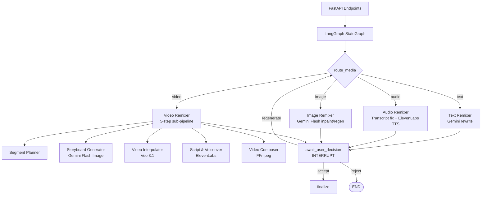
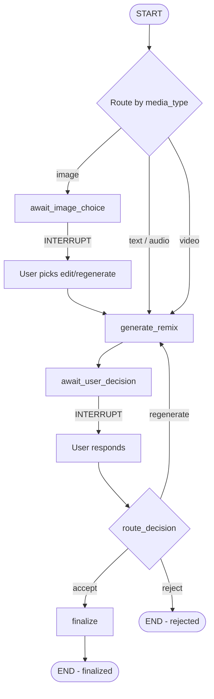

# JusAds Remix Pipeline — Design Spec

## Overview

After compliance audit, user can trigger "Remix" to auto-generate a compliant version.
Each media type has a specific remix strategy.

---

## Architecture

The remix pipeline is orchestrated as a LangGraph `StateGraph` that routes by media type and applies the appropriate remixer. The graph handles human-in-the-loop interrupts for user decisions.



See [§5. Remix Orchestration (LangGraph)](#5-remix-orchestration-langgraph) for the full graph definition, interrupt patterns, and API contract.

---

## Components and Interfaces

| Module | Interface | Responsibility |
|--------|-----------|----------------|
| `route_media` | `(RemixState) → str` | Entry router — directs flow based on `media_type` |
| `generate_remix` | `(RemixState) → dict` | Dispatches to the appropriate remixer; for video runs the 5-step sub-pipeline |
| `await_image_choice` | `(RemixState) → dict` | Interrupts for image edit/regenerate choice |
| `await_user_decision` | `(RemixState) → dict` | Interrupts for accept/reject/regenerate decision |
| `finalize` | `(RemixState) → dict` | Persists final output |
| `remix_text` | `(text, violations, audience) → dict` | Gemini-based compliant rewrite |
| `remix_audio` | `(file_path, violations, audience) → dict` | Transcript fix + ElevenLabs TTS |
| `remix_image` | `(file_path, violations, audience, choice) → dict` | Inpaint or full regeneration |
| `plan_segments` | `(violations) → list[dict]` | Splits video violations into ≤8s chunks |
| `generate_storyboard` | `(segment_plan, audience) → list[dict]` | Key frame generation via Gemini Flash Image |
| `interpolate_clips` | `(frames, file_path) → list[dict]` | Veo 3.1 reference_images interpolation |
| `generate_script_and_voiceover` | `(clips, audience) → dict` | Localized script + ElevenLabs voiceover |
| `compose_video` | `(clips, script_vo, file_path) → str` | FFmpeg assembly of final video |

See [§5. Remix Orchestration](#5-remix-orchestration-langgraph) for full implementation details and code examples.

---

## Data Models

### RemixState (TypedDict)

The central state object flowing through the LangGraph graph. Full schema defined in [§5 RemixState Schema](#remixstate-schema).

Key fields: `check_id`, `thread_id`, `media_type`, `violations`, `target_audience`, `remix_result`, `user_decision`, `status`.

### Violation Formats

Each media type has a distinct violation schema. Full JSON schemas defined in [§API Violation Formats](#api-violation-formats-different-per-media-type):

- **Text**: `{ index, type:"text", phrase, severity, reason, suggested_replacement }`
- **Image**: `{ index, type:"visual", component, severity, location_description, edit_prompt }`
- **Audio**: `{ index, type:"audio", spoken_phrase, severity, reason, suggested_replacement, voice_gender }`
- **Video**: `{ index, start, end, type, category, severity, description, clip_url }`

### Remix Output Schemas

- **Text output**: `{ original_text, compliant_text, changes: [{original, replacement, reason}] }`
- **Audio output**: `{ original_transcript, compliant_transcript, audio_path, voice_used }`
- **Image output**: `{ violations, edit_prompt, options: ["edit","regenerate"], result_image_path }`
- **Video output**: `{ video_path, type: "video" }`

---

## 1. Text Remix

**Audit Output:**
- AI highlights specific non-compliant words/phrases
- Shows category of violation per phrase
- Suggests replacement for each

**Remix:**
- Gemini rewrites the full text to be compliant
- Maintains brand voice and message intent
- Localizes language to target audience (e.g. Mandarin for Chinese audience)

**Output:** `{ original_text, compliant_text, changes: [{original, replacement, reason}] }`

---

## 2. Audio Remix

**Audit Output:**
- Transcribes audio → runs text compliance on transcript
- Highlights non-compliant spoken phrases

**Remix:**
1. Fix the transcript text (same as text remix)
2. Select voice based on target audience:
   - AI decides male/female based on content context
   - Market + ethnicity → voice mapping (ElevenLabs)
3. Generate new audio with ElevenLabs TTS
4. Match duration to original

**Output:** `{ original_transcript, compliant_transcript, audio_path, voice_used }`

---

## 3. Image Remix

**Audit Output:**
- Gemini 3 analyzes image, identifies non-compliant components
- Returns structured violations: `[{component, issue, location_description}]`
- Builds a DETAILED edit prompt describing exactly what to change

**Remix (2 options presented to user):**

Option A: **Edit existing image** (Gemini Flash Image inpainting)
- Use the detailed prompt to edit specific regions
- Keep composition, change only non-compliant elements

Option B: **Regenerate full image**
- Generate a completely new compliant image
- Use the original as style reference

**Strict Rules:**
- If target = Malay → only Malay models in generated image
- If target = Chinese → only Chinese models
- Hijab required for Malay female models
- No exposed skin above elbow/below knee for Malay

**Output:** `{ violations, edit_prompt, options: ["edit", "regenerate"], result_image_path }`

---

## 4. Video Remix (Most Complex)

**Audit Output:**
- Gemini 3 analyzes full video (multimodal)
- Identifies non-compliant segments with timestamps
- Extracts clips for each violation

**Violation Format:**
```json
{
  "violations": [
    {
      "index": 0,
      "start": 3.0,
      "end": 8.0,
      "type": "visual",
      "category": "Modesty",
      "severity": "error",
      "description": "Model wearing sleeveless top exposing shoulders",
      "clip_url": "/clips/xxx_violation_0.mp4"
    }
  ]
}
```

**Remix Pipeline:**

### Step 1: Segment Planning
- Split non-compliant segments into 8-second max chunks
- Example: 15s violation → chunk1 (8s) + chunk2 (7s)
- Keep compliant sections untouched (no re-generation needed)

### Step 2: Storyboard Generation (per chunk)
- Use Gemini Flash Image to generate key frames as a storyboard
- Generate multiple frames in ONE call (efficient — not frame-by-frame)
- Apply strict character rules:
  - Malay target → Malay models only, hijab for females
  - Chinese target → Chinese models only
  - Maintain product/brand elements

### Step 3: Video Interpolation (Veo 3.1)
- Use `reference_images` parameter in Veo:
  ```python
  config = types.GenerateVideosConfig(
      reference_images=[
          types.VideoGenerationReferenceImage(image=frame1, reference_type="asset"),
          types.VideoGenerationReferenceImage(image=frame2, reference_type="asset"),
      ],
  )
  ```
- Veo interpolates between storyboard frames → smooth 5-8s clip
- Duration: 5-8 seconds per clip
- **Keep ambient audio / SFX** from original video (do NOT discard)
- No speech generation at this step

### Step 4: Script & Voiceover Generation
- AI watches the NEW remixed video to understand visual flow
- Generates a localized script that matches the visuals
- Script includes natural timing:
  - "3 seconds of speech → 2 seconds silence → speech again"
  - Not every second needs dialogue — match the visual rhythm
- ElevenLabs TTS generates voiceover:
  - AI decides male/female voice based on target audience + content context
  - Language matches target ethnicity (Mandarin for Chinese, BM for Malay)
  - Duration-matched segments with natural pauses

### Step 5: Composition (FFmpeg)
- Base: stitched video (compliant sections + remixed clips)
- Layer 1: Original ambient audio/SFX (kept from source)
- Layer 2: New voiceover track (with pauses baked in)
- Output: final compliant video with localized audio

**Key Efficiency Rules:**
- NEVER generate first+last frame separately for each clip (wasteful)
- Generate storyboard (multiple frames) in ONE image generation call
- Only regenerate non-compliant sections — keep good parts
- Max clip duration: 8 seconds (Veo limit)
- Use `reference_images` for asset consistency across clips
- Keep original ambient SFX — only replace speech track

---

## API Violation Formats (Different per media type)

### Text Violations
```json
{
  "violations": [
    {
      "index": 0,
      "type": "text",
      "phrase": "4 out of 5 gynecologists",
      "severity": "error",
      "reason": "Number 4 is inauspicious for Chinese audience; 'gynecologists' is too clinical",
      "suggested_replacement": "80% of dermatologists"
    }
  ]
}
```

### Image Violations
```json
{
  "violations": [
    {
      "index": 0,
      "type": "visual",
      "component": "character_clothing",
      "severity": "error",
      "location_description": "Female model in center frame wearing sleeveless top, shoulders and upper arms exposed",
      "edit_prompt": "Replace the sleeveless top with a long-sleeve modest blouse in similar color. Keep the same pose, lighting, and background. The model should be wearing a hijab if targeting Malay audience."
    }
  ]
}
```

### Audio Violations
```json
{
  "violations": [
    {
      "index": 0,
      "type": "audio",
      "spoken_phrase": "from your pits to your private areas",
      "severity": "error",
      "reason": "Suggestive double entendre inappropriate for conservative market",
      "suggested_replacement": "for all-day freshness from head to toe",
      "voice_gender": "female"
    }
  ]
}
```

### Video Violations
```json
{
  "violations": [
    {
      "index": 0,
      "start": 3.0,
      "end": 8.0,
      "type": "visual",
      "category": "Modesty",
      "severity": "error",
      "description": "Model wearing sleeveless top exposing shoulders",
      "clip_url": "/clips/xxx_violation_0.mp4"
    },
    {
      "index": 1,
      "start": 11.0,
      "end": 12.0,
      "type": "audio",
      "category": "Suggestive",
      "severity": "warning",
      "description": "Suggestive phrasing 'from your pits to your...'",
      "clip_url": "/clips/xxx_violation_1.mp4"
    }
  ]
}
```

---

## Technology Stack

| Step | Tool | Why |
|------|------|-----|
| Text analysis | Gemini / Claude | Text understanding |
| Image analysis | Gemini 3 (multimodal) | Vision + understanding |
| Image generation | Gemini Flash Image | Fast inpainting/editing |
| Storyboard frames | Gemini Flash Image | Multiple frames in one call |
| Video generation | Veo 3.1 Lite | reference_images interpolation |
| Audio TTS | ElevenLabs | Market-specific voices |
| Transcription | AWS Transcribe | Audio → text |
| Composition | FFmpeg | Video stitching |

---

## 5. Remix Orchestration (LangGraph)

The remix pipeline is orchestrated as a LangGraph `StateGraph` with human-in-the-loop interrupt points. This replaces the flat SSE stream with a persistent, resumable graph that pauses execution at decision points and waits for explicit user input before proceeding.

### RemixState Schema

```python
class RemixState(TypedDict):
    # Identity
    check_id: str
    thread_id: str
    media_type: str  # "text" | "image" | "audio" | "video"
    
    # Input context
    file_path: str
    text_input: str
    violations: list[dict]
    target_audience: dict  # { market, ethnicity, age_group }
    
    # Intermediate results (populated by nodes)
    remix_result: dict           # generated remix output (text, audio path, image path, or composed video)
    generation_progress: list[dict]  # SSE-style progress events logged during generation
    
    # Video-specific intermediate state
    segment_plan: list[dict]     # output of segment planning
    storyboard_frames: list[dict]  # output of storyboard generation
    interpolated_clips: list[dict]  # output of video interpolation
    script_and_voiceover: dict   # output of script/voiceover generation
    composed_video_path: str     # output of composition step
    
    # Human-in-the-loop
    user_decision: str           # "accept" | "reject" | "regenerate"
    user_feedback: str           # free-text feedback when user chooses "regenerate"
    image_remix_choice: str      # "edit" | "regenerate" (image-only, pre-generation)
    
    # Iteration tracking
    iteration_count: int         # number of generate→decision loops completed
    max_iterations: int          # safety limit (default: 5)
    
    # Output
    final_output: dict           # finalized remix result after user accepts
    status: str                  # "generating" | "awaiting_decision" | "finalized" | "rejected" | "error"
    error: str                   # error message if status == "error"
```

### Graph Structure



### Node Descriptions

| Node | Responsibility |
|------|---------------|
| `route_media` | Entry router — directs flow based on `media_type`. For image, routes to `await_image_choice`; for others, routes to `generate_remix`. |
| `await_image_choice` | Calls `interrupt()` to pause the graph. Waits for user to choose "edit" or "regenerate" for image remix. Resumes with `image_remix_choice` populated. |
| `generate_remix` | Executes the actual remix generation. For text/audio: single-step generation. For image: uses `image_remix_choice` to call edit or regenerate. For video: runs the 5-step sub-pipeline (segment → storyboard → interpolation → script/voiceover → composition) sequentially within this node, updating `generation_progress` at each sub-step. |
| `await_user_decision` | Calls `interrupt()` to pause the graph. The remix result is available for the user to review. Graph waits for user to respond with accept/reject/regenerate. |
| `route_decision` | Conditional edge function. Routes based on `user_decision`: accept → `finalize`, regenerate → `generate_remix` (loop), reject → END. |
| `finalize` | Copies `remix_result` to `final_output`, sets `status = "finalized"`, persists the final asset. |

### Interrupt Pattern

The graph uses LangGraph's `interrupt()` function (not `interrupt_before`/`interrupt_after` on edges) to pause execution mid-node:

```python
from langgraph.types import interrupt, Command

def await_user_decision(state: RemixState) -> dict:
    """Pause graph and wait for user to review the remix result."""
    # This raises an interrupt — graph state is persisted, execution halts
    user_input = interrupt(
        {
            "type": "review_remix",
            "remix_result": state["remix_result"],
            "message": "Review the generated remix. Accept, reject, or request changes.",
        }
    )
    # When resumed, user_input contains the decision
    return {
        "user_decision": user_input["decision"],  # "accept" | "reject" | "regenerate"
        "user_feedback": user_input.get("feedback", ""),
    }

def await_image_choice(state: RemixState) -> dict:
    """For images: pause to get user's choice of edit vs regenerate."""
    user_input = interrupt(
        {
            "type": "image_method_choice",
            "violations": state["violations"],
            "message": "Choose how to remix this image: edit (inpaint) or regenerate entirely.",
        }
    )
    return {
        "image_remix_choice": user_input["choice"],  # "edit" | "regenerate"
    }
```

### Video Sub-Pipeline (inside `generate_remix` node)

For video, the `generate_remix` node internally executes the 5-step pipeline sequentially. Each step updates `generation_progress` for SSE streaming. The interrupt happens AFTER the full video is composed — the user reviews the complete composed video before deciding.

```python
def generate_remix(state: RemixState) -> dict:
    media = state["media_type"]
    
    if media == "video":
        # Step 1: Segment Planning
        segment_plan = plan_segments(state["violations"])
        
        # Step 2: Storyboard Generation
        frames = generate_storyboard(segment_plan, state["target_audience"])
        
        # Step 3: Video Interpolation (Veo 3.1)
        clips = interpolate_clips(frames, state["file_path"])
        
        # Step 4: Script & Voiceover
        script_vo = generate_script_and_voiceover(clips, state["target_audience"])
        
        # Step 5: Composition (FFmpeg)
        composed_path = compose_video(clips, script_vo, state["file_path"])
        
        return {
            "segment_plan": segment_plan,
            "storyboard_frames": frames,
            "interpolated_clips": clips,
            "script_and_voiceover": script_vo,
            "composed_video_path": composed_path,
            "remix_result": {"video_path": composed_path, "type": "video"},
            "status": "awaiting_decision",
            "iteration_count": state.get("iteration_count", 0) + 1,
        }
    
    elif media == "text":
        result = remix_text(state["text_input"], state["violations"], state["target_audience"])
        return {"remix_result": result, "status": "awaiting_decision", "iteration_count": state.get("iteration_count", 0) + 1}
    
    elif media == "audio":
        result = remix_audio(state["file_path"], state["violations"], state["target_audience"])
        return {"remix_result": result, "status": "awaiting_decision", "iteration_count": state.get("iteration_count", 0) + 1}
    
    elif media == "image":
        result = remix_image(state["file_path"], state["violations"], state["target_audience"], state["image_remix_choice"])
        return {"remix_result": result, "status": "awaiting_decision", "iteration_count": state.get("iteration_count", 0) + 1}
```

### Graph Compilation

```python
from langgraph.graph import StateGraph, END
from langgraph.checkpoint.memory import MemorySaver  # or PostgresSaver for production

remix_workflow = StateGraph(RemixState)

# Nodes
remix_workflow.add_node("route_media", route_media)
remix_workflow.add_node("await_image_choice", await_image_choice)
remix_workflow.add_node("generate_remix", generate_remix)
remix_workflow.add_node("await_user_decision", await_user_decision)
remix_workflow.add_node("finalize", finalize)

# Entry
remix_workflow.set_entry_point("route_media")

# Conditional: route by media type
remix_workflow.add_conditional_edges("route_media", route_by_media, {
    "image": "await_image_choice",
    "text": "generate_remix",
    "audio": "generate_remix",
    "video": "generate_remix",
})

# Image choice → generate
remix_workflow.add_edge("await_image_choice", "generate_remix")

# Generate → await decision
remix_workflow.add_edge("generate_remix", "await_user_decision")

# Decision → conditional routing
remix_workflow.add_conditional_edges("await_user_decision", route_decision, {
    "accept": "finalize",
    "regenerate": "generate_remix",
    "reject": END,
})

# Finalize → END
remix_workflow.add_edge("finalize", END)

# Compile with checkpointer for state persistence across requests
checkpointer = MemorySaver()  # Use PostgresSaver in production
remix_graph = remix_workflow.compile(checkpointer=checkpointer)
```

### API Contract

The remix graph is exposed via three endpoints that use `thread_id` for state persistence between requests:

#### `POST /remix/start`

Invokes the graph with initial state. Returns the `thread_id` for subsequent interactions.

```json
// Request
{
  "check_id": "chk_abc123",
  "media_type": "video",
  "file_path": "/assets/uploads/ad_video.mp4",
  "violations": [...],
  "target_audience": {
    "market": "Malaysia",
    "ethnicity": "Malay",
    "age_group": "25-34"
  }
}

// Response
{
  "thread_id": "thread_xyz789",
  "status": "generating",
  "message": "Remix pipeline started"
}
```

The endpoint invokes `remix_graph.ainvoke(initial_state, config={"configurable": {"thread_id": thread_id}})` which runs until the first `interrupt()` is hit.

#### `GET /remix/{thread_id}/status`

Returns the current graph state — whether it's generating, awaiting a decision, finalized, or errored.

```json
// Response (awaiting decision)
{
  "thread_id": "thread_xyz789",
  "status": "awaiting_decision",
  "interrupt_type": "review_remix",
  "remix_result": {
    "video_path": "/assets/results/remix_thread_xyz789.mp4",
    "type": "video"
  },
  "iteration_count": 1,
  "generation_progress": [
    {"step": "segment_planning", "status": "complete"},
    {"step": "storyboard", "status": "complete"},
    {"step": "interpolation", "status": "complete"},
    {"step": "script_voiceover", "status": "complete"},
    {"step": "composition", "status": "complete"}
  ]
}
```

#### `POST /remix/{thread_id}/decision`

Resumes the graph with the user's decision. The graph continues from the interrupt point.

```json
// Request (accept)
{
  "decision": "accept"
}

// Request (regenerate with feedback)
{
  "decision": "regenerate",
  "feedback": "The hijab color should be darker, and the product should be more prominent"
}

// Request (reject)
{
  "decision": "reject"
}

// Response
{
  "thread_id": "thread_xyz789",
  "status": "finalized",  // or "generating" if regenerating, or "rejected"
  "final_output": { ... }  // present only if finalized
}
```

The endpoint resumes the graph via:
```python
remix_graph.ainvoke(
    Command(resume={"decision": decision, "feedback": feedback}),
    config={"configurable": {"thread_id": thread_id}},
)
```

### SSE Streaming for Progress Updates

During the `generate_remix` node execution (especially for video which takes multiple minutes), the API streams progress events via Server-Sent Events. The client connects to an SSE endpoint that reads from the graph's streaming interface:

#### `GET /remix/{thread_id}/stream`

```
event: progress
data: {"step": "segment_planning", "status": "in_progress", "detail": "Planning 3 segments..."}

event: progress
data: {"step": "storyboard", "status": "in_progress", "detail": "Generating frames for segment 1/3..."}

event: progress
data: {"step": "interpolation", "status": "in_progress", "detail": "Veo generating clip 2/3..."}

event: progress
data: {"step": "script_voiceover", "status": "in_progress", "detail": "Generating voiceover..."}

event: progress
data: {"step": "composition", "status": "in_progress", "detail": "FFmpeg compositing final video..."}

event: interrupt
data: {"type": "review_remix", "remix_result": {"video_path": "/assets/results/remix_xyz.mp4"}}
```

This uses LangGraph's `astream_events` to capture node execution events and forward them as SSE:

```python
@app.get("/remix/{thread_id}/stream")
async def stream_remix(thread_id: str):
    async def event_generator():
        config = {"configurable": {"thread_id": thread_id}}
        async for event in remix_graph.astream_events(config=config, version="v2"):
            if event["event"] == "on_custom_event":
                yield f"event: progress\ndata: {json.dumps(event['data'])}\n\n"
            elif event["event"] == "on_chain_end" and "interrupt" in str(event.get("data", "")):
                yield f"event: interrupt\ndata: {json.dumps(event['data'])}\n\n"
    
    return StreamingResponse(event_generator(), media_type="text/event-stream")
```

### Thread Persistence

The `thread_id` pattern allows the graph state to persist between HTTP requests. When the user reviews a remix result (which may take minutes or hours), the graph state is saved in the checkpointer. When the user submits their decision, the graph resumes from exactly where it paused.

- **Development**: `MemorySaver` (in-memory, lost on restart)
- **Production**: `PostgresSaver` or `RedisSaver` for durable persistence across deployments

### Safety: Iteration Limit

The `regenerate` loop is bounded by `max_iterations` (default: 5). If the user regenerates more than `max_iterations` times, the `route_decision` function routes to END with status `"max_iterations_reached"` instead of looping back to `generate_remix`.

---

## Correctness Properties

*A property is a characteristic or behavior that should hold true across all valid executions of a system — essentially, a formal statement about what the system should do. Properties serve as the bridge between human-readable specifications and machine-verifiable correctness guarantees.*

### Property 1: Text violations are eliminated

*For any* text input and non-empty violation list, after the Text_Remixer processes the input, the output compliant_text SHALL NOT contain any of the original violation phrases from the violation list.

**Validates: Requirements 1.1**

### Property 2: No-violation text is identity

*For any* text input with an empty violation list, the Text_Remixer SHALL return output where compliant_text equals the original text and the changes list is empty.

**Validates: Requirements 1.5**

### Property 3: Audio transcript violations are eliminated

*For any* transcript and non-empty audio violation list, after the Audio_Remixer corrects the transcript, the compliant_transcript SHALL NOT contain any of the original spoken_phrase values from the violation list.

**Validates: Requirements 2.1**

### Property 4: Voice mapping completeness

*For any* valid market and ethnicity pair in the supported set, the voice mapping function SHALL return a valid, non-empty ElevenLabs voice identifier.

**Validates: Requirements 2.3**

### Property 5: Cultural rules enforced in generation prompts

*For any* image or storyboard generation request with a defined target audience, the generated prompt SHALL include all cultural constraints for that audience (Malay target → Malay models, hijab for females, modest dress; Chinese target → Chinese models only).

**Validates: Requirements 3.4, 3.5, 5.2, 5.3**

### Property 6: Segment chunking respects 8-second limit

*For any* video violation segment with duration > 0, all output chunks produced by the Segment_Planner SHALL have a duration of 8 seconds or less, and the sum of all chunk durations SHALL equal the original segment duration.

**Validates: Requirements 4.1**

### Property 7: Segment plan targets only non-compliant sections

*For any* video with a mix of compliant and non-compliant sections, the Segment_Planner output SHALL only include chunks whose time ranges overlap with identified violation segments, and SHALL NOT include any time ranges that fall entirely within compliant sections.

**Validates: Requirements 4.2, 10.2**

### Property 8: Video composition covers full duration without gaps

*For any* segment plan consisting of compliant sections and remixed clips, the Video_Composer SHALL produce a composition timeline that covers the entire original video duration with no gaps and no overlaps between segments.

**Validates: Requirements 8.1**

### Property 9: Ethnicity-to-language mapping consistency

*For any* target audience with a specified ethnicity, the Script_Generator SHALL select a voiceover language that matches the defined ethnicity-to-language mapping (Chinese → Mandarin, Malay → Bahasa Malaysia).

**Validates: Requirements 7.4**

### Property 10: Violation data serialization round-trip

*For any* valid violation object (text, image, audio, or video type), serializing the violation to JSON and then parsing it back SHALL produce an object with all fields equal to the original.

**Validates: Requirements 9.1, 9.2, 9.3, 9.4**

### Property 11: Invalid violations are rejected

*For any* violation record that is missing one or more required fields for its media type, the Remix_Pipeline validation SHALL reject the input and return an error message identifying the missing field(s).

**Validates: Requirements 9.5**

### Property 12: Remix output structure completeness

*For any* successful remix operation (text, audio, or image), the output SHALL contain all required fields defined for that media type's output schema (text: original_text, compliant_text, changes; audio: original_transcript, compliant_transcript, audio_path, voice_used; image: violations, edit_prompt, options, result_image_path).

**Validates: Requirements 1.4, 2.5, 3.6**

### Property 13: Image remixer always presents both options

*For any* image violation input, the Image_Remixer output SHALL contain exactly two remediation options: "edit" and "regenerate".

**Validates: Requirements 3.1**

### Property 14: Human-in-the-loop gate before finalization

*For any* remix generation that completes without error, the graph SHALL pause at an interrupt point and NOT finalize until the user explicitly accepts. Specifically: the graph state SHALL transition to `status = "awaiting_decision"` after `generate_remix` completes, and SHALL only transition to `status = "finalized"` after receiving a `user_decision = "accept"` via the `/remix/{thread_id}/decision` endpoint.

**Validates: Requirements 10.1, 10.2**
