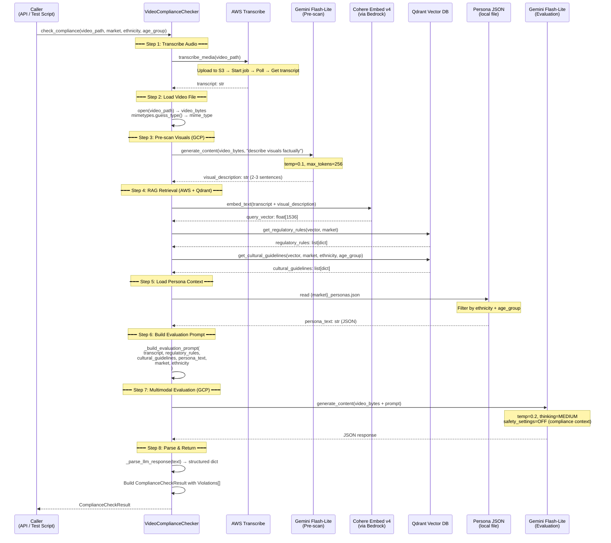
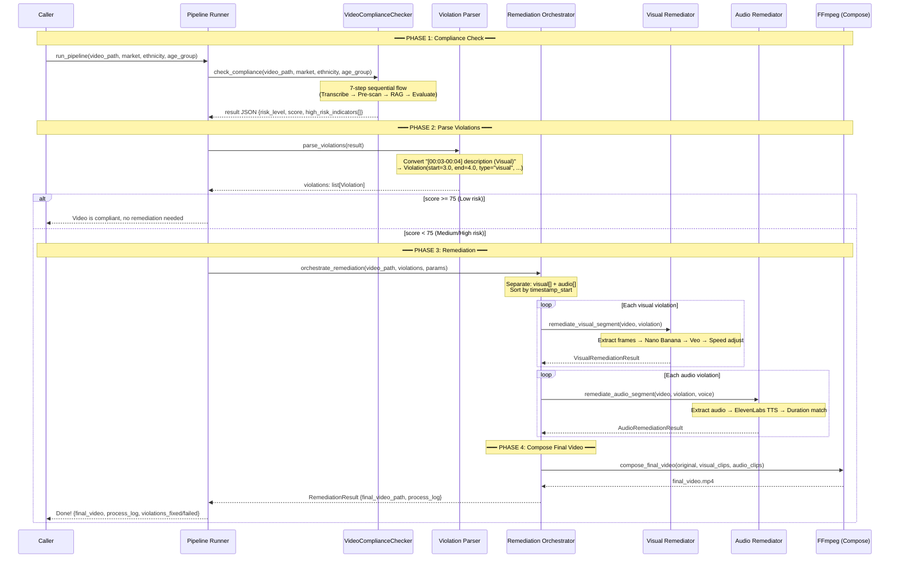

# Design Document: Video Compliance Checker — Sequential Pipeline

## Overview

A deterministic, non-agentic video compliance checking pipeline that runs as a fixed sequence of steps. Designed to be stable and reproducible — no routing decisions, no state machines. Later, this pipeline can be exposed as a **tool** for an agentic system (AWS Bedrock agent) without modifying the core logic.

## Architecture Philosophy

```
┌─────────────────────────────────────────────────────────────┐
│  NOW: Sequential Pipeline (this design)                      │
│  video_checker.py → deterministic 7-step flow               │
│  Called directly from FastAPI or test scripts                │
└─────────────────────────────────────────────────────────────┘
                          │
                          ▼ (future)
┌─────────────────────────────────────────────────────────────┐
│  LATER: Agentic Wrapper                                      │
│  AWS Bedrock Agent (text reasoning) decides WHEN to call     │
│  the pipeline as a tool. Agent handles:                      │
│  - Multi-step decisions (check → remediate → re-check)      │
│  - User interaction and clarification                        │
│  - Orchestrating multiple tools                              │
└─────────────────────────────────────────────────────────────┘
```

**Key principle**: The pipeline itself is never agentic. An agent may *call* it, but the pipeline always runs the same steps in the same order.

## Cloud Accounts

| Account | Provider | Services Used |
|---------|----------|---------------|
| AWS | Bedrock | Transcribe, Cohere Embed v4, Nova Pro (text LLM for future agent) |
| GCP | Vertex AI | Gemini Flash-Lite (multimodal video evaluation) |

---

## Pipeline Sequence Diagram



---

## Pipeline Steps Detail

### Step 1: Transcribe Audio (AWS)

| Property | Value |
|----------|-------|
| Service | AWS Transcribe (via `jusads_transcription.transcriber`) |
| Input | video_path (MP4/MOV/WebM) |
| Output | transcript text (full spoken content) |
| Timeout | 60s |
| Retry | 1 retry on transient errors |
| On failure | Return error result, skip remaining steps |

### Step 2: Load Video File

| Property | Value |
|----------|-------|
| Service | Local filesystem |
| Input | video_path |
| Output | video_bytes, mime_type |
| Validation | File exists, size ≤ 100MB |
| On failure | Return error result |

### Step 3: Pre-scan Visuals (GCP)

| Property | Value |
|----------|-------|
| Service | Gemini Flash-Lite (Vertex AI) |
| Input | video_bytes + "describe visuals factually" prompt |
| Output | visual_description (2-3 sentences) |
| Config | temp=0.1, max_tokens=256 |
| Timeout | 30s |
| Retry | 1 retry on 5xx/timeout |
| On failure | Continue with empty description (transcript-only RAG) |

### Step 4: RAG Retrieval (AWS + Qdrant)

| Property | Value |
|----------|-------|
| Service | Cohere Embed v4 (Bedrock) + Qdrant |
| Input | transcript + visual_description |
| Output | regulatory_rules[], cultural_guidelines[] |
| Embedding dim | 1536 |
| Top-K | regulatory=10, cultural=10 |
| Timeout | 15s per query |
| Retry | 1 retry on Qdrant timeout |
| On failure | Continue with empty rules (LLM uses general knowledge) |

### Step 5: Load Persona Context

| Property | Value |
|----------|-------|
| Service | Local JSON file |
| Input | market, ethnicity, age_group |
| Output | persona_text (structured JSON) |
| File path | `jusads_text_compliance/personas/{market}_personas.json` |
| On failure | Continue with no persona (general evaluation) |

### Step 6: Build Evaluation Prompt

| Property | Value |
|----------|-------|
| Service | Local (string formatting) |
| Input | transcript, rules, cultural, persona, market, ethnicity |
| Output | Full evaluation prompt string |
| Key elements | Scoring logic, timestamp requirements, output format |

### Step 7: Multimodal Evaluation (GCP)

| Property | Value |
|----------|-------|
| Service | Gemini Flash-Lite (Vertex AI) |
| Input | video_bytes + evaluation prompt |
| Output | JSON {RISK, SCORE, high_risk_indicator[], explanation, suggestion} |
| Config | temp=0.2, top_p=0.95, thinking=MEDIUM, safety=OFF |
| Timeout | 90s |
| Retry | 1 retry on 5xx/timeout |
| On failure | Return error result with RISK="High", SCORE=0 |

### Step 8: Parse & Return

| Property | Value |
|----------|-------|
| Service | Local (JSON parsing + validation) |
| Input | Raw LLM JSON text |
| Output | ComplianceCheckResult with Violation[] objects |
| Parsing | Strip markdown fences, json.loads, validate fields |
| On failure | Return error result with parsing error message |

---

## Data Flow Diagram

```mermaid
flowchart TD
    VIDEO[Video File<br/>MP4/MOV/WebM] --> S1[Step 1: Transcribe]
    VIDEO --> S2[Step 2: Load Bytes]
    
    S1 --> |transcript| S3[Step 3: Pre-scan]
    S2 --> |video_bytes| S3
    
    S1 --> |transcript| S4[Step 4: RAG]
    S3 --> |visual_desc| S4
    
    S4 --> |rules + guidelines| S6[Step 6: Build Prompt]
    S1 --> |transcript| S6
    S5[Step 5: Persona] --> |persona_text| S6
    
    S6 --> |prompt| S7[Step 7: Evaluate]
    S2 --> |video_bytes| S7
    
    S7 --> |JSON| S8[Step 8: Parse]
    S8 --> RESULT[ComplianceCheckResult<br/>risk_level, score, violations[]]

    style VIDEO fill:#e1f5fe
    style RESULT fill:#e8f5e9
    style S1 fill:#fff3e0
    style S3 fill:#fce4ec
    style S4 fill:#fff3e0
    style S7 fill:#fce4ec
```

**Color key**: 🟡 AWS services | 🔴 GCP services | ⬜ Local processing

---

## Output Schema

```python
@dataclass
class ComplianceCheckResult:
    risk_level: str          # "High" | "Medium" | "Low"
    score: int               # 0-100
    violations: list[Violation]
    explanation: str
    suggestion: str
    raw_result: dict         # Full pipeline output for debugging

@dataclass
class Violation:
    timestamp_start: float   # seconds
    timestamp_end: float     # seconds
    category: str            # e.g. "Sexual/Explicit", "Religious Sensitivity"
    severity: str            # "Severe" | "Moderate" | "Minor"
    description: str         # max 200 chars
    violation_type: str      # "visual" | "audio"
    guideline_source: str    # "regulatory" | "cultural"
```

---

## Error Handling Strategy

| Error Type | Behavior |
|-----------|----------|
| Transcription fails | Return error result immediately (can't evaluate without transcript) |
| Video file unreadable | Return error result immediately |
| Pre-scan fails | Continue — use transcript-only for RAG |
| Qdrant unavailable | Continue — LLM uses general knowledge |
| Persona not found | Continue — general evaluation without persona |
| Evaluation LLM fails | Return error result with RISK="High", SCORE=0 |
| JSON parse fails | Return error result with parsing error |

**Principle**: Only Steps 1, 2, and 7 are hard failures. Steps 3-5 degrade gracefully.

---

## Future: Agentic Integration

When ready to add an agent layer:

```python
# The pipeline becomes a tool for the AWS Bedrock Agent
class VideoComplianceCheckerTool:
    """Tool wrapper for Bedrock Agent (Nova Pro)."""
    
    name = "check_video_compliance"
    description = "Check a video ad for cultural/regulatory compliance"
    
    def invoke(self, video_path: str, market: str, ethnicity: str, age_group: str) -> dict:
        checker = VideoComplianceChecker()
        result = checker.check_compliance(video_path, market, ethnicity, age_group)
        return result.__dict__
```

The agent (AWS Nova Pro via Bedrock) handles:
- Deciding when to check vs remediate
- Multi-turn user interaction
- Orchestrating check → remediate → re-check loops
- Explaining results in natural language

The pipeline itself never changes — it's always the same steps.

---

## Full Pipeline: Check → Remediate (Option 1 — Sequential)

This is the chosen approach. No agent, no memory needed. The compliance result JSON carries all context from step 1 to step 2.

### End-to-End Sequence Diagram



### Data Flow Between Phases

```
┌──────────────────────┐
│  PHASE 1: Check      │
│  video_checker.py    │
│                      │
│  Input:              │
│  - video_path        │
│  - market            │
│  - ethnicity         │
│  - age_group         │
│                      │
│  Output:             │
│  - result JSON       │
│    (score, risk,     │
│     indicators[])    │
└──────────┬───────────┘
           │ result JSON passes directly
           ▼
┌──────────────────────┐
│  PHASE 2: Parse      │
│  parse_violations()  │
│                      │
│  Input:              │
│  - result JSON       │
│                      │
│  Output:             │
│  - Violation[]       │
│    (structured       │
│     objects with     │
│     timestamps)      │
└──────────┬───────────┘
           │ violations[] + original params
           ▼
┌──────────────────────┐
│  PHASE 3: Remediate  │
│  orchestrator.py     │
│                      │
│  Input:              │
│  - video_path        │
│  - violations[]      │
│  - market, ethnicity │
│  - language          │
│                      │
│  Output:             │
│  - final_video.mp4   │
│  - process_log[]     │
│  - stats             │
└──────────────────────┘
```

### Why No Agent/Memory is Needed

The compliance result JSON already contains everything the remediation step needs:
- `video_path` — same video
- `high_risk_indicators` — parsed into Violation objects with timestamps
- `market`, `ethnicity`, `age_group` — same params passed through
- `suggestion` — informs the remediation prompts

No "remembering" required — it's just function composition: `output_of_step1 → input_of_step2`.

---

## Files to Keep / Remove

### Keep (active pipeline)
| File | Purpose |
|------|---------|
| `video_checker.py` | Phase 1 — compliance checking (7-step flow) |
| `models.py` | Data models (Violation, ComplianceCheckResult, etc.) |
| `visual_remediator.py` | Phase 3 — visual remediation (Nano Banana + Veo) |
| `audio_remediator.py` | Phase 3 — audio remediation (ElevenLabs TTS) |
| `orchestrator.py` | Phase 3 — remediation orchestrator + compose |
| `__init__.py` | Package init |
| `run_video_check.py` | Test script for Phase 1 |
| `run_full_pipeline.py` | Test script for full flow (check → remediate) |

### Already Archived
| File | Reason |
|------|--------|
| `compliance_checker.py` | Was a LangGraph wrapper — replaced by direct video_checker |
| `video_remediator_kling.py` | Old Kling-based approach — replaced by Veo |
| `kling_generator.py` | Old Kling client |
| `video_remediator.py` | Old generic remediator |
| `video_assembler.py` | Old assembler — replaced by orchestrator.compose_final_video |
| `audio_generator.py` | Old audio gen — replaced by audio_remediator |
| Test files | Testing done directly via run scripts |

### Testing Approach
Test the pipeline directly with real videos:
```bash
# Test Phase 1 only (compliance check)
cd backend
python run_video_check.py

# Test full pipeline (check → remediate)
python run_full_pipeline.py
```
