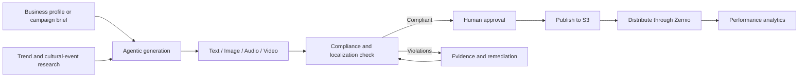

# JusAds

**AI-powered advertising generation, localization, compliance, remediation, distribution, and analytics for Southeast Asian markets.**

JusAds helps marketing teams move from an advertising brief to market-ready creative while keeping a human approval gate before publication. The platform supports text, image, audio, and video assets, with Malaysia as the primary market and regional localization support for Southeast Asia.

## Product showcase

| Capability | What JusAds does | Main technology |
|---|---|---|
| Agentic ad studio | Interprets a brief, selects media agents, generates creative, checks output, and streams progress | LangGraph, Gemini on Vertex AI, FastAPI SSE |
| Multimodal compliance | Evaluates text, image, audio, and video against regulatory, platform, and cultural rules | Gemini multimodal, Qdrant RAG, AWS Transcribe |
| Violation evidence | Finds risky content, timestamps video findings, and creates masks or evidence clips | Transformers, SAM/CLIPSeg, FFmpeg |
| AI remediation | Rewrites copy, edits imagery, localizes voice, and rebuilds non-compliant media | Gemini, ElevenLabs, Flux/KIE fallbacks, FFmpeg |
| Trend intelligence | Researches current platform trends and contextual cultural events by market | Google Search grounding, PredictHQ, Supabase cache |
| Distribution | Publishes approved ads to connected social accounts | Zernio SDK, AWS S3 |
| Analytics | Displays post performance, daily metrics, best posting times, and account summaries | Zernio analytics, Recharts |
| Persistence | Stores users, projects, tasks, checks, violations, generated ads, profiles, and trend caches | Supabase PostgreSQL |

## End-to-end workflow



The approval step is intentional: generated assets are not distributed until a user publishes and selects a connected destination.

## Agentic architecture

JusAds uses two active agent systems:

1. **Generation graph** — loads conversation history, resolves platform context, detects requested media, routes work to text/image/audio/video agents, performs compliance checks, persists outputs, and emits SSE status events.
2. **Compliance graph** — detects media type, retrieves market and platform rules, gathers multimodal evidence, scores risk, records violations, and routes non-compliant assets toward remediation.

The generation agents live in `backend/jusads_generation/agents/`. Compliance evidence and research agents live in `backend/jusads_compliance/agents/`. Runtime prompt templates are intentionally kept in `backend/shared/prompts/`; they are application inputs, not developer documentation.

## Technology usage

### Frontend

- **React 19 and TypeScript 6** provide the SPA and typed service layer.
- **Vite 8** builds and serves the application.
- **Tailwind CSS 4 and shadcn/Radix components** implement the design system.
- **React Router 7** handles public, authenticated, project, task, compliance, and generation routes.
- **AWS Cognito through `oidc-client-ts`** provides OAuth/OIDC authentication.
- **GSAP** provides scoped page and data-entry animations.
- **Recharts** renders social-performance analytics.
- **Vitest and fast-check** cover example-based and property-based frontend behavior.

### Backend and AI

- **Python 3.12, FastAPI, and Uvicorn** expose asynchronous HTTP, SSE, and WebSocket APIs.
- **LangGraph and LangChain Core** orchestrate typed, conditional agent workflows.
- **Google Gemini on Vertex AI** powers reasoning, multimodal analysis, grounded research, image generation, and video planning/generation.
- **Qdrant** retrieves regulatory and prompt context using vector similarity.
- **PyTorch, Transformers, SAM/CLIPSeg, and Pillow** support violation-region segmentation.
- **FFmpeg and CapCut draft tooling** assemble video evidence and editable outputs.
- **ElevenLabs** generates localized speech and audio remediation.

### Data and integrations

- **Supabase PostgreSQL** is the system of record.
- **AWS S3** stores uploads and generated media; pre-signed URLs support direct browser transfer.
- **AWS Transcribe** is available for speech-to-text workflows.
- **Tavily and Google Search grounding** support current research.
- **PredictHQ** supplies cultural and contextual events.
- **Zernio** publishes approved assets and returns social analytics.

External calls are wrapped with graceful-degradation paths where practical. A provider quota error such as Vertex AI `429 RESOURCE_EXHAUSTED` can cause cached or unavailable research results without taking down the rest of the application.

## Repository structure

```text
.
├── backend/
│   ├── app.py                         # FastAPI entry point
│   ├── routes/                        # API modules
│   ├── jusads_generation/             # Generation graph, agents, publishing
│   ├── jusads_compliance/             # Compliance and remediation graphs
│   ├── shared/                        # Config, clients, storage, runtime prompts
│   ├── migrations/                    # Supabase schema and seed data
│   ├── scripts/manual/                # Explicit data-refresh utilities
│   └── tests/                         # pytest suites
├── frontend/
│   ├── src/pages/                     # Route-level React pages
│   ├── src/components/                # Shared and feature components
│   ├── src/services/                  # HTTP, SSE, and WebSocket clients
│   ├── src/hooks/                     # Application hooks
│   └── src/tests/                     # Vitest suites
├── cloud/                              # Docker, Nginx, HTTPS, deployment scripts
├── diagram/                            # draw.io architecture sources
├── assets/                             # Demo and evaluation media
└── README.md
```

Developer-only skill packs were removed from the repository. `.kiro/steering/` remains because it contains active workspace conventions, not agent skills.

## Prerequisites

- Python 3.12 recommended
- Node.js 20+ and npm
- FFmpeg available on `PATH`
- A Supabase project
- Google Cloud/Vertex AI credentials for AI features
- Optional credentials for AWS, Qdrant, Tavily, ElevenLabs, PredictHQ, Apify, Flux/KIE, and Zernio

## Local setup

### 1. Backend

From PowerShell:

```powershell
Set-Location backend
python -m venv .venv
.\.venv\Scripts\Activate.ps1
python -m pip install -r requirements.txt
Copy-Item .env.example .env
```

Fill in `backend/.env`. Startup requires `SUPABASE_URL` and `SUPABASE_KEY`; other integrations activate when their credentials are configured.

Start the API:

```powershell
uvicorn app:app --reload --port 8000
```

Verify it:

```powershell
Invoke-RestMethod http://localhost:8000/api/health
```

Interactive API documentation is available at `http://localhost:8000/docs`.

### 2. Frontend

In a second terminal:

```powershell
Set-Location frontend
npm install
npm run dev
```

Open `http://localhost:5173`. The API URL defaults to `http://localhost:8000`; set `VITE_API_BASE` when a different backend origin is required.

## Configuration

Never commit `.env` files or credentials. Use `backend/.env.example` as the authoritative template.

| Group | Variables | Purpose |
|---|---|---|
| Required persistence | `SUPABASE_URL`, `SUPABASE_KEY` | Backend startup and structured data |
| Vertex AI | `VERTEX_PROJECT_ID`, `VERTEX_LOCATION`, `VERTEX_GCS_BUCKET`, `LLM_MODEL_ID` | Gemini and video generation |
| AWS | `AWS_REGION`, `AWS_ACCESS_KEY_ID`, `AWS_SECRET_ACCESS_KEY`, `S3_BUCKET_NAME` | Media storage and AWS services |
| Regulatory RAG | `QDRANT_URL`, `QDRANT_API_KEY`, `QDRANT_TOP_K`, `EMBED_DIMENSIONS` | Rule and prompt retrieval |
| Research | `TAVILY_API_KEY`, `APIFY_API_TOKEN`, `PREDICTHQ_API_KEY` | Web research, trend collection, events |
| Remediation | `ELEVENLABS_API_KEY`, voice IDs, `FLUXAI_API_KEY`, `KIE_API_KEY`, `HUGGINGFACE_ACCESS_TOKEN` | Speech, image/video editing, segmentation |
| Distribution | `ZERNIO_API_KEY`, `ZERNIO_ACCOUNT_TIKTOK`, `ZERNIO_ACCOUNT_INSTAGRAM` | Social publishing and analytics |
| Observability | `LANGSMITH_TRACING`, `LANGSMITH_ENDPOINT`, `LANGSMITH_API_KEY`, `LANGSMITH_PROJECT` | Agent tracing |

The Cognito authority and client configuration currently live in `frontend/src/lib/cognito.ts`; callback URLs must include the local and deployed `/callback` routes.

## Main user experiences

- `/` — public product landing page
- `/dashboard` — authenticated project dashboard
- `/dashboard/new` — project creation
- `/dashboard/project/:projectId/easy` — guided generation
- `/dashboard/project/:projectId/advance/:taskId` — conversational advanced generation
- `/dashboard/project/:projectId/compliance` — multimodal compliance checking
- `/dashboard/assets` — generated asset library
- `/dashboard/trends` — trend research and cultural-event intelligence
- `/dashboard/profile` — business profile and targeting context

## API overview

FastAPI's `/docs` page is the complete live contract. Key route families are:

| Route family | Purpose |
|---|---|
| `GET /api/health` | Service readiness |
| `/projects` and `/projects/{project_id}/tasks` | Project and task lifecycle |
| `POST /projects/{project_id}/tasks/{task_id}/chat` | SSE generation-agent conversation |
| `GET /projects/{project_id}/tasks/{task_id}/generated-ads` | Generated outputs |
| `POST .../ads/{ad_id}/publish` | Human approval and publication |
| `POST .../ads/{ad_id}/distribute` | Zernio distribution |
| `GET .../ads/{ad_id}/analytics` | Per-ad performance |
| `POST /api/compliance/check` | Compliance pipeline entry point |
| `WS /ws/{task_id}` | Live pipeline results and decisions |
| `POST /api/compliance/{task_id}/remix` | SSE remediation flow |
| `GET /api/trends` | Cached trends |
| `POST /api/trends/research` | Personalized grounded research |
| `POST /api/trends/refresh` | Manual scoped refresh |
| `GET /api/trends/events` | Cultural-event calendar |
| `GET /api/statistics/posts` | Zernio post analytics |
| `POST /upload-url`, `POST /download-url` | S3 pre-signed media access |

Uploads are limited by backend validation, and generated/runtime media belongs in ignored asset or cloud storage locations rather than source directories.

## Database

For a new Supabase project, run:

```text
backend/migrations/full_schema.sql
```

Incremental migrations are retained for existing deployments. Core domains include users, business profiles, projects, tasks, compliance checks, violations, generated ads, chat history, platform rules, cultural events, and trend caches.

## Development commands

### Backend (`backend/`)

```powershell
pytest
.\.venv\Scripts\python.exe -c "import app; print('FastAPI app import successful')"
```

### Frontend (`frontend/`)

```powershell
npm run build
npm run lint
npm run test
```

`npm run test` already invokes Vitest with `--run`; do not use watch mode in automated validation.

## Deployment

The `cloud/` folder contains a three-service Docker deployment:

```text
Internet -> Nginx :80/:443
              |-> React static frontend
              |-> FastAPI backend :8000
```

Required files include `docker-compose.yml`, backend/frontend Dockerfiles, `nginx.conf`, `.env.production.template`, and setup/deploy scripts.

Typical deployment from the server:

```bash
cd cloud
cp .env.production.template .env.production
# Populate secrets without committing the file.
docker compose up -d --build
```

Verify with `docker compose ps`, `docker logs jusads-backend --tail 100`, and the deployed `/api/health` endpoint. TLS certificates are mounted into Nginx from `cloud/certbot/`, which is ignored by Git.

## Operational notes and current constraints

- Vertex AI and grounded research are quota-bound. On HTTP 429, retry later, request quota, or rely on scoped cached trend data.
- Trend cards show a large preview only for verifiable YouTube URLs; unsupported or nonvisual sources use compact cards.
- Zernio may take time to ingest analytics after publication. Current source classification depends on Zernio metadata, so matching stored post IDs is the most reliable reconciliation method.
- S3, Supabase, Qdrant, ElevenLabs, and search-provider failures are logged and should degrade gracefully where the workflow permits.
- Development CORS is permissive. Restrict origins before deploying to a new production environment.
- Runtime prompt Markdown in `backend/shared/prompts/` must remain available because the backend loads it dynamically.

## Security

- Keep `.env`, production environment files, private keys, certificates, and credentials out of Git.
- Use least-privilege AWS and database credentials.
- Do not expose provider keys in frontend variables.
- Review generated content and compliance findings before publication; AI results support human review rather than replacing legal or regulatory judgment.

## License

Private project. No open-source license has been declared.