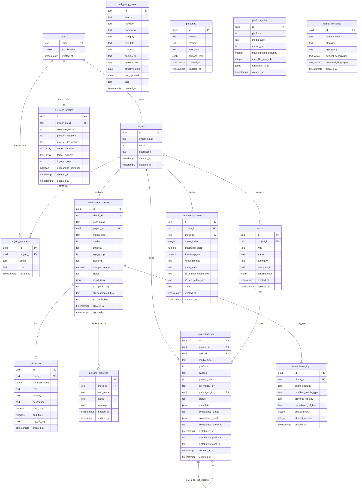
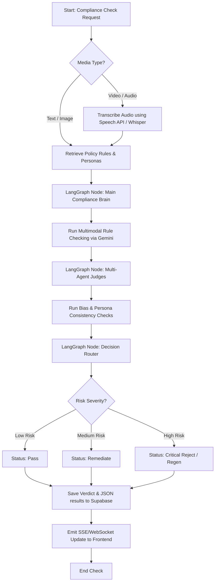

# JusAds — System Documentation

**Version:** 2.0  
**Date:** July 3, 2026  
**Authors:** Development Team  

---

## Table of Contents

1. [System Overview](#1-system-overview)
2. [Technology Stack](#2-technology-stack)
3. [System Architecture](#3-system-architecture)
4. [Module Structure](#4-module-structure)
5. [Key Libraries & Dependencies](#5-key-libraries--dependencies)
6. [Use Case Diagram](#6-use-case-diagram)
7. [Class Diagram](#7-class-diagram)
7.5. [Database Entity-Relationship Diagram (ERD)](#75-database-entity-relationship-diagram-erd)
8. [Activity Diagrams](#8-activity-diagrams)
9. [Sequence Diagrams](#9-sequence-diagrams)
10. [Test Cases](#10-test-cases)
11. [Before vs After Comparison](#11-before-vs-after-comparison)
12. [Future Plan](#12-future-plan)
13. [Intelligent Remediation Engine](#13-intelligent-remediation-engine-implemented)
14. [V3 Character Grid Video Pipeline](#14-v3-character-grid-video-pipeline-implemented)
15. [Dual Output System](#15-dual-output-system-implemented)
16. [Background Task Architecture](#16-background-task-architecture-implemented)

---

## 1. System Overview

JusAds is an AI-powered advertising compliance and generation platform for Southeast Asian markets (primarily Malaysia). It provides:

- **Multi-modal ad generation** — Text, image, audio, and video ad creation via AI agents
- **Cultural compliance checking** — Automated regulatory and cultural sensitivity analysis
- **Multi-scene video production** — Storyboard planning with Veo 3 dynamic video synthesis
- **Social distribution** — Direct publishing to TikTok/Instagram via Zernio API
- **Prompt library** — 14,642 searchable prompt templates via vector similarity (Qdrant)
- **Conditional localization** — Ethnicity-aware cultural rules (Malay/Chinese/Indian)

### Core Workflow
```
User Brief → AI Generation → Compliance Check → Human Approval → Social Distribution
```

---

## 2. Technology Stack

### Backend (Python 3.12 / FastAPI)

| Layer | Technology | Purpose |
|-------|-----------|---------|
| Framework | FastAPI + uvicorn (async ASGI) | REST API + SSE streaming |
| AI/LLM | Google Gemini 2.5 Flash (Vertex AI) | Text generation, compliance analysis, prompt refinement |
| Image Gen | Imagen 4.0 (primary), Gemini Flash Lite (fallback) | Keyframe and ad image generation |
| Video Gen | Google Veo 3.0 / 3.1 Lite | Dynamic video clip synthesis (image-to-video) |
| Voice/Audio | ElevenLabs Multilingual v3 | TTS voiceover + sound effects |
| Orchestration | LangGraph (StateGraph) | Pipeline orchestration with typed state |
| Vector DB | Qdrant Cloud | Prompt template similarity search (768-dim, cosine) |
| Embeddings | Gemini text-embedding-004 | 768-dimensional text embeddings |
| Cloud Storage | AWS S3 | Media file storage (generated ads, references) |
| Database | Supabase (PostgreSQL) | Projects, tasks, generated_ads, compliance_checks |
| Distribution | Zernio API | Social media publishing (TikTok, Instagram) |
| Media Processing | FFmpeg | Video transitions, subtitle burn, audio mixing |

### Frontend (TypeScript / React 19)

| Layer | Technology | Purpose |
|-------|-----------|---------|
| Framework | React 19 + TypeScript | SPA with type safety |
| Build | Vite 8 | Fast dev/build tooling |
| Styling | Tailwind CSS 4 | Utility-first CSS |
| UI Components | shadcn/ui (Radix) | Accessible component primitives |
| Animation | GSAP 3.15 + @gsap/react | Smooth entrance/interaction animations |
| Routing | react-router v7 | Client-side routing |
| Auth | oidc-client-ts (Cognito) | OAuth authentication |
| Charts | Recharts | Analytics visualization |

---

## 3. System Architecture

```
┌─────────────────────────────────────────────────────────────────────┐
│                         FRONTEND (React SPA)                         │
│  ┌──────────┐  ┌──────────┐  ┌──────────┐  ┌───────────────────┐  │
│  │ Dashboard │  │  Canvas  │  │  Assets  │  │ Compliance Page   │  │
│  │   Pages   │  │(Generate)│  │  Library │  │ (Check + Remix)   │  │
│  └─────┬─────┘  └────┬─────┘  └────┬─────┘  └────────┬──────────┘  │
│        │              │              │                  │             │
│        └──────────────┴──────────────┴──────────────────┘             │
│                              │ HTTP/SSE                               │
└──────────────────────────────┼───────────────────────────────────────┘
                               │
┌──────────────────────────────┼───────────────────────────────────────┐
│                      BACKEND (FastAPI)                                │
│                              │                                        │
│  ┌───────────────────────────┴────────────────────────────────────┐  │
│  │                     routes/ (API Layer)                         │  │
│  │  generation.py │ compliance.py │ projects.py │ remix.py │ ...  │  │
│  └───────────┬────────────┬───────────────┬───────────────────────┘  │
│              │            │               │                           │
│  ┌───────────▼──┐  ┌─────▼────────────┐  ┌──────────────────────┐  │
│  │jusads_       │  │jusads_           │  │     shared/           │  │
│  │generation/   │  │compliance/       │  │  clients.py           │  │
│  │              │  │                  │  │  s3_client.py         │  │
│  │ orchestrator │  │ compliance_      │  │  supabase_client.py   │  │
│  │ agents/      │  │ pipeline         │  │  elevenlabs_utils.py  │  │
│  │ prompt_      │  │ remediation      │  │  models.py            │  │
│  │ search/      │  │ remix_tools      │  │  config.py            │  │
│  │ distribution │  │ decision_router  │  │  fallback_queue.py    │  │
│  └──────────────┘  └──────────────────┘  └──────────────────────┘  │
│              │            │               │                           │
└──────────────┼────────────┼───────────────┼───────────────────────────┘
               │            │               │
┌──────────────▼────────────▼───────────────▼───────────────────────────┐
│                     EXTERNAL SERVICES                                   │
│  ┌─────────┐ ┌────────┐ ┌─────────┐ ┌────────┐ ┌────────┐ ┌───────┐ │
│  │ Gemini  │ │ Veo 3  │ │Eleven   │ │  S3    │ │Supabase│ │Qdrant │ │
│  │(Vertex) │ │(Vertex)│ │Labs     │ │ (AWS)  │ │(Postgres)│ │(Cloud)│ │
│  └─────────┘ └────────┘ └─────────┘ └────────┘ └────────┘ └───────┘ │
│  ┌─────────┐ ┌────────┐                                              │
│  │ Zernio  │ │ FFmpeg │                                              │
│  │(Distrib)│ │(Local) │                                              │
│  └─────────┘ └────────┘                                              │
└───────────────────────────────────────────────────────────────────────┘
```


---

## 4. Module Structure

```
backend/
├── app.py                      # FastAPI application entry point
├── config.py                   # Re-exports from shared/config.py
├── shared/                     # SHARED utilities (cross-module)
│   ├── config.py               # Environment variables, secrets, voice config
│   ├── clients.py              # Gemini, S3, Supabase, ElevenLabs instances
│   ├── s3_client.py            # S3 operations (upload, delete, presigned)
│   ├── supabase_client.py      # Supabase CRUD (projects, tasks, checks)
│   ├── elevenlabs_utils.py     # TTS + SFX generation
│   ├── models.py               # Pydantic models (CheckRecord, etc.)
│   └── fallback_queue.py       # Deferred retry queue
├── jusads_compliance/          # COMPLIANCE pipeline
│   ├── compliance_pipeline.py  # LangGraph compliance analysis pipeline
│   ├── compliance_tools.py     # Gemini-based content analysis tools
│   ├── decision_router.py      # Pass/remediate/reject routing logic
│   ├── remediation_pipeline.py # Auto-remediation (image/audio/text)
│   ├── remix_tools.py          # Text rewrite, audio remix, image edit
│   ├── prompts.py              # All compliance prompt templates
│   ├── pipeline_runner.py      # Runs pipeline + emits WebSocket events
│   ├── progress_tracker.py     # Step-by-step progress tracking
│   ├── rules_client.py         # Qdrant regulatory rules retrieval
│   ├── triage.py               # Violation triage + severity routing
│   └── ai_designer.py          # AI-guided image edit planning
├── jusads_generation/          # GENERATION pipeline
│   ├── orchestrator.py         # LangGraph StateGraph + SSE streaming
│   ├── state.py                # TypedDict state schema
│   ├── intent.py               # Media type detection from user message
│   ├── platform_rules.py       # Platform sizing (TikTok/IG/YouTube/Shopee)
│   ├── chat_store.py           # Chat message persistence
│   ├── compliance_bridge.py    # Bridges generated ads to compliance check
│   ├── distribution.py         # Zernio social distribution
│   ├── publish.py              # Human-in-the-loop publish gate
│   ├── agents/                 # Independent media agents
│   │   ├── base.py             # Shared AgentResult contract
│   │   ├── text_agent.py       # Gemini copy generation
│   │   ├── image_agent.py      # Imagen 4 / Gemini image generation
│   │   ├── audio_agent.py      # ElevenLabs VO + SFX + mix
│   │   ├── video_agent.py      # Veo 3.0 single-clip (V1)
│   │   └── video_v2.py         # Multi-scene storyboard (V2)
│   └── prompt_search/          # Vector prompt search
│       ├── embeddings.py       # Gemini text-embedding-004
│       ├── qdrant_store.py     # Qdrant ingest + search
│       └── ingest.py           # CSV ingestion script
├── routes/                     # FastAPI route handlers
│   ├── generation.py           # Chat, publish, distribute, search
│   ├── compliance.py           # Compliance check + WebSocket
│   ├── projects.py             # Project/task CRUD
│   ├── remix.py                # Remediation endpoints
│   ├── files.py                # S3 presigned URLs
│   ├── profile.py              # User profile/onboarding
│   ├── progress.py             # Pipeline progress polling
│   └── health.py               # Health check
├── data/                       # Reference data (CSV, prompt packs)
├── tests/                      # Test scripts
├── migrations/                 # SQL schemas
└── archived/                   # Deprecated code
```


---

## 5. Key Libraries & Dependencies

### Backend (Python)

| Library | Version | Purpose |
|---------|---------|---------|
| **fastapi** | 0.115+ | Main web framework for high-performance async REST API and SSE streaming |
| **uvicorn** | 0.30+ | ASGI web server for running the FastAPI application |
| **mangum** | latest | AWS Lambda adapter to support serverless API Gateway deployment |
| **python-multipart** | latest | Form-data parsing for uploading reference media assets |
| **python-dotenv** | 1.0+ | Reads configuration and service API keys from local environment files |
| **google-genai** | latest | Official Google SDK for Vertex AI (Gemini 2.5 Flash, Imagen 4, Veo 3) |
| **google-cloud-speech**| latest | Performs voice transcription fallbacks for audio/video ads |
| **google-cloud-aiplatform**| latest | Vertex AI platform client for unified orchestration |
| **langgraph** | 0.2+ | StateGraph orchestrator to structure generative agents and compliance checks |
| **langchain-core** | latest | Base schemas and interfaces for structuring LLM inputs and prompts |
| **qdrant-client** | 1.9+ | High-performance vector database client for prompt template searches |
| **boto3 / botocore** | 1.34+ | AWS SDK for storage (S3 bucket media) and Transcribe service fallback |
| **supabase** | 2.0+ | Database client for PostgreSQL structured persistence layer |
| **elevenlabs** | 1.0+ | High-fidelity text-to-speech, sound effects generator, and voice cloning |
| **pydantic** | 2.0+ | Type hinting, schema compliance, and JSON serialization validation |
| **Pillow** | 10.0+ | Python Imaging Library (PIL) for keyframe editing and format fallbacks |
| **numpy** | latest | Matrix calculations for violation image mask arrays and sound signals |
| **torch / torchvision**| latest | PyTorch framework backing visual segmentation checks (e.g. SAM 2) |
| **transformers** | latest | Hugging Face library running local image/video compliance classifications |
| **pycapcut** | latest | Generates editable CapCut draft packages containing timelines and tracks |
| **pyJianYingDraft** | latest | Generates editor-compliant JianYing drafts for Chinese-market workflows |
| **pydub** | latest | Audio mixing, volume ducking, and MP3 format splicing/processing |
| **tavily-python** | latest | Web search client verifying policy rules against active ad copy claims |
| **requests** | 2.31+ | Client for external API interactions (Zernio publishing) |

### Frontend (TypeScript)

| Library | Version | Purpose |
|---------|---------|---------|
| **react** | 19.x | Component UI architecture framework |
| **typescript** | 6.x | System-wide type-safety and visual component typing |
| **vite** | 8.x | Frontend build tool and rapid Hot Module Replacement (HMR) server |
| **tailwindcss** | 4.x | Utility-first CSS framework for visual layouts |
| **gsap** | 3.15 | Smooth timeline animations and transitions on the canvas dashboard |
| **@gsap/react** | 2.x | Specialized React hooks wrapping GSAP timelines |
| **react-router** | 7.x | Frontend routing and route transitions |
| **lucide-react** | latest | Modern clean SVG icon set |
| **sonner** | latest | UI toast alerts and progress popups |
| **recharts** | 2.x | Visual performance and ad analytics dashboard graphs |
| **oidc-client-ts** | latest | OpenID Connect client for AWS Cognito user authentication |

---

## 6. Use Case Diagram

### 6.1 Actor Definitions

| Actor Category | Actor Name | Description | Role / Permissions |
|---|---|---|---|
| **Human Actors** | **Project Owner (Admin)** | The owner of the project. | Full access to manage project metadata, invite project members, delete projects/tasks, configure brand assets, and run generation/compliance/publishing flows. |
| | **Content Creator (Editor)** | Standard workspace user. | Full access to create/update tasks, run prompt searches, generate creatives, run compliance, request remediation, and publish/distribute ads. Cannot delete projects or invite team members. |
| | **Auditor (Viewer)** | Read-only external or internal reviewer. | View-only access. Can inspect generated ads, compliance scores, and reasons/logs, but cannot generate, edit, delete, publish, or distribute. |
| **System Actors** | **Google Vertex AI** | AI foundation models. | Executes text copy generation (Gemini), keyframe rendering (Imagen 4), compliance analysis, and video clip generation (Veo 3). |
| | **ElevenLabs API** | Audio foundation service. | Generates scene voiceovers (TTS) and ambient sound effects (SFX), and conducts voice-cloning remediation. |
| | **Zernio API** | Distribution gateway. | Directs cross-posting and status updates to TikTok and Instagram. |
| | **Supabase (PostgreSQL)** | Database layer. | Manages persistence for projects, tasks, members, rules, target personas, ads, and compliance checks. |
| | **AWS S3** | Object storage. | Stores raw inputs, generated video clips, keyframe images, VO audio, and combined media tracks. |
| | **Qdrant Vector DB** | Vector search engine. | Performs 768-dimensional prompt template searches and recommendations. |

### 6.2 Diagram

```
                                 ┌───────────────────────────────────────────────┐
                                 │                JusAds Platform                │
                                 │                                               │
  ┌─────────────────┐            │    ┌─────────────────────────────────────┐    │
  │  Project Owner  ├────────────┼───►│ UC6: Manage Projects & Assets       │    │
  │     (Admin)     │            │    │ (CRUD, delete, team invitations)    │    │
  └────────┬────────┘            │    └─────────────────────────────────────┘    │
           │ inherits            │                                               │
           ▼                     │    ┌─────────────────────────────────────┐    │
  ┌─────────────────┐            │    │ UC1: Generate Ad Creative           │◄───┼───────┐
  │ Content Creator ├────────────┼───►│ (text/image/audio/video)            │    │       │
  │    (Editor)     │            │    └─────────────────────────────────────┘    │       │
  └────────┬────────┘            │                                               │       ▼
           │ inherits            │    ┌─────────────────────────────────────┐    │  ┌──────────┐
           ▼                     │    │ UC2: Check Compliance               │◄───┼──┤ Vertex   │
  ┌─────────────────┐            │    │ (cultural + regulatory analysis)    │    │  │ AI Engine│
  │     Auditor     ├────────────┼──┐ └─────────────────────────────────────┘    │  └──────────┘
  │    (Viewer)     │            │  │                                            │       ▲
  └─────────────────┘            │  │ ┌─────────────────────────────────────┐    │       │
                                 │  │ │ UC3: Review & Publish               │    │  ┌────┴─────┐
                                 │  │ │ (human-in-the-loop gate)            │    │  │ElevenLabs│
                                 │  │ └─────────────────────────────────────┘    │  └──────────┘
                                 │  │                                            │
                                 │  │ ┌─────────────────────────────────────┐    │  ┌──────────┐
                                 │  │ │ UC4: Distribute to Social           │◄───┼──┤  Zernio  │
                                 │  │ │ (TikTok/Instagram posting)          │    │  │   API    │
                                 │  │ └─────────────────────────────────────┘    │  └──────────┘
                                 │  │                                            │
                                 │  │ ┌─────────────────────────────────────┐    │  ┌──────────┐
                                 │  └►│ UC5: Browse Prompt Library           │◄───┼──┤  Qdrant  │
                                 │    │ (vector similarity search)          │    │  │ Vector DB│
                                 │    └─────────────────────────────────────┘    │  └──────────┘
                                 │                                               │
                                 └───────────────────────────────────────────────┘
```

### 6.3 Use Case Details

| UC | Name | Primary Actor | Precondition | Flow | Postcondition |
|----|------|---------------|--------------|------|---------------|
| UC1 | Generate Ad Creative | Content Creator | Authenticated, project exists | Configure target audience and platform → Type text brief → Dispatch media agents → Output results | Ad segments stored in S3, metadata recorded in DB |
| UC2 | Check Compliance | Content Creator | Ad creative generated | Enable compliance mode → LangGraph retrieves policy rules → Executes multi-modal check → Show badge & verdict panel | Compliance record inserted, risk flags visualised |
| UC3 | Review & Publish | Content Creator | Ad creative passes compliance or non-final | Click "Publish" button on canvas outputs | Ad status updated to "published" in DB |
| UC4 | Distribute to Social | Content Creator | Ad status is "published" | Click "Distribute" → Choose platform → Call Zernio API → Post ad | Post ID stored, distributed_at timestamp recorded |
| UC5 | Browse Prompt Library | Content Creator, Auditor | Qdrant DB initialized | Enter search keywords → Search vector DB → Return relevant prompt recipes | Prompts loaded into chat window for active use |
| UC6 | Manage Projects & Assets | Project Owner | Authenticated | Create project or deleteTask → S3 cleanup triggered | Records deleted from DB; orphaned media files removed from S3 |


---

## 7. Class Diagram

```
┌────────────────────────────────────────────────────────────────────┐
│                        shared/                                      │
├────────────────────────────────────────────────────────────────────┤
│ clients.py                                                         │
│   gemini: genai.Client          (Vertex AI)                        │
│   s3: boto3.client              (AWS S3)                           │
│   supabase: Client              (Supabase)                         │
│   elevenlabs: ElevenLabs        (TTS)                              │
├────────────────────────────────────────────────────────────────────┤
│ models.py                                                          │
│   CheckRecord(BaseModel)        check_id, user_email, media_type...│
│   ComplianceOutput(BaseModel)   risk_percentage, violations...     │
│   Compliance_State(TypedDict)   session_id, media_type, result...  │
│   HistoryResponse(BaseModel)    items, total, page...              │
├────────────────────────────────────────────────────────────────────┤
│ supabase_client.py                                                 │
│   SupabaseComplianceStore       (legacy class wrapper)             │
│   create_project(user_id, name) → dict                             │
│   delete_project(project_id) → bool  [+ S3 cleanup]               │
│   delete_task(project_id, task_id) → bool  [+ S3 cleanup]         │
├────────────────────────────────────────────────────────────────────┤
│ s3_client.py                                                       │
│   upload_file_public(path, key) → url                              │
│   delete_prefix(prefix) → count                                    │
│   delete_project_media(project_id, owner) → count                  │
│   generate_presigned_url(key) → url                                │
└────────────────────────────────────────────────────────────────────┘

┌────────────────────────────────────────────────────────────────────┐
│                   jusads_generation/                                │
├────────────────────────────────────────────────────────────────────┤
│ state.py                                                           │
│   GeneratedAdRef(TypedDict)     ad_id, media_type, compliance...   │
│   GenerationState(TypedDict)    project_id, task_id, user_message..│
├────────────────────────────────────────────────────────────────────┤
│ orchestrator.py                                                    │
│   run_generation(...)           → AsyncGenerator[SSE]              │
│   run_video_plan_execution(...) → AsyncGenerator[SSE]              │
│   _enrich_brief(msg, context)   → enriched string                  │
│   _build_pipeline_state(...)    → canvas pipeline dict             │
├────────────────────────────────────────────────────────────────────┤
│ agents/base.py                                                     │
│   AgentResult(TypedDict)        ad_id, status, public_url...       │
│   generate(brief, ...) → AgentResult  [contract]                   │
├────────────────────────────────────────────────────────────────────┤
│ agents/video_v2.py                                                 │
│   Scene(TypedDict)              description, shot_type, script...  │
│   plan_video(...) → plan dict   [Phase 1: keyframes only]          │
│   execute_video_plan(plan) → AgentResult  [Phase 2: Veo render]   │
│   generate(...) → AgentResult   [one-shot full pipeline]           │
├────────────────────────────────────────────────────────────────────┤
│ distribution.py                                                    │
│   distribute_ad(ad_id, platform, url, ...) → {post_id, status}    │
│   DistributionError / AccountNotConfiguredError                    │
├────────────────────────────────────────────────────────────────────┤
│ prompt_search/qdrant_store.py                                      │
│   ingest_prompts_csv(path) → count                                 │
│   search_prompts(query, top_k) → [{title, content, score}]        │
└────────────────────────────────────────────────────────────────────┘

┌────────────────────────────────────────────────────────────────────┐
│                   jusads_compliance/                                │
├────────────────────────────────────────────────────────────────────┤
│ compliance_pipeline.py                                             │
│   compliance_pipeline (StateGraph)                                  │
│   Nodes: fetch_rules → transcribe → main_brain → judges → decide  │
├────────────────────────────────────────────────────────────────────┤
│ decision_router.py                                                 │
│   route_compliance_decision(risk, indicators) → pass/remediate/regen│
├────────────────────────────────────────────────────────────────────┤
│ remediation_pipeline.py                                            │
│   remediate_text / remediate_image / remediate_audio               │
└────────────────────────────────────────────────────────────────────┘
```


---

## 7.5 Database Entity-Relationship Diagram (ERD)

The database schema of JusAds consists of 15 relational tables managed in Supabase (PostgreSQL). Below is the comprehensive Entity-Relationship Diagram showing all tables, attributes, constraints, and relationships.



---

## 8. Activity Diagrams

### 8.1 Ad Generation Flow (Primary Service)

```
┌─────────┐
│  START  │
└────┬────┘
     │
     ▼
┌─────────────────┐
│ User types brief│
│ in chat + sets  │
│ target settings │
└────────┬────────┘
     │
     ▼
┌─────────────────┐     ┌──────────────────┐
│ Detect Intent   │────→│ No media type?   │──→ Request clarification
│ (media types)   │     │ detected         │
└────────┬────────┘     └──────────────────┘
     │ (text/image/audio/video detected)
     ▼
┌─────────────────┐
│ Resolve Platform│
│ Rules (sizing)  │
└────────┬────────┘
     │
     ▼
┌─────────────────────────────────────────┐
│  FAN-OUT: Parallel Media Agent Dispatch  │
│                                          │
│  ┌──────┐ ┌───────┐ ┌──────┐ ┌───────┐ │
│  │ Text │ │ Image │ │Audio │ │ Video │ │
│  │Agent │ │ Agent │ │Agent │ │ Agent │ │
│  └──┬───┘ └───┬───┘ └──┬───┘ └───┬───┘ │
│     │         │         │         │      │
└─────┼─────────┼─────────┼─────────┼──────┘
      │         │         │         │
      ▼         ▼         ▼         ▼
┌─────────────────────────────────────────┐
│       Upload to S3 + Record in DB        │
└─────────────────┬───────────────────────┘
                  │
                  ▼
        ┌─────────────────┐
        │ Compliance ON?  │──No──→ Mark "non-final"
        └────────┬────────┘
                 │ Yes
                 ▼
        ┌─────────────────┐
        │  Run Compliance │
        │  Pipeline (120s │
        │  timeout)       │
        └────────┬────────┘
                 │
                 ▼
        ┌─────────────────┐
        │ Record verdict  │
        │ + reasons on ad │
        └────────┬────────┘
                 │
                 ▼
        ┌─────────────────┐
        │  Emit SSE with  │
        │  pipeline_state │
        └────────┬────────┘
                 │
                 ▼
           ┌─────────┐
           │   END   │
           └─────────┘
```

### 8.2 Video V2 Two-Phase Flow

```
┌─────────┐
│  START  │
└────┬────┘
     │
     ▼
┌──────────────────────┐
│ PHASE 1: PLANNING    │
│                      │
│ Director plans N     │
│ scenes (storyboard)  │
│         │            │
│         ▼            │
│ Generate keyframe    │
│ per scene (Imagen 4) │
│ with retry/throttle  │
│         │            │
│         ▼            │
│ Upload keyframes     │
│ to S3               │
│         │            │
│         ▼            │
│ Emit video_plan SSE │
│ Persist on task      │
└──────────┬───────────┘
           │
           ▼
┌──────────────────────┐
│ USER REVIEWS         │
│ storyboard + edits   │
│ subtitles            │
│                      │
│ Clicks "Continue"    │
└──────────┬───────────┘
           │
           ▼
┌──────────────────────┐
│ PHASE 2: EXECUTION   │
│                      │
│ Download keyframes   │
│ from S3              │
│         │            │
│         ▼            │
│ Veo image→video      │
│ per scene            │
│         │            │
│         ▼            │
│ Burn subtitles       │
│ (ffmpeg drawtext)    │
│         │            │
│         ▼            │
│ xfade transitions    │
│ (ffmpeg filter)      │
│         │            │
│         ▼            │
│ Generate SFX bed +   │
│ voiceover (audience- │
│ matched voice)       │
│         │            │
│         ▼            │
│ Mix audio onto video │
│ Upload final to S3   │
└──────────┬───────────┘
           │
           ▼
     ┌─────────┐
     │   END   │
     └─────────┘
```

### 8.3 Publish + Distribute Flow

```
┌─────────┐
│  START  │
└────┬────┘
     │
     ▼
┌─────────────────┐
│ Ad generated    │
│ (status=complete)│
└────────┬────────┘
     │
     ▼
┌─────────────────┐     ┌──────────────────┐
│ Compliance      │────→│ Non-compliant?   │──→ BLOCKED (cannot publish)
│ status check    │     └──────────────────┘
└────────┬────────┘
     │ (compliant or non-final)
     ▼
┌─────────────────┐
│ User clicks     │
│ "Publish"       │
└────────┬────────┘
     │
     ▼
┌─────────────────┐
│ status → published │
│ (idempotent)    │
└────────┬────────┘
     │
     ▼
┌─────────────────┐
│ User clicks     │
│ "Distribute"    │
└────────┬────────┘
     │
     ▼
┌─────────────────┐
│ Zernio POST     │
│ /api/v1/posts   │
│ publishNow=true │
└────────┬────────┘
     │
     ▼
┌─────────────────┐
│ Record          │
│ distributed_at  │
│ + post_id on DB │
└────────┬────────┘
     │
     ▼
┌─────────┐
│   END   │
└─────────┘
```

### 8.4 Compliance Pipeline (LangGraph Stages)




---

## 9. Sequence Diagrams

### 9.1 Chat Generation (SSE Streaming)

```
Browser          Frontend         Backend API       Orchestrator      Media Agent       S3
  │                │                 │                  │                 │              │
  │ type message   │                 │                  │                 │              │
  │───────────────→│                 │                  │                 │              │
  │                │ POST /chat      │                  │                 │              │
  │                │────────────────→│                  │                 │              │
  │                │                 │ run_generation() │                 │              │
  │                │                 │─────────────────→│                 │              │
  │                │                 │                  │ detect_intent() │              │
  │                │   SSE: {text}   │                  │                 │              │
  │                │←────────────────│←─ stream reply ──│                 │              │
  │ show typing    │                 │                  │                 │              │
  │←───────────────│                 │                  │ generate()      │              │
  │                │                 │                  │────────────────→│              │
  │                │ SSE: {status}   │                  │                 │ upload       │
  │                │←────────────────│←─────────────────│←────────────────│─────────────→│
  │                │                 │                  │                 │              │
  │                │ SSE:{pipeline}  │                  │                 │              │
  │                │←────────────────│←─── final state ─│                 │              │
  │ show outputs   │                 │                  │                 │              │
  │←───────────────│                 │                  │                 │              │
```

### 9.2 Prompt Vector Search

```
Browser          Frontend         Backend API       Embeddings        Qdrant
  │                │                 │                  │               │
  │ type + Enter   │                 │                  │               │
  │───────────────→│                 │                  │               │
  │                │ GET /prompt-    │                  │               │
  │                │ suggestions     │                  │               │
  │                │────────────────→│                  │               │
  │                │                 │ embed_text()     │               │
  │                │                 │─────────────────→│               │
  │                │                 │ ←── 768-dim vec ─│               │
  │                │                 │                  │               │
  │                │                 │ query_points()   │               │
  │                │                 │─────────────────────────────────→│
  │                │                 │ ←── top-K results ───────────────│
  │                │ JSON response   │                  │               │
  │                │←────────────────│                  │               │
  │ show results   │                 │                  │               │
  │←───────────────│                 │                  │               │
```

### 9.3 Intelligent Auto-Remediation (AI Tool Router)

```
Browser          Frontend          Backend API        AI Router         Remediation Agent       S3 / DB
  │                 │                   │                  │                     │                 │
  │ click Remediate │                   │                  │                     │                 │
  │────────────────►│                   │                  │                     │                 │
  │                 │ POST /remediate   │                  │                     │                 │
  │                 │──────────────────►│                  │                     │                 │
  │                 │                   │ classify         │                     │                 │
  │                 │                   │ severity & rules │                     │                 │
  │                 │                   │─────────────────►│                     │                 │
  │                 │                   │                  │ returns strategy    │                     │
  │                 │                   │                  │ (e.g., Inpaint)     │                     │
  │                 │                   │                  │◄────────────────────│                 │
  │                 │                   │                  │                     │                 │
  │                 │                   │                  │ dispatch_tool()     │                 │
  │                 │                   │───────────────────────────────────────►│                 │
  │                 │                   │                  │                     │ run edit/render │
  │                 │                   │                  │                     │ (CapCut/Eleven) │
  │                 │                   │                  │                     │───────────────┐ │
  │                 │                   │                  │                     │               │ │
  │                 │                   │                  │                     │◄──────────────┘ │
  │                 │                   │                  │                     │                 │
  │                 │                   │                  │                     │ upload new media│
  │                 │                   │                  │                     │────────────────►│
  │                 │                   │                  │                     │                 │
  │                 │                   │                  │                     │ returns s3_key  │
  │                 │                   │                  │                     │◄────────────────│
  │                 │                   │                  │                     │                 │
  │                 │                   │ log attempt &    │                     │                 │
  │                 │                   │ update ad record │                     │                 │
  │                 │                   │──────────────────┼─────────────────────┼────────────────►│
  │                 │ JSON: {remediated}│                  │                     │                 │
  │                 │◄──────────────────│                  │                     │                 │
  │ show Before/After│                  │                  │                     │                 │
  │◄────────────────│                  │                  │                     │                 │
```

---

## 10. Test Cases

### 10.1 Generation Pipeline Tests

| ID | Test Case | Input | Expected Output | Status |
|----|-----------|-------|-----------------|--------|
| G01 | Text ad generation | "Generate text caption for coffee promo" | Text output in Outputs tab, compliance badge | ✅ Pass |
| G02 | Image ad generation | "Generate image ad for matcha drink" | Image uploaded to S3, shown in gallery | ✅ Pass |
| G03 | Image with reference | Upload shoe image + "Generate ad for this product" | Generated image resembles reference | ✅ Pass |
| G04 | Video V1 (single clip) | "Generate TikTok video for energy drink" | Veo video in Output Gallery | ✅ Pass |
| G05 | Video V2 (storyboard) | Toggle V2 ON + "Generate video ad" | Storyboard with scenes → Continue → video | ✅ Pass (keyframes via Imagen 4) |
| G06 | Settings influence output | Set Chinese + Gen Z + Mandarin | Output is Mandarin, trendy tone | ✅ Pass |
| G07 | Different audience = different output | Malay Boomer vs Chinese Gen Z | Visibly different content | ✅ Pass |

### 10.2 Compliance Tests

| ID | Test Case | Input | Expected Output | Status |
|----|-----------|-------|-----------------|--------|
| C01 | Non-compliant ad shows reasons | Generate "deodorant ad showing armpits" | Red badge + "Why this verdict" panel expanded | ✅ Pass |
| C02 | Compliant ad shows low-risk | Generate safe ad | Green badge + low-risk explanation | ✅ Pass |
| C03 | Compliance skipped note | Toggle OFF + generate | Amber "Pending" + "Compliance skipped" message | ✅ Pass |
| C04 | Product context prevents hallucination | Set product="Matcha Latte" | Judge doesn't flag wrong product | ✅ Pass |

### 10.3 Publish + Distribution Tests

| ID | Test Case | Input | Expected Output | Status |
|----|-----------|-------|-----------------|--------|
| P01 | Publish button appears | Generated ad in Outputs tab | Blue Publish button visible | ✅ Pass |
| P02 | Publishing works | Click Publish | Green "Published" badge | ✅ Pass |
| P03 | Non-compliant blocked | Red-badge ad | "Blocked" notice, no Publish button | ✅ Pass |
| D01 | Distribute to TikTok | curl POST /distribute | 200 + post_id from Zernio | ✅ Pass |
| D02 | Unpublished blocked | Distribute before publish | 409 "must be published first" | ✅ Pass |
| D03 | publishNow works | Distribute with correct format | Live post (not draft) | ✅ Pass |

### 10.4 Persistence Tests

| ID | Test Case | Input | Expected Output | Status |
|----|-----------|-------|-----------------|--------|
| R01 | Ads survive refresh | Generate → F5 → reopen task | Outputs still in gallery | ✅ Pass |
| R02 | Chat history survives | Send messages → F5 | Messages restored | ✅ Pass |
| R03 | Video plan survives | Plan storyboard → F5 | Storyboard + Continue button restored | ✅ Pass |
| R04 | Settings persist | Change settings → F5 | Settings restored | ✅ Pass |

### 10.5 Infrastructure Tests

| ID | Test Case | Input | Expected Output | Status |
|----|-----------|-------|-----------------|--------|
| I01 | Delete project cleans S3 | Delete project | S3 prefix removed + DB row gone | ✅ Pass |
| I02 | Delete task cleans S3 | Delete task | Task S3 folder removed | ✅ Pass |
| I03 | Prompt search works | "coffee shop poster" | Relevant results from 14K prompts | ✅ Pass |
| I04 | Recommendations load | Open Assets page | Prompt cards shown (even empty profile) | ✅ Pass |


---

## 11. Before vs After Comparison

| Aspect | BEFORE (v1) | AFTER (v2) |
|--------|------------|-----------|
| **Ad Generation** | Single Gemini call, basic text/image | Multi-agent orchestration (4 independent agents), LangGraph pipeline |
| **Video** | FFmpeg image stitching (static frame + audio) | Veo 3 dynamic video + multi-scene storyboard with planning |
| **Compliance** | Basic check, single-pass | Full pipeline (rules + analysis + judges + bias check), conditional by audience |
| **Localization** | Hardcoded "Malaysia" + blanket prohibitions | Conditional per-ethnicity rules (Malay=halal, Chinese=OK, Indian=no-beef) |
| **Structure** | Hook→product→CTA (generic) | Hook-FIRST (scroll-stopping) then product, designed for TikTok/Reels |
| **Voice** | One fixed female voice | 12 voices: per-ethnicity + per-gender (Malay/Chinese/Indian × male/female) |
| **Image model** | Gemini Flash Lite (rate-limited) | Imagen 4 primary (separate quota) + Gemini fallback |
| **Persistence** | Lost on refresh | Generated ads, chat, storyboard plans, settings all persist in DB |
| **Distribution** | None (publish = DB flag only) | Zernio API → live posts on TikTok/Instagram |
| **Prompt Library** | 6 hardcoded template cards | 14,642 templates, vector search (Qdrant + Gemini embeddings) |
| **Settings** | Platform only | 10 fields: market, ethnicity, age, gender, language, product, category, platform, compliance, video mode |
| **UI Layout** | Gallery blocks chat | 3-tab panel: Chat / Outputs / Inspector (independent) |
| **Deletion** | DB only (S3 orphaned) | DB + S3 media purge (paginated batch delete) |
| **Code Structure** | Single `agent/` folder (mixed concerns) | `shared/` + `jusads_compliance/` + `jusads_generation/` (clean separation) |
| **Keyframe quality** | N/A | Imagen 4 @ 1048px, with character casting + multimodal consistency |
| **Audio** | Single voiceover | Per-scene SFX bed + voiceover, mixed with ducking |

---

## 12. Future Plan

### Short-term (Next Sprint)

| # | Feature | Impact |
|---|---------|--------|
| 1 | Full distribution UI (platform picker modal, caption editor) | Users can customize before posting |
| 2 | Distribution analytics (Zernio `GET /analytics/{postId}`) | Track views, likes, engagement per ad |
| 3 | Read `business_profiles` for personalized recommendations | Better prompt suggestions based on onboarding |
| 4 | Persist video plan subtitle edits across refresh | User tweaks survive page reload |

### Medium-term (Next Month)

| # | Feature | Impact |
|---|---------|--------|
| 5 | Multi-platform campaign generation | Generate one brief → output for TikTok + IG + YouTube simultaneously |
| 6 | A/B variant generation | Generate 2-3 variants of each ad for split testing |
| 7 | Scheduled publishing (via Zernio `scheduledFor`) | Queue ads for optimal posting times |
| 8 | Asset version history | Track iterations of an ad (v1 → v2 → v3) |
| 9 | Team collaboration (project_members roles) | Multiple users on one project |

### Long-term (Quarter)

| # | Feature | Impact |
|---|---------|--------|
| 10 | Performance analytics dashboard | ROI tracking, cost-per-engagement per creative |
| 11 | Auto-remediation loop | Compliance fails → auto-fix → re-check (no human intervention) |
| 12 | Singapore market expansion | Full persona + rules + voice set for SG |
| 13 | Real-time preview (live canvas render) | See video being assembled in real-time |
| 14 | Brand kit (consistent fonts, colors, logos) | Enforce brand consistency across ads |
| 15 | Shopee product feed integration | Pull product images/descriptions directly from Shopee seller center |

---

## Appendix A: Environment Variables

| Variable | Required | Used By |
|----------|----------|---------|
| `VERTEX_PROJECT_ID` | Yes | Gemini, Imagen, Veo |
| `VERTEX_LOCATION` | No (default: global) | Vertex AI |
| `SUPABASE_URL` | Yes | Database |
| `SUPABASE_KEY` | Yes | Database |
| `AWS_ACCESS_KEY_ID` | Yes | S3 |
| `AWS_SECRET_ACCESS_KEY` | Yes | S3 |
| `AWS_REGION` | Yes | S3 |
| `S3_BUCKET_NAME` | Yes | Media storage |
| `ELEVENLABS_API_KEY` | Yes | Voice/SFX |
| `QDRANT_URL` | Yes | Prompt search |
| `QDRANT_API_KEY` | Yes | Prompt search |
| `ZERNIO_API_KEY` / `ZERNIO_KEY` | For distribution | Zernio |
| `ZERNIO_ACCOUNT_TIKTOK` | For distribution | TikTok posting |
| `ZERNIO_ACCOUNT_INSTAGRAM` | For distribution | Instagram posting |

---

## Appendix B: API Endpoints

| Method | Endpoint | Purpose |
|--------|----------|---------|
| POST | `/api/projects/{id}/tasks/{id}/chat` | Generate ads (SSE streaming) |
| POST | `/api/projects/{id}/tasks/{id}/execute-video-plan` | Render approved V2 storyboard |
| POST | `/api/projects/{id}/tasks/{id}/ads/{id}/publish` | Human approval gate |
| POST | `/api/projects/{id}/tasks/{id}/ads/{id}/distribute` | Push to social platform |
| GET | `/api/projects/{id}/tasks/{id}/generated-ads` | Fetch persisted ads |
| GET | `/api/projects/{id}/tasks/{id}/chat-history` | Fetch chat turns |
| GET | `/api/prompt-suggestions?query=...` | Vector prompt search |
| GET | `/api/prompt-recommendations` | Personalized prompt feed |
| GET | `/api/user-assets?user_email=...` | All user's generated ads |
| POST | `/api/compliance/check` | Run compliance check |
| DELETE | `/api/projects/{id}` | Delete project + S3 |
| DELETE | `/api/projects/{id}/tasks/{id}` | Delete task + S3 |

---

*End of documentation.*


---

## 13. Intelligent Remediation Engine (Implemented)

### Overview

AI-driven post-generation editing with intelligent tool routing. Instead of always re-generating (slow + expensive), the system classifies violation severity and picks the cheapest/fastest tool that can fix the issue.

### Architecture: AI Tool Router

```
┌──────────────────────────────────────────────────────────┐
│              Remediation Request                           │
│  (from compliance verdict: REMEDIATE)                     │
└────────────────────────┬─────────────────────────────────┘
                         │
                         ▼
              ┌─────────────────────┐
              │   AI Tool Router    │
              │   (Gemini 2.5 Flash │
              │   classifies + picks│
              │   cheapest tool)    │
              └──────────┬──────────┘
                         │
         ┌───────────────┼───────────────┐
         │               │               │
         ▼               ▼               ▼
   ┌───────────┐  ┌───────────┐  ┌───────────┐
   │  MINOR    │  │  MODERATE │  │  MAJOR    │
   │  (≤40%)   │  │  (41-70%) │  │  (>70%)   │
   └─────┬─────┘  └─────┬─────┘  └─────┬─────┘
         │               │               │
         ▼               ▼               ▼
   ┌───────────┐  ┌───────────┐  ┌───────────┐
   │CapCut trim│  │ Voice clone│  │  Veo/     │
   │ Inpaint   │  │ Scene repl │  │  Imagen   │
   │ Dub seg   │  │ Imagen     │  │  full     │
   │ Rewrite   │  │ constrained│  │  regen    │
   └───────────┘  └───────────┘  └───────────┘
```

### Decision Matrix (16 tools)

| Severity | Video | Image | Audio | Text |
|----------|-------|-------|-------|------|
| **Minor** | CapCut text overlay, trim, speed ramp, transition | Inpaint area | ElevenLabs dub segment, SFX replace | Gemini rewrite phrase |
| **Moderate** | CapCut scene replace | Imagen constrained | Voice clone re-read | Gemini full rewrite |
| **Major** | Veo regenerate | Imagen full regen | New VO from scratch | Gemini new copy |

### Implementation Modules

| Module | Purpose |
|--------|---------|
| `jusads_compliance/tool_router.py` | AI severity classification + tool selection (Gemini + heuristic fallback) |
| `jusads_compliance/capcut_client.py` | pyCapCut draft generation (1120 transitions) + FFmpeg rendering |
| `jusads_compliance/voice_clone_manager.py` | Persistent brand voice cloning via ElevenLabs |
| `jusads_compliance/remediation_executor.py` | Orchestrates sequential tool execution from routing decision |

### API Endpoints

| Method | Endpoint | Purpose |
|--------|----------|---------|
| POST | `/api/compliance/{check_id}/smart-remediate` | AI-driven remediation (SSE stream) |
| GET | `/api/compliance/{check_id}/routing-preview` | Preview tool routing without executing |
| POST | `/api/compliance/{check_id}/clone-voice` | Clone brand voice from audio sample |

### Key Design Decisions

1. **AI decides the tool** — the user doesn't pick CapCut vs Veo; the AI analyzes what needs fixing and routes to the cheapest option.
2. **Voice cloning is persistent** — clone once per project, reuse across all future audio remediation.
3. **Dual output** — FFmpeg renders instant .mp4 + pyCapCut creates editable draft for CapCut desktop.
4. **Non-destructive** — original is always preserved; edits create a new version.
5. **Heuristic fallback** — when Gemini is unavailable, deterministic risk% thresholds route to appropriate tools (confidence: 0.5).

---

## 14. V3 Character Grid Video Pipeline (Implemented)

### Overview

AI-directed multi-scene video production with character consistency. Replaces V2 (legacy storyboard) with a more sophisticated pipeline that uses Veo's first+last frame mode for smooth inter-scene motion.

### Pipeline Flow (each step = visible canvas node)

```
┌─────────────┐     ┌──────────────┐     ┌──────────────┐     ┌─────────────┐
│ Node 0:     │     │ Node 1:      │     │ Node 2:      │     │ Node 3:     │
│ DIRECTOR    │────▶│ CHARACTER    │────▶│ SCENE GRID   │────▶│ GRID SLICER │
│ (Gemini     │     │ SHEET        │     │ (NxM panels) │     │ (PIL split) │
│  plans      │     │ (Imagen 4)   │     │ (Imagen 4)   │     │             │
│  scenes)    │     │              │     │              │     │             │
└─────────────┘     └──────────────┘     └──────────────┘     └──────┬──────┘
                                                                      │
         ┌────────────────────────────────────────────────────────────┘
         │
         ▼
┌─────────────────────────┐     ┌──────────────┐     ┌──────────────────────┐
│ Nodes 4-N:              │     │ Node N+1:    │     │ Node N+2:            │
│ VEO I2V (first+last     │────▶│ AI EDITOR    │────▶│ ASSEMBLER            │
│ frame pairs)            │     │ (Gemini      │     │ (FFmpeg .mp4 +       │
│ clip[0]: frame[0]→[1]  │     │  plans edits)│     │  pyCapCut draft)     │
│ clip[1]: frame[1]→[2]  │     │              │     │                      │
│ ...                     │     │              │     │                      │
└─────────────────────────┘     └──────────────┘     └──────────────────────┘
```

### Dynamic Scene Count (based on video duration)

| Video Length | Keyframes | Clips | Grid Layout |
|---|---|---|---|
| 15s | 4 | 3 | 2×2 |
| 30s | 6 | 5 | 3×2 |
| 45s | 8 | 7 | 3×3 |
| 60s | 11 | 10 | 4×3 |

### Key Innovation: Veo First + Last Frame

Instead of generating each clip independently (causing character inconsistency), V3 uses Veo's first-and-last-frame mode:

- **Clip 1**: `frame[0]` as start, `frame[1]` as end → Veo interpolates motion
- **Clip 2**: `frame[1]` as start, `frame[2]` as end → seamless transition
- **Result**: Character stays consistent across all scenes (same clothing, features, style)

### Modules

| Module | Purpose |
|--------|---------|
| `jusads_generation/agents/video_v3_grid.py` | Full pipeline: Director → Character → Grid → Slice → Veo → Assemble |
| `jusads_generation/agents/video_assembler.py` | AI Edit Planner + FFmpeg assembly + CapCut draft creation |
| `docs/prompts/character_setting.md` | Prompt template for character turnaround sheets |
| `docs/prompts/scene_grid.md` | Prompt template for dynamic NxM scene grids |

---

## 15. Dual Output System (Implemented)

### Overview

Every video generation produces TWO outputs simultaneously:

1. **FFmpeg → instant .mp4** — viewable immediately in the Output Gallery
2. **pyCapCut → editable CapCut draft** — user opens in CapCut desktop for fine-tuning

### Architecture

```
AI generates scenes → AI Editor decides edits → Both renderers execute:

┌────────────────────┐     ┌─────────────────────────────────┐
│ FFmpeg Renderer     │     │ pyCapCut Draft Generator         │
│                     │     │                                  │
│ • Crossfade/xfade  │     │ • 1120 transition types          │
│ • drawtext subs    │     │ • Animated text intros/outros    │
│ • Speed ramp       │     │ • Video effects & filters        │
│ • Audio mix        │     │ • Sticker & keyframe support     │
│                     │     │ • Full NLE timeline              │
│ Output: .mp4 file  │     │ Output: CapCut project folder    │
└────────────────────┘     └─────────────────────────────────┘
         │                              │
         ▼                              ▼
┌────────────────────┐     ┌─────────────────────────────────┐
│ Shown in Output    │     │ "Open in CapCut" button          │
│ Gallery instantly   │     │ User opens in CapCut desktop     │
│                     │     │ and exports at full quality      │
└────────────────────┘     └─────────────────────────────────┘
```

### Technology

| Component | Library | Features |
|-----------|---------|----------|
| FFmpeg | System binary | Renders .mp4 immediately, cross-platform |
| pyCapCut | `pip install pycapcut` (v0.0.3) | CapCut draft format, 1120 transitions, text animations |
| pyJianYingDraft | Fallback (JianYing Chinese version) | Same API, 451 transitions |

### AI Edit Planner

The AI (Gemini) analyzes each scene and decides **what edits to apply** — the user doesn't choose manually:

- **Transition type** per scene (crossfade, fade_black, wipe_left, zoom_in, cut)
- **Speed factor** (1.0 normal, 1.2 for energy in hooks, 0.8 for slow-mo drama)
- **Text overlay** position and timing (immediate, delayed, last 2 seconds)
- **Text position** (bottom for subtitles, center for CTA, top for hooks)

---

## 16. Background Task Architecture (Implemented)

### Problem Solved

Previously, the generation pipeline was tied to the SSE HTTP connection. If the user navigated away mid-generation, the pipeline stopped and no outputs were produced.

### Solution

Generation now runs as an independent `asyncio.create_task()`:

```
┌───────────┐        ┌──────────────┐        ┌──────────────┐
│  Frontend │──SSE──▶│ Queue Reader │◀──queue──│ Background   │
│  (client) │        │ (can drop)   │          │ Task         │
└───────────┘        └──────────────┘          │ (keeps       │
                                               │  running!)   │
     User navigates away?                      └──────┬───────┘
     ↓ No problem.                                    │
     Task continues...                                ▼
                                               ┌──────────────┐
                                               │  Supabase    │
                                               │  (incremental│
                                               │   persist)   │
                                               └──────────────┘
```

### Key Behaviors

- **Incremental persistence**: `pipeline_state` saved after EACH media agent completes (not just at the end)
- **Node rebuild on return**: When user comes back, canvas nodes are rebuilt from persisted `generated_ads`
- **Graceful disconnect**: `asyncio.CancelledError` caught without stopping background task
- **Keep-alive pings**: SSE sends `{"type": "ping"}` every 120s to prevent proxy timeouts

---

*End of documentation.*

