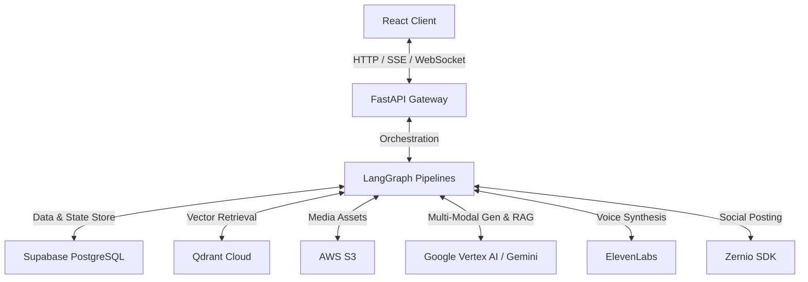

# JusAds — Technical Technology Stack Reference

This document provides a comprehensive breakdown of the technical frameworks, AI models, cloud infrastructure, databases, and APIs powering **JusAds**, the AI-Driven Trend-Aware and Regulation Compliance platform for hyper-localized advertising in Southeast Asian markets.

---

## 🚀 1. Architectural Topology Overview

JusAds is designed around a decoupled, modern multi-agent architecture comprising:
1. **Frontend Client**: A highly responsive, animated React Single Page Application (SPA) built with TypeScript.
2. **Backend Server**: An asynchronous Python FastAPI gateway hosting LangGraph orchestration state-machines.
3. **AI/ML Orchestration**: Dynamic multi-modal generative and compliance pipelines leveraging Google Vertex AI, ElevenLabs, and localized regulation reasoning.
4. **Data Persistence**: Relational Supabase (PostgreSQL) coupled with high-dimensional vector similarity store (Qdrant Cloud).

---

## 💻 2. Frontend Technology Stack (Client-Side)

The frontend is constructed using **React 19** and **Vite 8** to guarantee fast compile times, hot-module reloading, and modern component lifecycle execution.

| Technology Layer | Solution Chosen | Technical Rationale & Role |
| :--- | :--- | :--- |
| **Core Framework** | `React 19` + `TypeScript` | Standardized component structure with strict type-safety across API requests and WebSocket states. |
| **Build & Dev Tooling** | `Vite 8` | Next-generation dev server providing extremely fast compilation and optimized production asset bundles. |
| **Styling Engine** | `Tailwind CSS 4` | Utility-first styling for rapid layout building, clean HSL colors, responsive design breakpoints, and native dark mode support. |
| **UI Components** | `shadcn/ui` (Radix Primitives) | High-quality, accessible (WAI-ARIA compliant), unstyled UI components configured with Tailwind CSS. |
| **Motion & Animation** | `GSAP 3.15` + `@gsap/react` | High-fidelity micro-interactions, page transitions, and staggered card entrances. |
| **Client-Side Routing** | `React Router v7` | Client-side page navigation, parameter handling, and route layout nesting. |
| **User Authentication** | `oidc-client-ts` (Cognito OAuth) | Secure login handling via AWS Cognito OIDC client, supporting JWT session storage and token refresh. |
| **Visual Analytics** | `Recharts` | High-performance SVG charting library for interactive engagement rates, reach, CTR, and views charts. |
| **Pipeline Visualization** | `React Flow` | Renders the backend LangGraph node execution map directly on the canvas as an interactive graph node canvas. |

---

## ⚙️ 3. Backend Technology Stack (Server-Side)

The backend is built as a modular ASGI application in **Python 3.12** using **FastAPI** to facilitate native concurrency, asynchronous execution, and real-time streaming capabilities.

| Technology Layer | Solution Chosen | Technical Rationale & Role |
| :--- | :--- | :--- |
| **Core Server API** | `FastAPI` + `Uvicorn` | Asynchronous API gateway supporting real-time Server-Sent Events (SSE) and WebSockets for streaming graph execution. |
| **Orchestration** | `LangGraph (StateGraph)` | Core multi-agent state management engine mapping complex looping compliance, generation, and remediation graphs. |
| **Data Validation** | `Pydantic v2` | Enforces structural contract validations for JSON inputs, database inserts, and structured AI agent responses. |
| **Media Processing** | `FFmpeg` | Server-side CLI processing for subtitle burning, video speed-ramping, overlays, audio mixing, and frame extraction. |
| **CapCut Integrations** | `pycapcut` / `pyJianYingDraft` | Automatically exports generated ad storyboards directly to CapCut-compatible XML drafts for human editors. |

---

## 🤖 4. Artificial Intelligence & Multi-Modal Generation Models

The core reasoning, generation, and compliance audits are powered by Google's state-of-the-art foundation models alongside specialized speech engines.

| Model / Service | Version / API | Platform Role | Key Capabilities |
| :--- | :--- | :--- | :--- |
| **Gemini Flash Lite (Nano Banana)** | `gemini-3.1-flash-lite` | Chat & Intent Classifier | Lightweight, cost-efficient model used for chat reasoning, intent detection, and fast text generation. (Configured as `LLM_MODEL_ID`). |
| **Gemini Flash** | `gemini-2.5-flash` / `gemini-3.5-flash` | Reasoning & Compliance RAG | High-performance text model for structured compliance checking, rule evaluation, and detailed copywriting. |
| **Gemini Omni** | `gemini-omni-flash-preview` | Multi-Modal Video Agent | Video editing, scene extraction, and interactive multi-modal canvas adjustments. |
| **Imagen** | `Imagen 3.0 / 4.0` (via Vertex AI) | Ad Image Generator | Creative high-fidelity image generation, object replacement, and inpainting. |
| **Veo** | `Veo 3.0 / 3.1` (via Vertex AI) | Video Synthesis Engine | Converts generated keyframe images into smooth, high-fidelity localized video commercials. |
| **Text Embeddings** | `text-embedding-004` (768-dim) | Vectorizer | Embeds queries and prompt library documents to run semantic similarity checks. |
| **ElevenLabs** | `ElevenLabs Multilingual v3` | Speech Synthesis (TTS) | Generates hyper-realistic localized voiceovers (Malay, Chinese, Tamil, English dialects) and sound effects. |

---

## 🗄️ 5. Persistence, Vector, and Infrastructure Layer

The data layer separates structured relational states from high-dimensional vector search spaces.

| Infrastructure Unit | Solution | Storage Target & Details |
| :--- | :--- | :--- |
| **Primary Database** | `Supabase (PostgreSQL)` | Stores relational data: user profiles, projects, tasks, generated assets metadata, and structured compliance rules. |
| **Vector Database** | `Qdrant Cloud` | Dedicated vector space storing over 14,000 embedded prompt templates for semantic retrieval. |
| **Object Storage** | `AWS S3` | Flat storage for generated image, video, and audio assets, exposing secure presigned URLs to the client. |
| **Social Distribution** | `Zernio SDK` | Integrates with TikTok and Instagram Graph API to automate post scheduling and retrieve live analytics. |
| **Trend Analytics** | `Gemini Google Search` / `Tavily API` | Resolves latest trending search terms, creative hooks, hashtags, and social media ads context dynamically. |
| **Events Database** | `PredictHQ API` | Pulls localized cultural, religious, and national holidays in Southeast Asia to populate the localized campaign timeline. |
| **Events Fetching** | `fetch_sea_events.py` | Local execution script that fetches events using the PredictHQ API, now configured with full UTF-8 support on Windows. |

---

## 🛠️ 6. Dev & Test Verification Suite

- **Backend Unit Tests**: Configured with `pytest` testing framework to validate decision routers, remediation triggers, and mock API behavior.
- **Linter & Code Quality**: Configured with `Ruff` for clean code conventions, unused imports cleanup, and strict formatting.
- **Frontend Verification**: Automated UI rendering and state preservation checks written in `Vitest`.
